<p align="center">
  
</p>

<p align="center"><em>A dark fantasy necromancer action RPG in the browser.</em></p>


Crossworlds is set in a dying diocese consumed by necromancy. You are a grave-worker of the
**Ossuary Covenant**, reclaiming one connected realm — haunted graveyards, bone-filled
ossuaries, a drowned cathedral nave and the bell sanctum at its heart. Farm endless waves,
turn every corpse into a servant or a weapon, collect equipment, and push your **Damage**
and **Wave Speed** higher. Faster waves bring greater pressure — and better rewards. Beat the
Bell-Sworn Prelate, then **Ascend**: burn the run for permanent boons and a world that grows older
and deadlier every time.

There are no short missions and no extraction timers. Enter the world, farm the dead,
improve your build, break the seals, and become an unstoppable master of the dead —
alone or with up to three friends.

---

## Death Muffin VPS

Play at https://muffindevelopment.com/death-muffin/. See [the VPS handoff](docs/DEATH-MUFFIN-HANDOFF.md) before editing or deploying.

Auto combat is enabled by default: stand near enemies to use basic rites, click to move, and press **G** to toggle it. Hold **1–4** to repeat a spell at the cursor; signature rites remain manual. Press **L** for the [Grimoire](#the-grimoire-l--choose-your-four) to choose which rites sit on 1–4. Casts have short recovery, quicker gestures and calmer effects, with projectile damage arriving at the visual impact.

Click a walkable spot on the **minimap** to travel there using normal paths; the amber marker shows your fixed destination. Hover or focus a spell icon for richer cost, targeting, status and combat-tip information.

Use **Settings → Change class** whenever you want. Your character ID, level, gold, items and permanent progress are preserved; the selected class starts safely in the Chapterhouse. [Future bots](docs/death-muffin-roadmap.md) are a documented follow-up.

## Contents
[The loop](#the-loop) · [Disciplines](#the-four-disciplines) · [Rites (spells)](#rites--the-necromancers-kit) ·
[Corpses](#corpses-are-the-economy) · [The dead (enemies)](#the-dead) · [The Diocese (areas)](#the-diocese) ·
[The Bell-Sworn Prelate](#the-bell-sworn-prelate) · [Ascension](#ascension--the-endless-rite) · [Professions](#professions--the-sextons-acre) · [Upgrades & loot](#upgrades--loot) ·
[Combat guide](#combat-guide) · [New to the Covenant?](#new-to-the-covenant) · [Controls](#controls) · [Art direction](#art-direction) · [Development](#development)

---

## The loop

1. **Enter the world** at the Chapterhouse — a safe sanctuary with your Reliquary (inventory), the Ossuary Workbench (crafting), the Rite Niches (skills), waystones and the Altar of Ascension. West of it lies the **Sexton's Acre**, where you can level gathering skills without fighting at all.
2. **Walk into a hunting ground.** The dead claw out of grave breaches in continuous waves.
3. **Kill → corpses.** Every corpse is a choice: raise it as a thrall, feed it to Black Litany, detonate it — or lose it to a Crypt Deacon.
4. **Loot** gold, soul shards (from elites) and relics — equip upgrades on the spot.
5. **Spend gold** on **Damage** (clear faster) and **Wave Speed** (more enemies, more reward — a risk dial you control).
6. **Break seals**: kill enough in an area to open the next one. At the end: offer soul shards at the Sundered Bell and awaken the Prelate.
7. **Keep going.** Die and you rise again in the Chapterhouse — nothing is lost.
8. **Ascend.** After the Prelate falls, burn the run at the Altar of Ascension for Ashes and permanent
   Covenant Boons. Your level, gold and relics stay; the seals close again and the dead come back older.

---

## The four disciplines

Every Covenant necromancer raises the dead. How you spend them is your discipline.

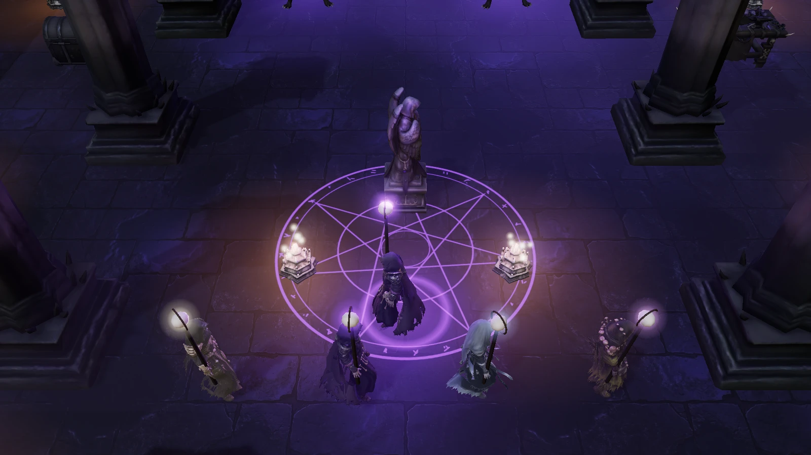

| | Discipline | Passive | Plays like |
|---|---|---|---|
|  | **Ossuary** — *Keeper of the Bone Wall* | **Bone Ward.** Thralls rise as Shieldbearers (+60% health, draw aggression). You take 6% less damage per active thrall. Black Litany grants a bone barrier. | The tank. Build a wall of shields, stand behind it, and let sacrifices armour you. |
|  | **Gravecaller** — *Marshal of the Restless* | **Grave Legion.** Thrall cap 5. Thralls attack 20% faster. Thralls sacrificed by Black Litany leave corpses behind. | The army. Raise, sacrifice, re-raise — the corpse field never runs dry. |
|  | **Mourner** — *Singer of the Funeral Rite* | **Funeral Rites.** Exhume binds Wraiths that attack from range. Consuming a corpse heals 6% max health. +25% Grave Essence regeneration. | Sustain. Ranged spirits and a heal on every rite. |
|  | **Rotweaver** — *Gardener of Decay* | **Carrion Bloom.** Miasma Circle is 30% wider and Withered stacks to 8. Corpses inside your Miasma burst, damaging and withering nearby enemies. | Area control. Seed rot where they gather; every corpse becomes a bomb. |

At **level 10** each discipline wakes its own **signature rite** on **R** — see [Signature rites](#signature-rites-level-10).

*(The server still stores the legacy class index — 1 Guardian → Ossuary, 2 Shadowblade → Gravecaller, 3 Cleric → Mourner, 4 Arcanist → Rotweaver.)*

---

## Rites — the necromancer's kit

Every discipline shares the core kit. Each rite has its own colour so a crowded fight stays readable:
**ivory/amber = bone**, **ember + dried crimson = marrow**, **jade = spirit and your risen dead**,
**chartreuse = rot**, **violet = the ritual** (reserved for the ultimate).

| | Rite | Key | Cost · Cooldown | What it does |
|---|---|---|---|---|
|  | **Bone Needle** | Click an enemy | free · 0.38 s | Fling a sliver of marrow. Each hit returns **6 Grave Essence**, so your basic attack fuels everything else. Auto-repeats on your target; Shift-click to cast without moving. |
|  | **Marrow Spear** | **1** | 18 · 2.2 s | A line of bone erupts toward the cursor, piercing everything and applying **Fracture** (+15% damage taken, up to 3 stacks). |
|  | **Exhume** | **2** | 12 · 0.5 s | Consume the corpse nearest the cursor and raise it as your **thrall**. At the cap, your oldest thrall crumbles. A corpse remembers what it was: hounds rise as hounds, Penitents as **skeleton archers**, Deacons as **bone mages**, Carrion Sacs as **plague bearers**; resonant and elite corpses rise **empowered**. |
|  | **Miasma Circle** | **3** | 25 · 7 s | Seed rot at the cursor for 6 s. Enemies inside are slowed 40% and gain a **Withered** stack (damage over time) each second. |
|  | **Black Litany** | **4** | 40 · 14 s | Consume **every corpse** and sacrifice **every thrall** within 7 m in one ritual burst: 1.5× spell power, **+0.6×** per corpse, **+1.2×** per resonant corpse, **+1.4×** per thrall (max 14×). |
|  | **Corpse Explosion** | **Right-click** / **5** | 15 · 0.6 s | Burst the corpse nearest the cursor in a 3 m blast of ember and bone (1.8× spell power). **Resonant** corpses blast 1.6× wider, **elite** corpses hit twice as hard, and a **toxic** corpse leaves a rot pool that works for *you*. Kills leave new corpses, so a pack on a pile of bodies can chain. |

<table><tr>
<td>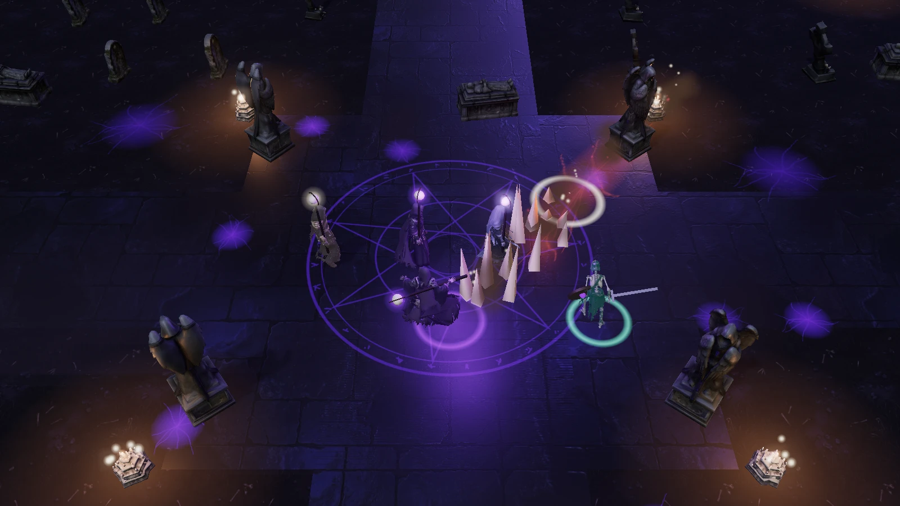<br/><sub><b>Marrow Spear</b> — bone through an ember-lit crack.</sub></td>
<td><br/><sub><b>Exhume</b> — jade spirit-fire as a thrall rises.</sub></td>
</tr><tr>
<td>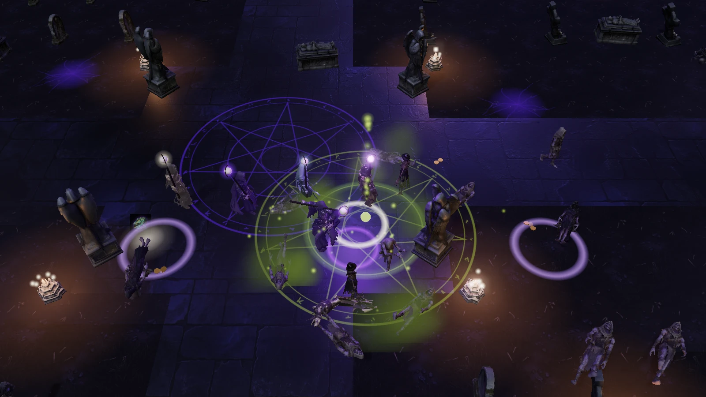<br/><sub><b>Miasma Circle</b> — rot, slows and Withered stacks.</sub></td>
<td>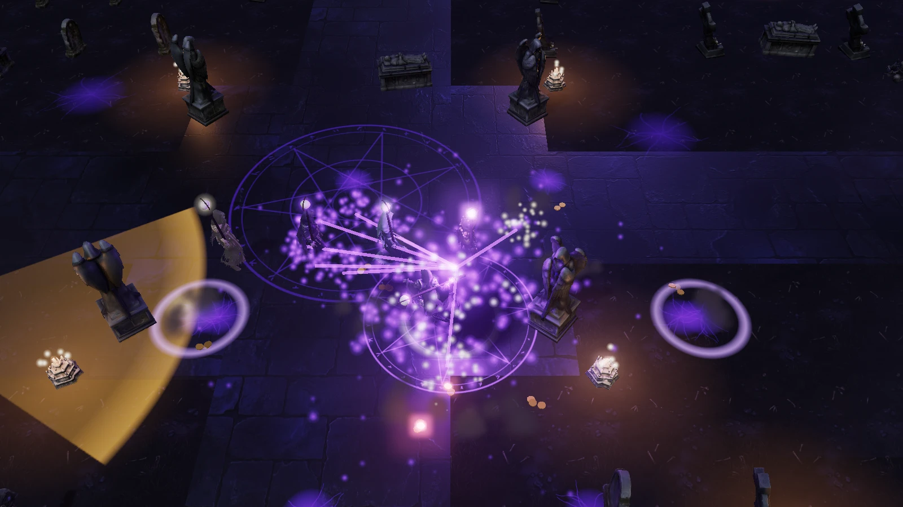<br/><sub><b>Black Litany</b> — every corpse tethered into one burst.</sub></td>
</tr></table>

### The Grimoire (L) — choose your four

Keys **1–4** are four fixed slots, and the **Grimoire** (**L**, or the open-book button beside the
minimap) decides which rites fill them. You start with the four above. Four more rites unlock with
level, and any four can be on the bar. Choosing a key for a rite that already sits on another key
swaps the two. Each rite keeps its own cooldown, so swapping resets nothing. Your choice is remembered
per character. Auto combat uses whatever is on your bar; it never casts Grave Step for you, because it
never moves you.

| | Rite | Unlocks | Cost · Cooldown | What it does |
|---|---|---|---|---|
|  | **Wailing Skull** | level 3 | 16 · 3 s | A shrieking jade skull hunts the enemy nearest the cursor (2.4× spell power), then **leaps** to two more within 6.5 m, each bite 20% weaker. A bite that kills earns another leap, up to 5. |
| 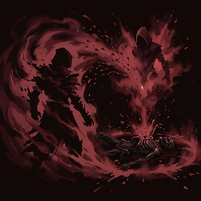 | **Grave Step** | level 5 | 10 · 5 s | Dissolve into blood mist and re-form on the corpse nearest the cursor (up to 12 m, never across a sealed door). The re-forming burst hits everything within 2.6 m (1.3×) and makes it **bleed**. The corpse stays for your next rite. |
| 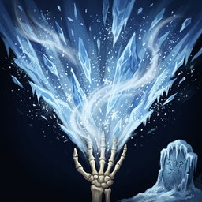 | **Grave Frost** | level 7 | 20 · 4.5 s | A 7 m cone of grave cold (1.4×) that **Chills** everything it touches for 3 s. Enemies that are already Chilled **shatter** for +50% damage, so breathe twice. |
| 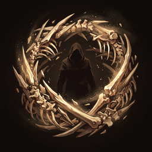 | **Bone Mantle** | level 12 | 25 · 15 s | Draw up to 5 corpses within 6 m into a whirling mantle: a **barrier** of 10% max health +7% per corpse (45% at most) that holds for 6 s, while bone shards cut anything within 1.7 m twice a second. |

Each borrows the feel of a rite you already know. The skull flies and lands like Bone Needle, Grave
Frost resolves its cone on impact like Marrow Spear, Grave Step picks its corpse like Corpse
Explosion, and Bone Mantle lets the world's keeper consume the corpses, as Black Litany does. Their
icons and effect sprites (skull, frost fan, rime, blood sigil, bone shards, bone ring) come from the
Gemini pipeline (`art-manifest/gemini-jobs/spells-v4.json`) and are tinted per rite in code.

**Status effects** (hover an enemy to see them in the target frame):

| | Status | Source | Effect |
|---|---|---|---|
| 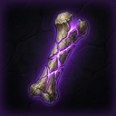 | **Fracture** | Marrow Spear | +15% damage taken per stack (3 max) |
| 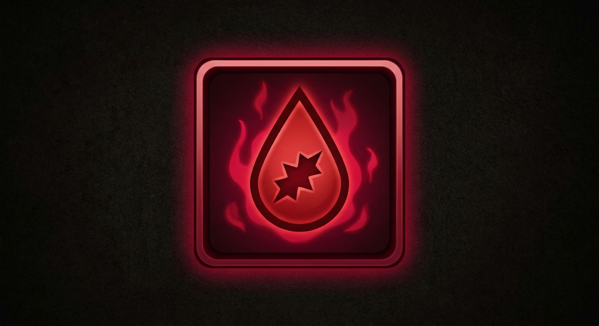 | **Hemorrhage** | Marrow Spear, Grave Step | Bleeds 12% of the hit per second for 4 s (crimson drips) |
| 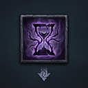 | **Withered** | Miasma, rot pools, Plague Bloom | Rot damage per stack each second |
| 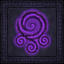 | **Miasma** | Miasma Circle | Slowed 40% |
|  | **Chilled** | Mourner wraiths, Grave Frost | −30% movement, −25% attack rate (frost motes); Grave Frost shatters it for +50% |
| 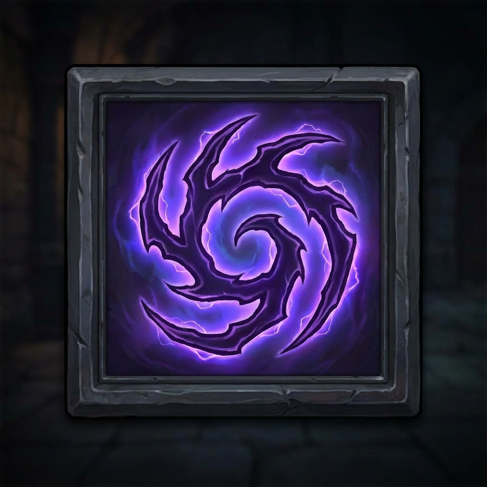 | **Bone Hex** | Bone-mage thralls | The enemy's blows land 25% softer |
| 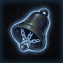 | **Silenced** | Dirge | Casters can't start a spell |
| 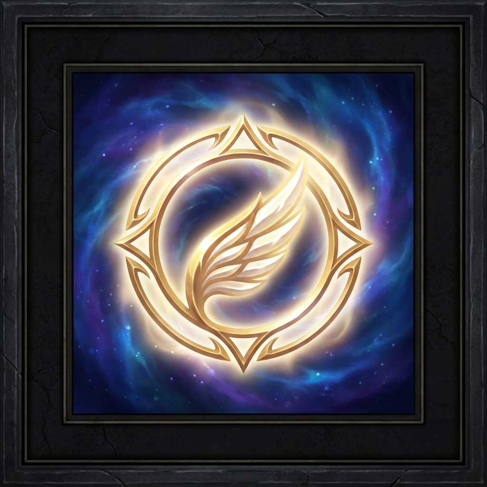 | **Sanctified** | Crypt Deacons (enemy) | The blessed enemy takes 30% less damage (pale gold halo) |
|  | **Incensed** | Censer Bearers (enemy) | +30% movement and +25% attack rate while near the censer (bronze motes) |

**Soul Harvest** — every kill by you or your thralls adds a soul to the jade skull meter above the
hotbar. At **50 souls** (fewer with the *Soul Hunger* boon), the next Marrow Spear, Miasma Circle or
Black Litany is **free and 50% larger** (the empowered slots glow jade, and so do you).

### Signature rites (level 10)

One per discipline, on **R** (or **6**). The slot shows a lock and a "10" until you reach level 10.

| Discipline | Rite | Cost · Cooldown | What it does |
|---|---|---|---|
| Ossuary | **Ossuary Wall** | 30 · 16 s | Raise a 7 m wall of fused bone across the aim line for 6 s. The dead can't pass it and Penitent cones break on it. Throw it across a door, put a Miasma behind it. |
| Gravecaller | **Command: Rend** | thrall health · 9 s | Your whole legion leaps to the cursor and cleaves (2.5× each thrall's hit). Costs each thrall 15% of its health instead of essence. |
| Mourner | **Dirge** | 35 · 18 s | A 4 s cold-blue bell-song around you: you and your thralls mend every second, and enemy casters inside are **Silenced**. |
| Rotweaver | **Plague Bloom** | 28 · 12 s | Plant a chartreuse rot flower that pulses Withered. Every 2 s it seeds a new bloom on the nearest corpse, three generations deep. |

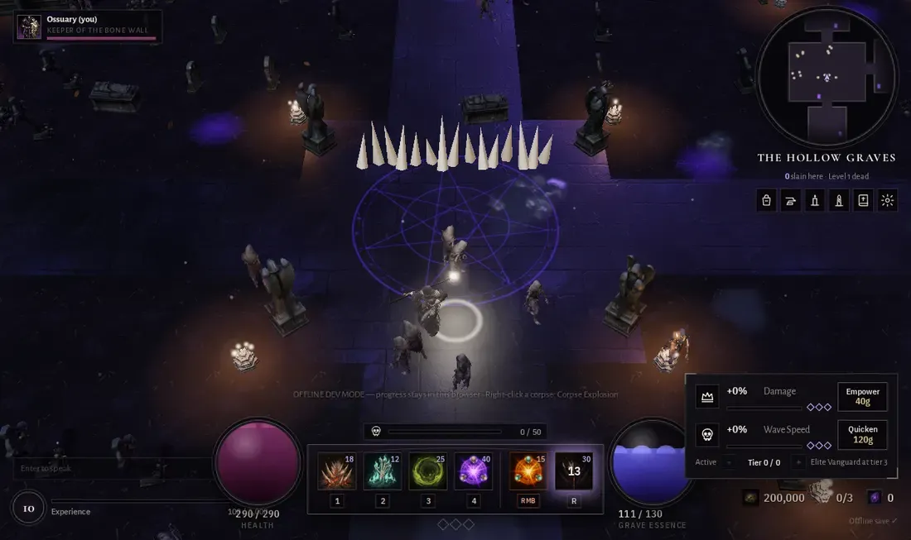

---

## Corpses are the economy

Almost everything that dies leaves a body where it fell. Corpses last ~26 seconds.

| Corpse | From | Special |
|---|---|---|
| Normal | Grave Robber | Raises a skeleton warrior (or your discipline's thrall). |
| Normal | Crypt Deacon | Raises a **bone mage**: amber bolts at range whose Bone Hex softens enemy blows. |
| **Swift** | Bone Hound | Raises a **Bone Hound** thrall — fast, lower health. |
| **Resonant** | Bellbound Penitent | Rings faintly. Counts **double** for Black Litany; Exhume raises an **empowered skeleton archer**. |
| **Toxic** | Carrion Sac | **Ruptures into a poison pool after 5 s** unless consumed. Exhumed, it rises a **plague bearer** that bursts into a rot pool *of your own* when it falls or is sacrificed. |
| — | Risen | Leaves nothing. |

Elite corpses are always empowered when exhumed. The Mourner's discipline overrides all of this: everything rises as a wraith.

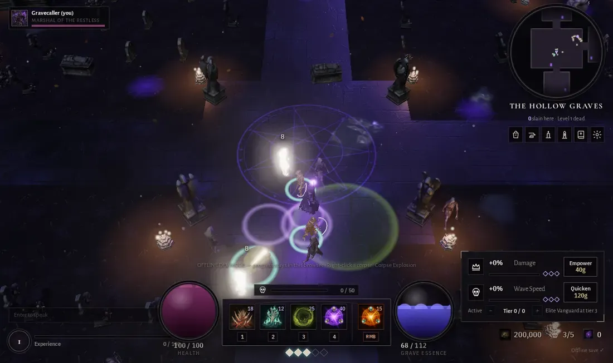

---

## The dead

| Enemy | Behaviour | Corpse | How to handle it |
|---|---|---|---|
| **Grave Robber** | Melee baseline; shambles straight at the nearest living thing. | normal | Fodder and fuel. Let thralls hold them while you needle. |
| **Bone Hound** | Fast flanker — curves around your side. | swift | Kill early; each one is a free fast thrall. |
| **Bellbound Penitent** | Stands off at range and tolls a **bronze cone** of grave-sound (telegraphed). | resonant | Step out of the cone; save its corpse for Litany. |
| **Carrion Sac** | Slow, swollen; slams an area in front of it. | toxic | Kill it away from your thralls, then Exhume or Litany the corpse before it ruptures. |
| **Crypt Deacon** | Support caster. **Steals your corpses** — channels a green beam and raises them as hostile Risen. With no corpse in reach it **Sanctifies** a wounded ally (30% less damage taken). Curses at range. | normal | **Priority target.** Every corpse it steals is a thrall you don't get. A Dirge silences it. |
| **Risen** | A corpse a Deacon claimed before you did. | none | Weak, but it means you were too slow. |
| **Censer Bearer** | Walks with the pack swinging bronze incense: the dead within 5 m are **Incensed** (+30% speed, +25% attack rate; bronze motes). | normal | **Kill it first**; the pack slows back down. Wailing Skull reaches it through the crowd. |
| **Choir Wraith** | Hovering caster. Sings pale song-lines onto a **ring where you stand**, which screams when the hymn breaks. Keeps its distance. | none | Keep moving: one step out of the ring. Dirge silences it; Grave Step closes the gap. |
| **Ossuary Skull-Rat** | Tiny, fast flankers that climb out in **packs of 4–6**. Never elite. | none | Area rites: Miasma, Grave Frost or a Corpse Explosion ends a pack. |
| **Bone Golem** | A slow giant of fused skeletons (430 base health) that slams a **wide 2.8 m ring**. | ×3 | Step out, punish the recovery. It falls apart into **three corpses**: a legion or a Litany in one kill. |
| **Elites** | Any enemy can spawn elite: bigger, tougher (×3.6 health), harder-hitting, pulsing violet ring, and **one affix** (below). | — | Drop **soul shards** (needed for the boss) and far more loot. |

**Processions.** From the second wave in an area, about one wave in three arrives as a themed band
instead of the usual mix, named on a banner:

| Area | Processions |
|---|---|
| Hollow Graves | **The Kennel Loosed** (hounds and skull-rats) · **The Bellringers' Round** (Penitents and robbers, led by a Censer Bearer) |
| Marrow Ossuary | **The Skittering** (rat packs) · **The Ossuary Wakes** (a Bone Golem leads robbers, rats and hounds) |
| Drowned Nave | **The Drowned Choir** (wraiths, Penitents, censers) · **The Carrion Tide** (sacs and rats) |
| Bell Sanctum | **The Procession** (a Bone Golem leads censers, Penitents, Deacons and wraiths) |

The new dead also join the regular mix deeper in: rats and the odd golem in the Ossuary, wraiths and
censers in the Nave, all four in the Sanctum. The Hollow Graves keep their gentle roster apart from its processions.

**Elite affixes.** The affix shows in the target frame and on the elite itself.

| Affix | Tell | Behaviour | Answer |
|---|---|---|---|
| **Bell-Tolled** | Bronze ring pulse | Every 6 s it rings a 3 m bronze circle that **stuns** briefly when it sounds. | Step out of the circle before it tolls. |
| **Hungering** | Olive drool | When wounded, it **eats a corpse** within 5 m every 4 s and heals 15%. | Exhume or burst the bodies around it first. |
| **Shrouded** | Dim, dusk smoke | Takes **half damage** unless it stands in your Miasma or a rot pool. | Seed Miasma under it, or burst a Carrion Sac corpse on it. |
| **Vengeful** | Ember cracks | Spawns **3 Risen** when it dies. | Kill it on top of your thralls, or with a Corpse Explosion ready. |

---

## The Diocese

One connected world. Each area's seal breaks when you've killed enough in the area before it.

| Area | Level | Opens when | Character |
|---|---|---|---|
| **The Chapterhouse** | — | always | Sanctuary. Reliquary, workbench, rite niches, waystone, Altar of Ascension. The dead cannot follow. |
| **The Sexton's Acre** | — | always | West of the Chapterhouse. A walled cemetery garden with every gathering node, the Sawpit, Bone Kiln and Cooking Fire. No waves, ever. |
| **The Hollow Graves** | 1 | always | Moonlit graveyard of tombs, mausoleums and mourning statues. Robbers, hounds, the first penitents. |
| **The Marrow Ossuary** | 5 | 300 kills in the Graves | Skull-walled aisles and bone floors. Deacons appear — protect your corpses. |
| **The Drowned Nave** | 9 | 420 kills in the Ossuary | A flooded cathedral nave: dark water in the aisles, raised walkways along the pillars, violet stained glass. Penitent choirs. |
| **The Bell Sanctum** | 13 | 520 kills in the Nave | The Prelate's seat. Summon it at the Sundered Bell with 5 soul shards. |

Every Ascension rank makes all of these levels **3 higher**.

<table><tr>
<td><br/><sub><b>The Chapterhouse</b></sub></td>
<td><br/><sub><b>The Marrow Ossuary</b></sub></td>
<td><br/><sub><b>The Drowned Nave</b></sub></td>
</tr></table>

Each area has its own weather: ash and dead leaves over the Graves, bone dust in the Ossuary,
rain and drips in the Nave, rising embers in the Sanctum. Rain puddles in the graveyard catch the moon,
and every body that wades through the Nave's flood leaves ripples. Ruined spires and dead trees stand
in the fog beyond the walls.

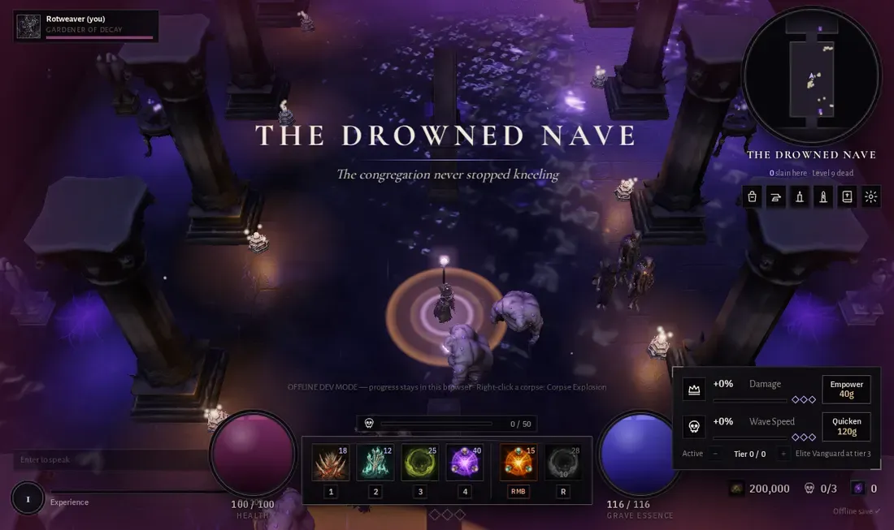

Waystones in every area let you travel between unlocked areas (stand beside one, or use it from the
Chapterhouse). **T** channels a return to the Chapterhouse from anywhere.

**Grave Surges.** Every 90–150 s spent in an open area, a mausoleum or sarcophagus cracks open (a breach where there is none).
Three rapid waves pour out of it over 20 seconds. Kill **80%** of them before the crypt closes and it
yields an **offering**: a guaranteed item plus bonus gold. Otherwise the surge fails and you get nothing.

---

## The Bell-Sworn Prelate


A cathedral corpse fused to a cracked processional bell. Every attack has a physical cause and a telegraph:

| Phase | Health | New pressure |
|---|---|---|
| **I — The bell is silent** | 100–60% | **Toll**: a bronze ring swells around the bell — step out before it sounds. **Slam**: the bell drops in front of it. |
| **II — The procession begins** | 60–30% | Penitents and Risen file in from the aisles; the west candles gutter out. **Bell Rain**: cracked shards fall on marked circles (one on each player, plus strays). |
| **III — The bell is breaking** | <30% | Enraged: faster tolls, more rain, the east candles die. |

A real fight: roughly 95,000 health solo at level 13 (more per extra player, more on Hard and at each
Ascension). A careful arrival-level necromancer who steps out of the rings wins in about three minutes;
one who stands in every telegraph does not.

Reward: a pile of gold, 3 soul shards and three relic rolls from the Sanctum's table. If everyone leaves or falls, the Prelate resets and waits to be summoned again.
Your first kill each run readies the [Altar of Ascension](#ascension--the-endless-rite).

---

## Ascension — the endless rite

Once the Prelate has fallen this run, the **Altar of Ascension** in the Chapterhouse will take the run.

- **What burns:** Damage and Wave Speed tiers, soul shards, area kill counts and every opened seal.
- **What stays:** your level, experience, gold, relics and professions — and everything Ascension gave you.
- **What you gain:** **Ashes** (more for extra Prelate kills, a higher peak Wave Speed, more of the dead
  laid to rest, and more at higher ranks), and one **Ascension rank**. Each rank makes every enemy and the
  Prelate **3 levels older** and pays **5% more** gold and XP on top of what older enemies already drop.

Ashes buy permanent **Covenant Boons** at the Altar. They shape *your* character only, so they're fair in co-op:

| Boon | Per rank | Ranks | Needs |
|---|---|---|---|
| Vigil of Bone | +8% maximum health | 3 | — |
| Marrow Font | +12% Grave Essence regeneration | 3 | — |
| Bone Tithe | Damage upgrades cost 10% less | 3 | — |
| Quickened Coin | Wave Speed upgrades cost 12% less | 2 | — |
| First Rites | Begin each run with 2 Damage tiers | 2 | — |
| Shard Keeper | Begin each run holding 2 soul shards | 2 | — |
| Soul Hunger | Soul Harvest fills 8 souls sooner | 2 | Ascension I |
| Swift Seals | Sealed doors open after 20% fewer kills | 2 | Ascension II |
| Legion Pact | Command one more thrall | 1 | Ascension III |

Ascend asks twice and spells out exactly what resets. Your rank shows under your portrait. In co-op the
world keeper's rank decides how old the dead are (like difficulty).


---

## Professions — the Sexton's Acre


Beside the combat loop sits a RuneScape-style skilling layer, where **the grind is the point**. **Click** a tree, an ore
seam, a fishing spot or a burial plot and your necromancer works it: a ring fills under you with each swing, cast
or dig. Every success gives skill XP and a find. The node gives out after a few successes (a felled tree becomes a stump,
a seam turns to rubble, a fishing spot drifts away, a grave is left open) and comes back on a timer. With **Auto
gathering** on (Settings, on by default), you walk to the nearest node of the same kind and carry on. Moving, casting,
opening a panel, a full bag or a hit stops you.

| Skill | Nodes (level) | Finds |
|---|---|---|
| **Woodcutting** · *Rite of Coffin-Oak* | Coffin-Oak (1) · Hangman's Elm (15) · Bleeding Willow (30) · Churchyard Yew (45) · Blackthorn (60) · Ghostwood (75) · Bone Elder (90) | Logs; a rare crow's nest (seed or ring) |
| **Mining** · *Rite of Grave-Iron* | Copper / Tin (1) · Iron (10) · Bronze (20) · Silver (30) · Gold (40) · Steel (50) · Hell geode (65) · Moon geode (80) | Ore; rare grave garnets, bone opals and void sapphires |
| **Fishing** · *Rite of the Black Water* | Still pool (1) · Crypt eels (15) · Bell carp (30) · Drowned pike (45) · Lanternfish (62) · Abyssal coelacanth (80) | Fish; drowned trinkets, reliquary fragments, covenant seals |
| **Gravedigging** · *Rite of the Sexton* | Pauper's grave (1) · Burial mound (20) · Crypt collapse (40) · Barrow-king's tomb (70) | Bones, a little gold, seeds, silver, reliquary fragments; rarely old gear |

- **The Acre is completely non-combat.** Every tier of every node is there, with the stronger ones further from the
  Chapterhouse door and a single Bone Elder at the far end. The **Sawpit**, **Bone Kiln** and **Cooking Fire** by the
  entrance run the Workbench recipes for their rite.
- **Rich nodes** (a gold glow) sit in the hunting grounds: oaks and pauper's graves in the Graves, silver and crypt
  collapses in the Ossuary, eels and a willow in the Nave, moon geodes in the Sanctum. They hold 50% more and return twice
  as fast, but taking a hit stops you, so clear the dead first.
- **Levels** run to 99. Each level improves your odds on every node of that skill and opens the next one. **P** opens the
  **Skills** panel with every level, the XP to go, what the next level unlocks and your total level. The Codex (**K**) has a
  *Professions* tab with every node's level, XP, cycle time, XP/h and location.
- **The server decides the rewards.** The client plays each cycle straight away for feel, but only reports how many
  cycles you worked. The Death Muffin server rolls the items, XP and gold itself, caps the claim by elapsed time, and stores
  everything in one transaction. In co-op, a node's depletion is shared (two necromancers fell a tree faster) and each
  player gets their own finds.

<table><tr>
<td><br/><sub><b>Working a seam</b></sub></td>
<td><br/><sub><b>Skills (P)</b></sub></td>
<td><br/><sub><b>Codex · Professions</b></sub></td>
</tr></table>

Grave Gardening (seeds, herb beds and tree patches) and new processing recipes are the next phases in
[docs/PROFESSIONS-ROADMAP.md](docs/PROFESSIONS-ROADMAP.md). Node models from the art pipeline replace the code-built stand-ins as they land.

---

## Upgrades & loot

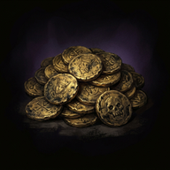 **Gold** drops from everything and buys upgrades at the lower-right panel, from anywhere in the world:

- **Damage** — +8% spell power per tier (25 tiers). Cost 40 × 1.5ⁿ gold.
- **Wave Speed** — faster waves (+12% per tier), more enemies at once (+9%), bigger waves (+6%), more gold (+10%), better item chances and more elites — but every enemy also hits 3.5% harder and has 3% more health per tier. 8 tiers, cost 120 × 1.75ⁿ. The first wave that greets you in an area ignores the dial.
  Buy tiers, then **dial the active tier** up or down (−/+) — it's a risk lever, not just a timer.
  The three diamonds are **milestones** that switch on while the dial sits at or above them:
  tier 3 *Elite Vanguard* (every other wave brings an elite), tier 6 *Restless Crypts* (Grave Surges
  40% sooner), tier 8 *Nightfall* (the moon darkens, half the common dead rise Shrouded; +25% gold, more relics).

**Difficulty** (Settings): *Easy* — enemies and the Prelate hit 40% softer with 25% less health, for 25% less gold and XP;
*Medium* — the intended balance; *Hard* — 30% harder hits, 20% more health, more elites, 30% more gold and XP.
In co-op the world keeper's difficulty applies.

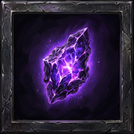 **Soul shards** drop from elites (1–2) and the Prelate (3). Five summon the Prelate.

**Relics** drop with a light pillar (uncommon and better). Each area has its own loot table; relic stats
come from the live server's item database. Healing flasks (**Q**) restore 35% / 70% health.
Rarity is shown by colour *and* mark: · common, ◆ uncommon, ◆◆ rare, ◆◆◆ epic.


|  |  |  |  |  | 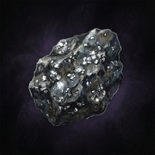 |
|---|---|---|---|---|---|
| Oak Staff | Gold-Tempered Helm | Iron Chestplate | Copper Ring | Major Healing Flask | Silver Ore |

---

## Combat guide

- **Needle first, spend second.** Bone Needle is free and refunds essence — keep it firing between rites.
- **Fracture before the burst.** Marrow Spear through a line, *then* Litany: three Fracture stacks is +45% damage.
- **Build the field, then cash it.** Let corpses pile up inside Miasma and around your thralls; Black Litany's power scales with everything it consumes (resonant corpses count double).
- **Deacons die first.** A Deacon raising your corpses turns your fuel into enemies — and with no corpse
  in reach it *Sanctifies* a wounded ally (pale gold halo: 30% less damage taken).
- **Marrow Spear bleeds** (Hemorrhage, crimson drips), and the Mourner's wraiths **Chill** what they
  strike (frost motes: slower feet, slower swings).
- **A corpse remembers what it was.** Exhume a Penitent for a skeleton archer, a Deacon for a bone mage
  (its hex softens enemy blows), a Carrion Sac for a plague bearer that bursts into your own rot pool.
- **Every corpse is a choice.** Exhume it (a thrall), bank it (Litany power), or burst it (Corpse
  Explosion, right now). Bursting is best when the pack is already on you or your legion is full.
- **Read the elite before you fight it.** Bronze ring: step out. Olive drool: clear the corpses. Dim and
  smoky: Miasma first. Ember cracks: expect Risen.
- **Carrion Sacs: consume or flee.** Their corpses burst into poison after 5 s.
- **Thralls are ablative.** Ossuary Shieldbearers pull aggression; let them take the hits and sacrifice them when they're low.
- **Wave Speed is a dial.** Turn it down to recover, up when your build is carrying — the rewards scale with the danger.
- **Watch the ground.** Bronze = bell/sound attacks, olive = poison, crimson rings = curses. Telegraphs always come before damage.

Planned content (new disciplines, spells, bosses and systems) lives in [FUTURE_CONTENT.md](FUTURE_CONTENT.md).

---

## New to the Covenant?

The game teaches itself as you go. **Covenant counsel** cards appear above the hotbar the first time
something matters: a welcome in the Chapterhouse, how to move and needle, your first corpse and thrall,
running out of essence, a Litany worth casting, a pack standing on a corpse, low health, your first elite,
surge and relic, a full Soul Harvest, a Sanctified enemy, the Codex, the Grimoire when your first new
rite unlocks (and each new rite the first time you put it on a key), your signature rite at level 10,
five soul shards, the Altar after your first Prelate kill, Ashes waiting to be spent, and on the skilling side your first
visit to the Sexton's Acre, your first node, a rich node, a station, a full bag and your first skill level-up. Each shows once per character, never pauses the game, and stays up long enough to
read. Turn them off (or **Show tips again**) in Settings (**Esc**). **K** opens the Codex any time.


---

## Controls

| Input | Action |
|---|---|
| Minimap click | Travel to a walkable location; sealed halls remain closed |
| Hover/focus spell | Detailed spell information and combat tips |
| Left click | Move · attack the enemy under the cursor · use an object · work a gathering node (tree, seam, fishing spot, grave) |
| Shift + click | Cast Bone Needle without moving |
| **1 2 3 4** (hold to repeat) | Your four Grimoire rites, aimed at the cursor (start: Marrow Spear · Exhume · Miasma Circle · Black Litany) |
| **L** | Grimoire: choose which rites sit on 1–4 (Wailing Skull, Grave Step, Grave Frost, Bone Mantle unlock at levels 3 / 5 / 7 / 12) |
| Right-click · **5** | Corpse Explosion on the corpse nearest the cursor (works while holding left-click to move) |
| **R** · **6** | Your discipline's signature rite (unlocks at level 10) |
| **Q** | Drink a healing flask |
| **T** | Return to the Chapterhouse |
| **I / C / P / M / K** | Reliquary · Workbench · Skills · Waystones · Codex (lore + everything you've met) |
| **G** | Toggle auto combat (enabled by default; fights while standing) |
| **Esc** | Settings (Change class, difficulty, auto gathering, graphics, volume, reduced motion, damage numbers, tips) |
| Click the Altar | Altar of Ascension (in the Chapterhouse) |
| Wheel · WASD · Enter | Zoom · walk (fallback) · chat |

---

## Art direction

The look comes from two reference boards: black and purple as the identity, made readable by
material contrast — soot, obsidian, plum, old bone, cold moonlight — with violet reserved for ritual magic.

| Character & minions | World & farming |
|---|---|
| 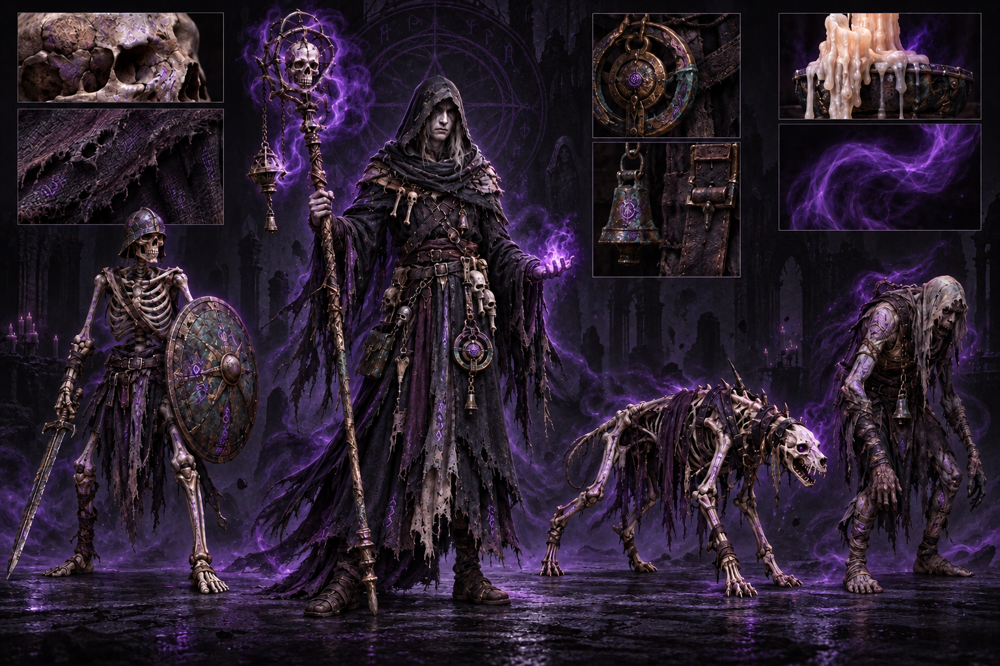 | 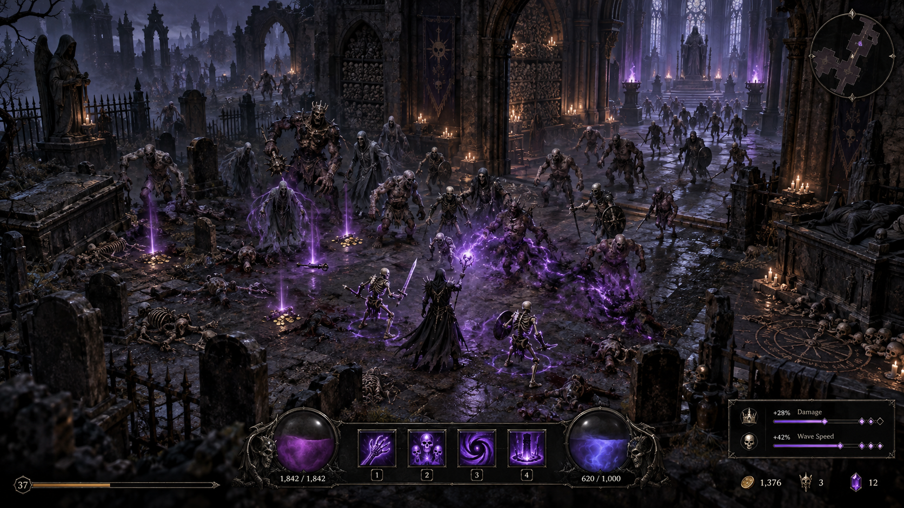 |

Every hero, monster and prop is generated and rigged through a reproducible pipeline
(Gemini concept → Tripo 3D low-poly model → auto-rig → per-clip animation → optimised GLB);
prompts, task ids and costs are recorded in [`art-manifest/`](art-manifest). Sound is fully
procedural WebAudio (bells, bone, rot, wind) — no audio files. See [ASSET_PIPELINE.md](ASSET_PIPELINE.md).

---

## Development

```
npm install
npm run dev            # http://localhost:5188
```

- `http://localhost:5188/?offline` — DEV-only offline mode: an in-browser mock of the auth server.
- Live server: the dev server proxies the REST API to `playcrossworlds.com:3000` (override with `VITE_API_PROXY_TARGET`).
- Co-op locally: `cd server/realtime && npm install && cp .env.example .env && node server.js`, then `?offline&coop` in two tabs.

```
npm run typecheck      # tsc
npm test               # game-logic unit tests (vitest)
npm run test:server    # realtime + necro-progress server tests (node:test; run `npm ci` in server/realtime first)
npm run build
npm run balance        # headless bot farms every area × level band × discipline (BALANCE.md)
npm run balance:boss   # headless Prelate fights, dodging and not
                       # env: BALANCE_SEEDS, BALANCE_AREAS, BALANCE_BANDS, BALANCE_DIFFICULTY, BALANCE_ASCENSION
npm run build:server-rules   # re-bundle src/gameplay/necroRules.ts for the VPS package (after changing prices/unlocks/Ascension)
```

**Where progress lives.** Level, XP and gold are saved through the existing auth server. Upgrade tiers, Soul Shards,
area kills, seals, Ascension rank, Ashes and boons go to `/api/necro-progress/*` once the VPS installs it
([server/VPS_HANDOFF.md](server/VPS_HANDOFF.md)). Until then they stay in the browser's localStorage. On the first connect
the browser save is uploaded once, and after that the server's copy wins. Server `error` messages show as toasts.
Skill levels and gathered items live on the Death Muffin backend (`POST /api/gather`,
[server/death-muffin/GATHERING_DEPLOY.md](server/death-muffin/GATHERING_DEPLOY.md)); the rules are shared through
`src/gameplay/gatheringRules.ts`, bundled by `npm run build:server-rules`.

DEV console hooks (`window.__cwDebug`, offline dev only): `advance(s)`, `goto(area)`, `unlockAll()`, `god()`,
`ring(def, n, r)`, `spawn(def, elite, affix)`, `surge()`, `souls()`, `xp(n)`, `perf()`, `prelateSlain()`, `altar()`,
gathering QA `nodes(area)`, `gatherAt(type)`, `gathering()`, `skill(id, level)`, `station(kind)`, `hoverNode(id)` and more.

Docs: [CLAUDE.md](CLAUDE.md) (working context) · [HANDOFF.md](HANDOFF.md) (current state) ·
[PHASE_REPORTS.md](PHASE_REPORTS.md) (what's built) · [BALANCE.md](BALANCE.md) (targets + numbers) ·
[NECROMANCER_REDESIGN_AUDIT.md](NECROMANCER_REDESIGN_AUDIT.md) (design direction) ·
[ASSET_PIPELINE.md](ASSET_PIPELINE.md) · [FUTURE_CONTENT.md](FUTURE_CONTENT.md) ·
[server/](server) (realtime service, deploy scripts, proposals).
