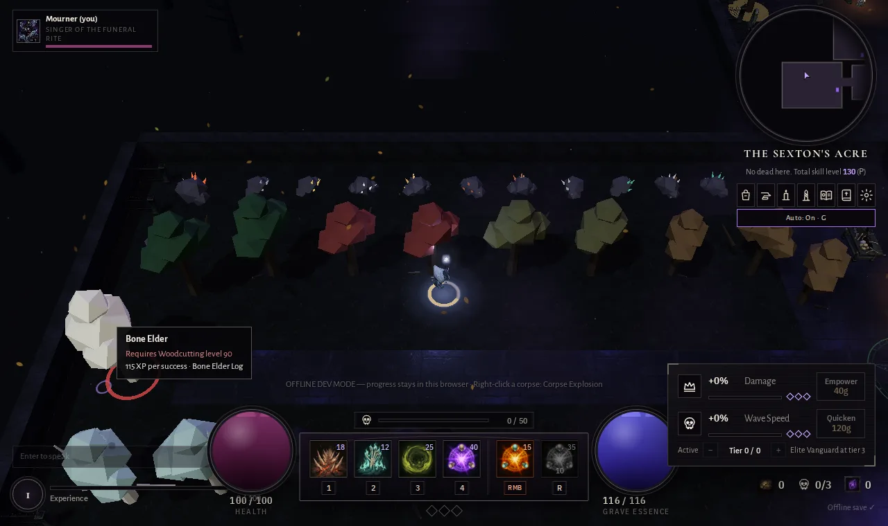

# Death Muffin — Player Guide

*A dark fantasy action RPG in your browser, alone or in a shared world of up to 10 players.*

The Ossuary Covenant stands in a diocese overrun by the dead. Choose one of nine disciplines, gather and craft in the safety of the Sexton's Acre, then fight through connected hunting grounds. Build your character, open the sealed passages, defeat the Bell-Sworn Prelate, and Ascend for permanent boons and a harder, more rewarding world.

**Play:** [muffindevelopment.com/death-muffin](https://muffindevelopment.com/death-muffin/). Create an account or sign in, then choose a discipline. You can change class later in **Settings** while keeping the same character's level, gold, items, and permanent progress.

## Contents

- [Your first hour](#your-first-hour)
- [Controls](#controls)
- [Choose a discipline](#choose-a-discipline)
- [Combat and corpses](#combat-and-corpses)
- [The world and its bosses](#the-world-and-its-bosses)
- [Gold, gear, and difficulty](#gold-gear-and-difficulty)
- [Gathering and crafting](#gathering-and-crafting)
- [Ascension](#ascension)
- [Playing together and getting help](#playing-together-and-getting-help)

## Your first hour

1. **Start in the Sexton's Acre.** This is a safe gathering area. Click a Coffin-Oak, Copper or Tin Seam, Still Pool, or Pauper's Grave to begin a level 1 skill. Press **P** to see your skills. You can leave gathering for later if you want to fight immediately.
2. **Walk east into the Chapterhouse.** This safe hub has the Reliquary for your inventory, the Workbench for crafting, the Altar of Ascension, and a Waystone. Press **T** to channel a return here when you need a break.
3. **Go north into the Hollow Graves.** Click ground to move and enemies to use your basic attack. Aim with the mouse and use **1–4** for your equipped rites. Watch the ground for attack warnings. The count beneath the minimap shows progress toward the next sealed area.
4. **Collect loot and grow stronger.** Open the Reliquary with **I** to equip items. Spend gold on **Damage** and **Wave Speed** in the HUD. Wave Speed has a separate active dial, so you can turn the pressure back down after buying a tier.
5. **Read what you meet.** Hover a rite for its cost and targeting advice, open the **Codex** with **K** for enemies and professions, and follow the Covenant counsel tips as they appear.

On **Easy**, auto combat can engage enemies, use equipped rites, heal, and drink flasks. It turns on when you switch to Easy unless you turn it off. **G** toggles it; clicking or moving takes manual control. **Medium** is the default difficulty.

## Controls

| Input | Action |
|---|---|
| Left click ground / enemy / object | Walk, use your basic attack, interact, or gather |
| Shift + left click | Use your basic attack without moving |
| Click the minimap | Walk to a reachable point; the amber marker is your destination |
| Mouse / wheel | Aim / zoom |
| WASD or arrow keys | Walk manually |
| **1–4** | Use equipped rites at the cursor; hold to repeat when ready |
| Right click or **5** | Use your class's fifth rite, often a corpse action |
| **R** or **6** | Use your class's signature rite after level 10 |
| **Q** | Drink a healing flask |
| **Z** / **X** | Drink the elixir / tonic on your belt (**F** is reserved for throwables) |
| **T** | Recall to the Chapterhouse |
| **L** | Open the Grimoire to inspect rites and set the four keys |
| **I** or **B** / **C** / **P** / **O** / **U** / **H** / **N** | Reliquary / Workbench / Skills and AFK gathering / Sexton’s Contracts / Grave Gardening / Grave Laborers / Capes & Pets |
| **M** / **K** | Waystone map / Codex |
| **G** | Toggle auto combat on Easy |
| **Enter** | Chat |
| **Esc** | Close an open panel, then open Settings |

You can also click hotbar icons. Right click a hotbar slot to open the Grimoire. In **Settings**, you can change class, difficulty, graphics, volume, reduced motion, damage numbers, gathering behavior, and counsel tips.

## Choose a discipline

Every class has a basic attack, four rites on **1–4**, a fifth rite on right click, and a signature on **R** at level 10. The four necromancers share a larger pool of rites and can change their loadout in the Grimoire as they level. The other five classes have their own resource and fixed rite choices for now; their four keys can be rearranged.

| Portrait | Discipline | Resource and style |
|---|---|---|
|  | **Ossuary** | Grave Essence. Defensive necromancer: shield-bearing thralls draw attacks, and each active thrall reduces the damage you take. |
|  | **Gravecaller** | Grave Essence. Leads the largest, fastest-attacking legion; sacrifices leave corpses to raise again. |
|  | **Mourner** | Grave Essence. Ranged wraiths, faster essence recovery, and healing when consuming corpses. |
|  | **Rotweaver** | Grave Essence. Larger Miasma, more Withered stacks, and corpses that burst inside its rot field. |
|  | **Grave Warden** | Oil refills over time and from burning bodies. A flail, lantern, chain, and protective wards support close fighting and allies. |
|  | **Bell Monk** | Build Resonance by landing hits, especially on the beat. Toll and corpse-sounding rites reward timing. |
|  | **Carrion Witch** | Harvest bodies for Offal; use hooks, crows, and hexes to control a pack. Offal does not refill on its own. |
|  | **Hollow Knight** | Build Rage by fighting and taking hits, especially with a well-timed block; spend it on a leap and slam. |
|  | **Veilwalker** | Veil refills in Life form and drains in Veil form. Move between forms and make temporary spectral allies from fallen enemies. |

**New player picks:** Ossuary gives you a sturdy front line; Mourner has forgiving sustain; Hollow Knight suits players who want to stand close and time blocks. Any discipline can change later through Settings.

At **level 10**, each discipline unlocks its own signature rite on **R**:

| Discipline | Signature | What it brings |
|---|---|---|
| Ossuary |  **Ossuary Wall** | Blocks the dead with a wall of bone. |
| Gravecaller |  **Command: Rend** | Sends the legion leaping into a target area. |
| Mourner |  **Dirge** | Mends allies and silences enemy casters nearby. |
| Rotweaver |  **Plague Bloom** | Starts a rot bloom that spreads through corpses. |
| Grave Warden |  **Last Light** | Stuns nearby enemies and heals allies. |
| Bell Monk |  **Great Toll** | Spends Resonance on a damaging, silencing toll. |
| Carrion Witch |  **Murder of Crows** | Sends a moving swarm after enemies. |
| Hollow Knight |  **Oath Unbroken** | Briefly refuses death and increases damage. |
| Veilwalker |  **Between Worlds** | Gains Veil protection with Life-form damage. |

## Combat and corpses

The necromancers begin with this kit. The icons are the same ones used on the hotbar:

| Icon | Input | Rite | Use |
|---|---|---|---|
|  | Left click | **Bone Needle** | Free basic attack; hits restore Grave Essence. |
|  | **1** | **Marrow Spear** | Pierces a line and applies Fracture, making targets take more damage. |
|  | **2** | **Exhume** | Raises the corpse nearest your cursor as a fighting thrall. |
|  | **3** | **Miasma Circle** | Slows and withers enemies standing in the field. |
|  | **4** | **Black Litany** | Sacrifices nearby corpses and thralls for a stronger burst. |
|  | Right click / **5** | **Corpse Explosion** | Detonates a corpse near the cursor under a pack. |

Your **Grimoire (L)** shows unlock levels, costs, cooldowns, and available alternatives. Necromancers gain new primaries and rites while leveling; put any four unlocked Grimoire rites on **1–4**. Swapping slots does not clear a rite's cooldown. Your loadout is remembered for your character, and Easy auto combat uses the rites you equipped. Other classes can use the Grimoire to inspect and rearrange their starting kit.

A corpse is an opportunity, but it will not last forever. Necromancers can raise it, explode it, or save it for Black Litany. The kind of corpse affects the thrall: a Penitent becomes an archer, a Deacon a bone mage, and a Carrion Sac a plague bearer. The other classes have their own corpse rites. **Crypt Deacons** can steal unattended bodies and raise enemies from them, so deal with a Deacon before letting corpses pile up.

Necromancers also fill a **Soul Harvest** meter through kills by themselves or their thralls. When it fills, the next Marrow Spear, Miasma Circle, or Black Litany costs no essence and covers a larger area. Watch the skull meter above the hotbar for the ready state.

**Practical combat habits:**

- Keep using your basic attack between costly rites. For necromancers, Bone Needle restores the essence you spend.
- Put Fracture on a tough target before a large burst. Pull a pack into Miasma or another area effect, then use corpses when the enemies are close.
- Read an elite's tag in the target frame. Soul shards come from elites and pay for boss summons.
- Step out of marked ground before it resolves. Use **Q** for a flask, **T** to recall, or reduce the Wave Speed dial when fights get too dense.
- Death returns you to the Chapterhouse without taking your level, gold, or gear.

## The world and its bosses

The diocese is one connected world. Kill enough enemies in the preceding area to break each seal. The Chapterhouse, the Acre, and the Hollow Graves are open from the start. Waystones can travel among areas you have unlocked.

| Area | Base level | How to open it | What to expect |
|---|---:|---|---|
| **The Chapterhouse** | Safe | Always open | Reliquary, Workbench, Altar, and Waystone. |
| **The Sexton's Acre** | Safe | Always open | Gathering nodes and processing stations; no enemy waves. |
| **The Hollow Graves** | 1 | Always open | Your first waves, corpses, elites, and the Gravedigger King. |
| **The Marrow Ossuary** | 5 | 300 kills in the Graves | Bone-lined halls and Crypt Deacons. |
| **The Drowned Nave** | 9 | 420 kills in the Ossuary | Flooded cathedral and the Drowned Congregation. |
| **The Bell Sanctum** | 13 | 520 kills in the Nave | The Sundered Bell and the Bell-Sworn Prelate. |
| **The Plague Cloister** | 20 minimum | 600 kills in the Sanctum | A scaling hunting ground: its enemies keep pace with the highest-level player inside it. |
| **The Catacomb Warren** | 4 | 150 kills in the Graves | A side dungeon west of the Graves: nine chambers split by tall half-walls. See [Levels to explore](#levels-to-explore). |
| **The Bone Coliseum** | 11 | 350 kills in the Ossuary | A horde pit east of the Ossuary: four gates, fast surges, twice the elites. |
| **The Cinder Pyre** | 30 minimum | 700 kills in the Cloister | A fire realm past the Cloister's east arch, level-scaled the same way. Cinder Husks burst into embers, Pyre Priests hurl coals, Cinderhounds hunt in packs, Slag Brutes slam burning rings: everything here leaves burning ground. |

<table><tr>
<td> The Chapterhouse</td>
<td> The Marrow Ossuary</td>
<td> The Drowned Nave</td>
</tr></table>

Every hunting ground has a boss summon object. Bosses cost **soul shards**, and only one can be active in a shared world at a time. Waves in that boss's area pause during the fight. Their first defeat per character awards extra shards, a rare or better relic, and a Codex trophy.

| Boss | Where and cost | Fight clue |
|---|---|---|
| **Gravedigger King** | King's Grave, Hollow Graves · **2 shards** | Leave the marked burial ground before it roots you; watch for pits later in the fight. |
| **Bone Abbess** | Abbess's Reliquary, Marrow Ossuary · **3 shards** | Break the skull niches that heal her; spend corpses before she draws them in. |
| **Drowned Congregation** | Drowned Font, Drowned Nave · **4 shards** | Use pews to block the Flood Hymn and leave grasping rings. |
| **Bell-Sworn Prelate** | Sundered Bell, Bell Sanctum · **5 shards** | Leave the expanding Toll ring, the frontal Slam, and marked Bell Rain circles. Defeating it unlocks Ascension for the run. |
| **Cinder Regent** | Ember Altar, Cinder Pyre · **6 shards** | When Conflagration starts, run to a grey ash circle and stay on it; the rest of the arena burns. Kill the Pyre Priests early so their coals do not cover the ash. His level scales with the Pyre. |
| **Plague Saint** | Saint's Litter, Plague Cloister · **5 shards** | Move her off rot pools, where she heals, and kill the Plague Doctors that feed her through a green link. Her level scales with the Cloister. |

### Levels to explore

Three levels sit off the main road. Each has its own layout and its own reason to go there.

<table><tr>
<td> The Catacomb Warren: the vault chamber</td>
<td> The Bone Coliseum: a surge in the pit</td>
</tr><tr>
<td> The Cinder Pyre: the Regent's arena and the Ember Altar</td>
<td> Conflagration: stand on a white ash circle</td>
</tr></table>

**The Catacomb Warren** (level 4 · open after 150 Graves kills · door on the Graves' west wall).
A chambered dungeon: a three-by-three grid of rooms divided by tall half-walls, with staggered gaps and a lantern beside every gap so the doorways read in the dark. The middle chamber is the vault, a sarcophagus under four candelabra. Walls are solid to more than feet: **cones and blows stop at a wall**, so stepping behind one breaks a Bellbound Penitent's line and funnels the swarm into the gaps. Rats, Barrow Ghouls, bats, sacs and the odd Penitent live here. Good for learning to fight around corners; drops lean toward bones, tin, iron and copper gear.

**The Bone Coliseum** (level 11 · open after 350 Ossuary kills · door on the Ossuary's east wall).
A wide sand pit ringed by pillars with four gates. Surges arrive fast (a wave of 14 every 4.2 seconds, cap 36) and **elites are twice as common** as in the Nave. The only shelter is four low L-shaped skull walls, each with a statue at the elbow, and the pillar ring. The roster mixes fodder (skull rats, hounds, bats) with the newer kinds (Wraiths, Gargoyles, Templars, Acolytes), so it rewards area rites, kiting and holding a wall. Better drops and more XP per minute than the Nave, and a real chance of dying.

**The Cinder Pyre** (level-scaled, never below 30 · open after 700 Cloister kills · east arch of the Cloister).
The fire realm: a scorched garth of black obelisks, funeral pyres and a slag font, under drifting embers and ash. Enemy level follows the highest-level player inside, like the Cloister, and **everything here leaves burning ground**:

| Dead | What it does | What to do |
|---|---|---|
| **Cinder Husk** | Sturdy melee corpse that bursts into an ember pool when it dies | Finish it at range or step back as it falls |
| **Pyre Priest** | Hurls a coal onto where you stand (orange ring), leaving burning ground | Leave the ring, then the embers; close the gap with a blink |
| **Cinderhound** | Fast flankers in packs of two or three; corpses rise as your own hounds | Hold a wall or a Bone Ward, use area rites |
| **Slag Brute** | Slow, heavy slam that cracks a wide ring and leaves it burning; resonant corpse | Leave the ring on the wind-up, kite it in circles |

The Regent waits at the Ember Altar on the arena's north edge. The floor sigil marks the arena; the slag font stands in the east alcove, out of the fight.

**Grave Surges** occasionally open a special breach in an active hunting area. Clear most of its rapid waves before it closes to earn an item and bonus gold.

## Gold, gear, and difficulty

**Kill Chain.** Kills you land (your thralls' and damage-over-time kills count) within **4 seconds** of each other build a chain, shown on the left edge. Tiers at 5, 12, 25, 45 and 80 (Stirring, Rampage, Slaughter, Massacre, Requiem) add **+5% to +25% XP and gold**, ring a rising chime and warm the readout from bone to red. It breaks when the window runs out or you die; a chain of 10 or more announces its end. Safe areas do not count.

**Weekly Omens.** One omen hangs over the diocese each week, the same for everyone, shown as an icon and name on the left edge (hover it for the rules). It changes every Monday at 00:00 UTC and cycles in order:

| Omen | Effect |
|---|---|
| **Blood Moon** | Elites are much more common in every hunting ground; every kill pays 15% more XP and gold. Red moon. |
| **Drowned Week** | Waves arrive 25% larger and kills pay 20% more; thicker cold mist. |
| **The Tolling** | Elites come Bell-Tolled and drop twice the shards; kills pay 5% more. Bronze moon. |

Omens only act in combat areas. The sky tint is half-way, so each place keeps its own light.

**Milestones.** One-off gold purses for kill counts (100 up to 25,000), kills in each hunting ground (100 up to 2,500) and your best chain (10 up to 100). Each pays once per character in this browser.

Gold and experience come from fighting. Open the **Reliquary (I)** to equip gear, use consumables, and see your inventory. Loot pillars mark better drops; item rarity is shown by color and marks. The **Workbench (C)** turns materials into equipment and tools. Healing flasks are used with **Q**. **Brews** are two slots: one **elixir** (combat: damage, ward, lifesteal, haste, fire/rot resist) and one **tonic** (utility: speed, essence, wisdom, fortune). A new elixir replaces the active one; drinking the same brew extends it (up to twice its length). Right-click a brew in the Reliquary to put it on your belt, then press **Z** (elixir) or **X** (tonic); active brews show with countdowns at the left edge. Lifesteal heals a share of the damage of each hit (at most 3 targets count, and one hit heals at most 1.5% of max health). Brews are local and never sent to other players; cooked meals can be eaten from the bag for healing over time.

Each discipline has two five-piece armor sets with matching icons and visible colors on the hero. The first collection begins in the Hollow Graves and completes in the Bell Sanctum; the stronger ascended collection begins in the Sanctum and completes in the Cinder Pyre. Any class can wear any set. See [the armor set guide](docs/ARMOR-SETS.md) for names and drop areas.

**Necromancer weapons.** The four necromancer disciplines (Ossuary, Gravecaller, Mourner, Rotweaver) can carry a weapon line that changes what your left click (Bone Needle) does. Other classes wear the same items for their stats only.

| Weapon | Hands | Left click becomes | Passive |
|---|---|---|---|
| **Staff** | Two | Needle reaches 25% farther and pierces one more enemy | +10% spell damage |
| **Scythe** | Two | A close reaping arc (100 degrees, 3 m, up to 3 enemies) | Kills in the arc give +1 soul toward Soul Harvest |
| **Wand** | One | Needle fires 30% faster and strikes 15% softer | none: pair it with an off-hand |
| **Ritual Sickle** | One | Needle leaves one Withered stack | Exhume returns 20% of its essence |
| **Skull Focus** | Off-hand | none | Gold tier and above: +1 thrall cap |
| **Grimoire** | Off-hand | none | Rites recover 10% sooner |
| **Mourning Bell** | Off-hand | none | A Mourner's wraith hits heal allies for 2% of their max health |

Every kind comes in five materials, **Bone, Iron, Gold, Hell and Moon** (recommended levels 1, 15, 30, 45 and 60). They drop by zone (Bone in the Hollow Graves and Bone Warren, Iron in the Ossuary and Coliseum, Gold in the Nave and Sanctum, Hell in the Cloister and Pyre, Moon rarely in the Pyre) and the Workbench crafts them from planks and ingots (Carpentry: staff, wand, grimoire; Smithing: scythe, sickle, skull focus, bell). Two-handed weapons push the off-hand back to your bag. Hover a piece in the Reliquary for its line, or open the Codex (K, Weapons tab). Screenshots: [docs/screenshots/necro-weapons](docs/screenshots/necro-weapons).

<table><tr>
<td></td>
<td></td>
<td></td>
<td></td>
<td></td>
</tr></table>

The HUD has two gold upgrades:

- **Damage:** each purchased tier adds 8% spell power, up to 25 tiers.
- **Wave Speed:** buy up to 8 tiers, then choose an **active** tier from 0 up to what you own. Higher settings mean faster, larger waves, stronger enemies, more gold, more loot chances, and more elites. The diamonds mark added pressure at tiers **3** (Elite Vanguard), **6** (Restless Crypts), and **8** (Nightfall). Lower the active tier when you need room to recover.

Choose difficulty in **Settings (Esc)**. **Medium** is the starting balance. **Easy** reduces enemy health and damage and pays less gold and XP; it allows auto combat. **Hard** raises enemy health and damage, adds elites, and pays more gold and XP. In a shared world, the world keeper's difficulty and Ascension rank govern the enemies; your Easy auto combat choice remains yours.

## Gathering and crafting

The **Sexton's Acre**, west of the Chapterhouse, contains every tier of the four gathering skills without combat. Click a node to work it; it depletes and later returns. Higher tiers need the matching skill level. Press **P** for your skill levels, next unlocks, and AFK controls. The **Codex (K)** has a Professions tab for node details.

| Skill | Level 1 start | What you collect and make |
|---|---|---|
| **Woodcutting** | Coffin-Oak | Logs; mill them into planks at the **Sawpit**. |
| **Mining** | Copper or Tin Seam | Ore for ingots, equipment, and tools at the **Workbench**. |
| **Fishing** | Still Pool | Fish; cook them into healing meals at the **Cooking Fire**. |
| **Gravedigging** | Pauper's Grave | Bones and occasional finds; grind bones into bone meal at the **Bone Kiln**. |

Keep a matching hatchet, pickaxe, rod, or spade **in your bag** to improve gathering success; the best one you carry counts. The Workbench crafts stronger tools from ingots and planks. Some hunting grounds also hold richer nodes, but enemy hits interrupt gathering there.

With **Auto gathering** enabled in Settings, clicking a node can continue to another of the same kind. For longer sessions, use **P → choose a node tier → Start AFK** while in the Acre. Your character keeps working while the game is open. A full bag pauses work; make space and start again. Movement, casting, or **Pause AFK** stops it. Closing the game ends the session, so this does not earn rewards while offline. When AFK work stops, **the Sexton’s Ledger** opens with what the session brought back: time worked, finds and their worth, skill levels gained, your best find, milestones and personal bests. Press **O** (or the Contracts button in Skills) for **the Sexton’s Contracts**: three delivery orders a day, from easy to hard, drawn from what your skills can make. Deliver from your bag for gold and sometimes an item; fill all three for a bonus and build a daily streak. **Grave Gardening (U)** has four Mourning Beds and two Coffin Patches: plant a seed or sapling and come back, because it grows in real time even while you are away (bone meal makes it a quarter faster). Seeds drop from graves, saplings from Coffin-Oaks and Yews, and you are told when plots are ready. **Alchemy** (Workbench, C, Alchemy tab) brews herbs and bone meal into flasks and elixirs, including a Grand Healing Flask (restores 90% health) and a Moonlight Elixir (+25% spell damage for a minute); it is its own skill and levels as you brew. **Reagents** are how Alchemy starts without a garden: the dead drop **Grave Dust** (Hollow Graves, Catacomb Warren), **Wraith Ectoplasm** (Choir Wraiths and Weeping Seraphs anywhere), **Plague Bile** (Plague Cloister) and **Cinder Ash** (Cinder Pyre), elites four times as often, and every area boss always leaves one **ichor** (Gravedigger, Abbess, Congregation, Prelate, Plague Saint, Regent). **Rot-cap** and **Ash-bloom** patches in the Cloister and the Pyre can be foraged from Gardening level 1 (their seeds grow in the Acre at Gardening 35 and 50). Eleven new brews use them: Grave-Dust Tonic (Alchemy 1, four Grave Dust, +20% essence regeneration), Wraithquick (10, haste), Grave-Luck (22, +15% drops), Sexton's Insight (28, +15% XP), Leechblood (38, 4% lifesteal), Rot-Proof (42) and Cinderskin (52) resists, Ghostwalk (62), and three top-tier elixirs that need boss ichor: Bloodmoon (70), Hymnal (78) and Regent's Vigil (85). The Codex (Professions tab, Reagents) lists every source, recipe and number. **Grave Laborers (H)** send the raised dead to work a gathering post while you fight, explore or sleep: they gather slowly for up to eight hours between collections (about an eighth of your own pace, a quarter of the XP), and the Ledger shows what they brought home. You command one laborer, plus one for every 50 total gathering levels, up to four. **Capes & Pets (N)**: a mastery cape for level 99 in each skill and total-level mantles (100, 300, and all skills at 99), plus five companions (Tithe Bat, Grave Rat, Drowned Pup, Wee Thrall, Shroud Moth) that turn up as rare charms while you gather, from your laborers, or from garden harvests. Adopt a charm and the pet is yours for good; other players see your cape and companion.

<table><tr>
<td> Working a node</td>
<td> Skills (P)</td>
<td> Codex professions</td>
</tr></table>

## Ascension

After defeating the **Bell-Sworn Prelate** during a run, visit the **Altar of Ascension** in the Chapterhouse. Ascending trades your current run for **Ashes** and one Ascension rank. The Altar shows the reward and asks you to confirm the reset.

| Reset on Ascension | Kept on Ascension |
|---|---|
| Damage and Wave Speed tiers, soul shards, area kill counts, and opened seals | Character level and XP, gold, items, profession progress, Ashes, purchased Covenant Boons, and Ascension rank |

Ashes buy permanent **Covenant Boons** at the Altar, including more health, cheaper upgrades, a stronger start, faster seals, and an extra thrall. More Prelate kills, a higher peak Wave Speed, and more kills during a run increase its Ashes reward. Each Ascension rank makes enemies and bosses three levels older and raises gold and XP rewards. The rank cap is **20**.

## Playing together and getting help

When co-op is available, joining places you in a world with room for up to **10 players**. Players in the same world share chat, combat, gathering node depletion, and boss activity; each character receives their own finds and progression. Press **Enter** to chat. If the realtime service is unavailable, the game continues as a solo world.

**Covenant counsel** cards appear when you first encounter important systems. You can move them, turn them off in Settings, or choose **Show tips again** there. Hover or focus an ability icon for its cost, target, effects, and combat tip. The **Codex (K)** records rites, enemies, bosses, and professions you have encountered.

For technical setup and deployment, see [docs/README.md](docs/README.md) and the [VPS handoff](docs/DEATH-MUFFIN-HANDOFF.md).
