# Death Muffin — Player Guide

*A dark fantasy action RPG in your browser, alone or in a shared world of up to 10 players.*

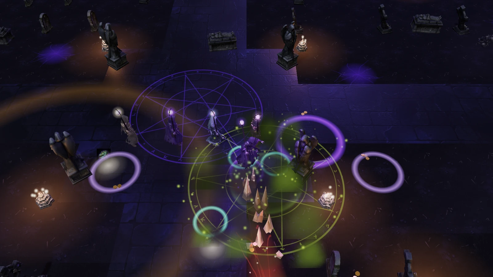

The Ossuary Covenant stands in a diocese overrun by the dead. Choose one of nine disciplines, gather and craft in the safety of the Sexton's Acre, then fight through connected hunting grounds. Build your character, open the sealed passages, defeat the Bell-Sworn Prelate, and Ascend for permanent boons and a harder, more rewarding world.

**Play:** [muffindevelopment.com/death-muffin](https://muffindevelopment.com/death-muffin/). Create an account or sign in, then choose a discipline. You can change class later in **Settings** while keeping the same character's level, gold, items, and permanent progress.

**Release status:** This guide matches the live game as of **4 October 2026** (the *Smoother, Clearer, Deeper* release, see **What's new** below). See the **[visual roadmap](ROADMAP.md)** for what is coming next, and [the handoff](HANDOFF.md) for development status.

## ✨ Highlights

### What's new (4 October 2026: Smoother, Clearer, Deeper)

- **Smoother.** A graphics memory leak that grew with every kill is fixed, thralls no longer stutter while following you, and walking under the arches no longer hitches. See [Smooth play and loading](#smooth-play-and-loading).
- **Better loot.** Stronger affix rolls, far more drops from your own set, better drops the deeper you go, and more runes and legendaries. The **Atlas** shows your real odds, and every list of areas now runs in descent order. See [Getting better gear](#getting-better-gear-upgrade-guide) and [Loot tables and the Gear Atlas](#-loot-tables--gear-atlas).
- **Vows replace the old Ascension grind.** Choose your own curses at the Altar; your rank is the heat you swear, soul shards unlock vows and playstyle boons, and **seals never reset**. See [Ascension](#ascension).
- **Gold sinks.** Reforge an affix at the Workbench, or spend a Covenant Seal to wake an **Empowered boss**. See [Gold sinks](#gold-sinks-reforge-and-empowered-bosses).
- **Loadouts.** Save rites, runes and weapons together and swap with one click, with optional hotkeys. See [Loadouts](#loadouts).
- **Co-op is solo by default.** You only share a world after making or joining a **party code** (Settings → Play together, or `/party`). Partied players can still go down the Depths. See [Playing together](#playing-together-and-getting-help).
- **Cleaner fights.** Other players' spell areas are faint and tinted, lingering areas fade to outlines, and danger warnings always draw on top. See [Combat and corpses](#combat-and-corpses).
- **A tidier HUD.** A Report a bug button above chat, a clearer elixir belt, a key-art loading screen, fewer panels (Acre ledger, Character, Grimoire) and **NEW** markers when something unlocks. See [A HUD that grows with you](#a-hud-that-grows-with-you).
- **Gear that fits.** Helms tint your own hood or helmet, capes no longer clip on death, there is a set summary under the paper doll and a **Hide helms** setting. See [Gear, stats and the character sheet](#gear-stats-and-the-character-sheet).
- **Levels go to 999,** and signing in somewhere new stops the old window saving over you. See [One login at a time](#one-login-at-a-time).

### Gallery

Some of the most polished corners of the game right now (updated 4 October 2026):

<table><tr>
<td width="50%">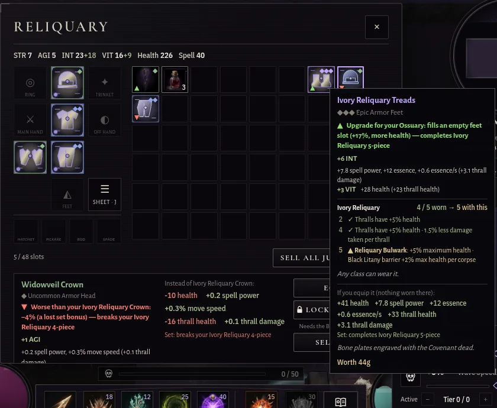 <b>Gear you can read.</b> Green ▲ / red ▼ on every bag item, a verdict for <i>your</i> discipline, and armor set bonuses that light up as you complete them.</td>
<td width="50%">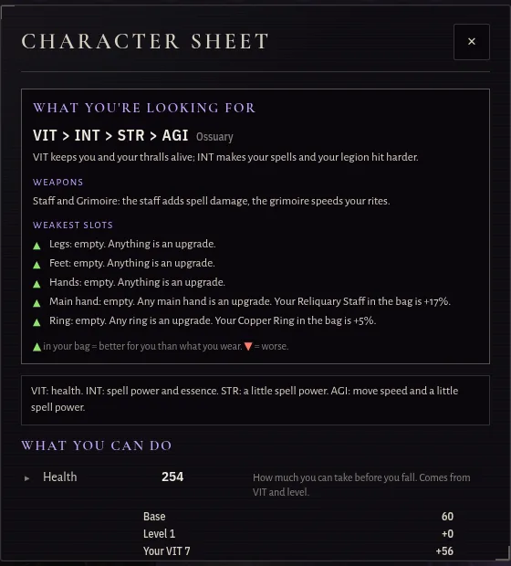 <b>Character sheet (J).</b> What your discipline wants, your weakest slots, and where every number comes from.</td>
</tr><tr>
<td>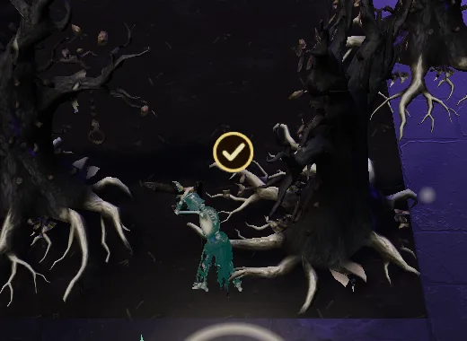 <b>Grave Laborers at work.</b> Your thralls chop, mine, dig and fish in the Sexton's Acre.</td>
<td>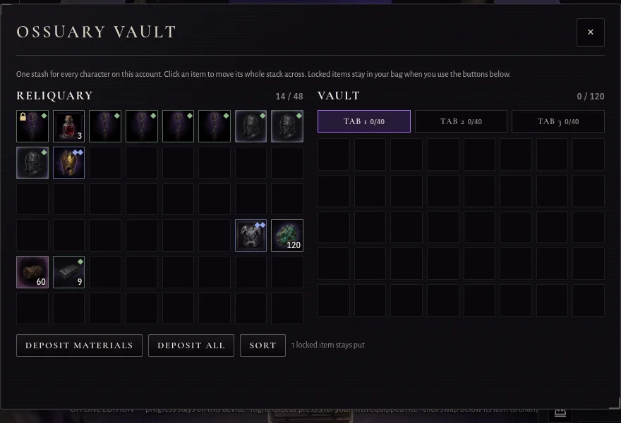 <b>Room to breathe.</b> A 48-slot bag and the 120-slot Ossuary Vault shared by your characters.</td>
</tr><tr>
<td>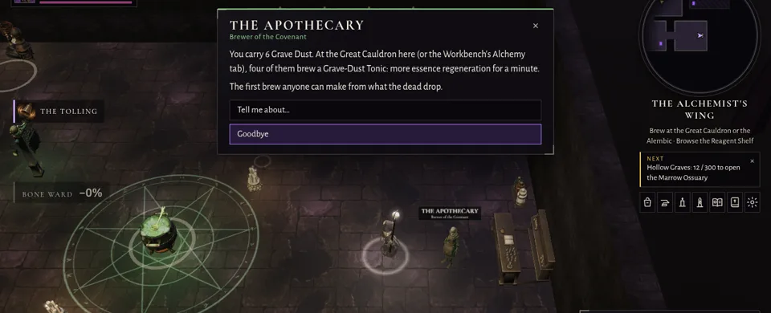 <b>The Alchemist's Wing.</b> A room for brewing, the Great Cauldron and the Apothecary, who tells you what your reagents make.</td>
<td>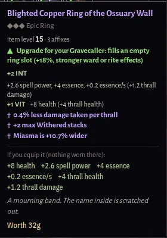 <b>Rolled loot.</b> Item levels and affixes rolled on the server; necromancer affixes marked †, verdicts in plain words.</td>
</tr><tr>
<td>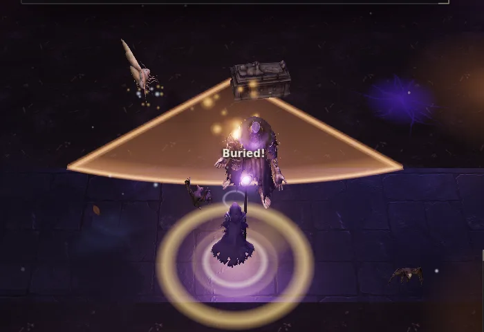 <b>Readable boss telegraphs.</b> Cones and lines are outlined and bright, so you always know where not to stand.</td>
<td>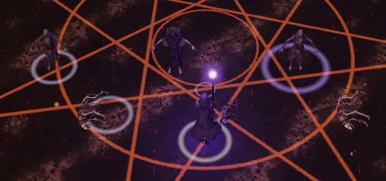 <b>Corpses you can find.</b> Every fresh body gets a faint ring, so a necromancer never loses track of their next thrall.</td>
</tr><tr>
<td>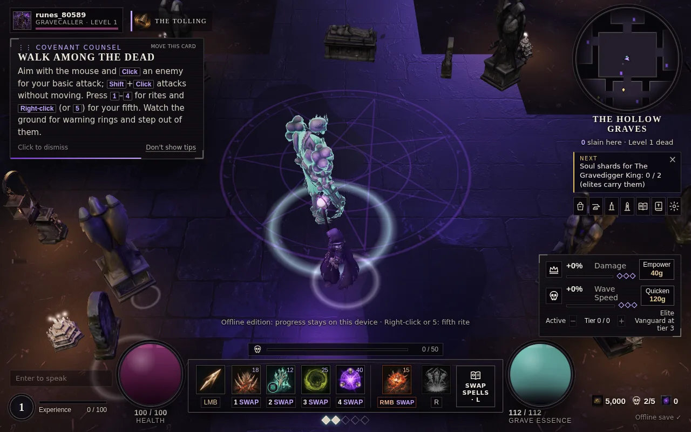 <b>Relic runes: the Bone Colossus.</b> Socket it into Exhume and five corpses become one jade-lit giant.</td>
<td>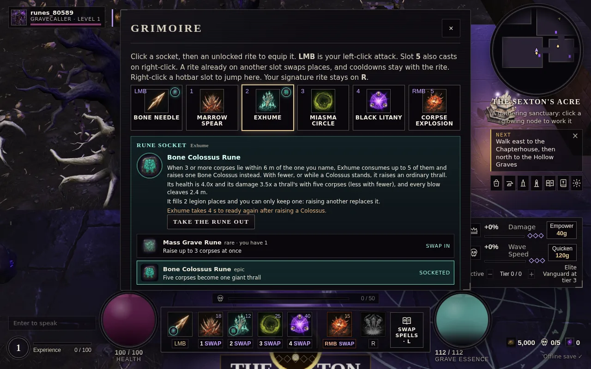 <b>Runes that change the spell.</b> Eleven necromancer runes, one per rite; the Grimoire says exactly what each one does.</td>
</tr><tr>
<td>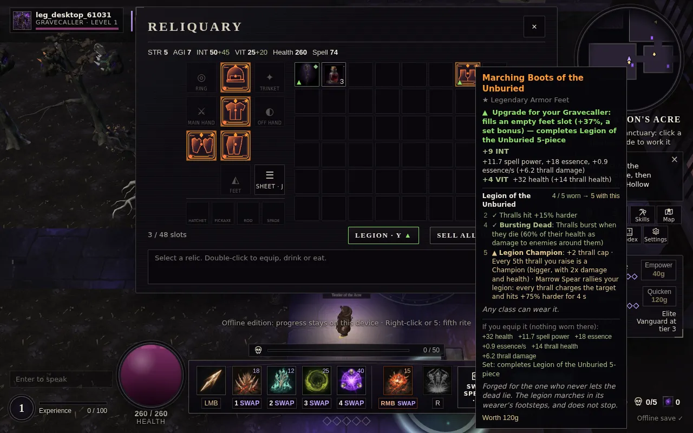 <b>Legendary armor sets.</b> One five-piece chase set per necromancer discipline; four pieces change a mechanic, five define the build.</td>
<td>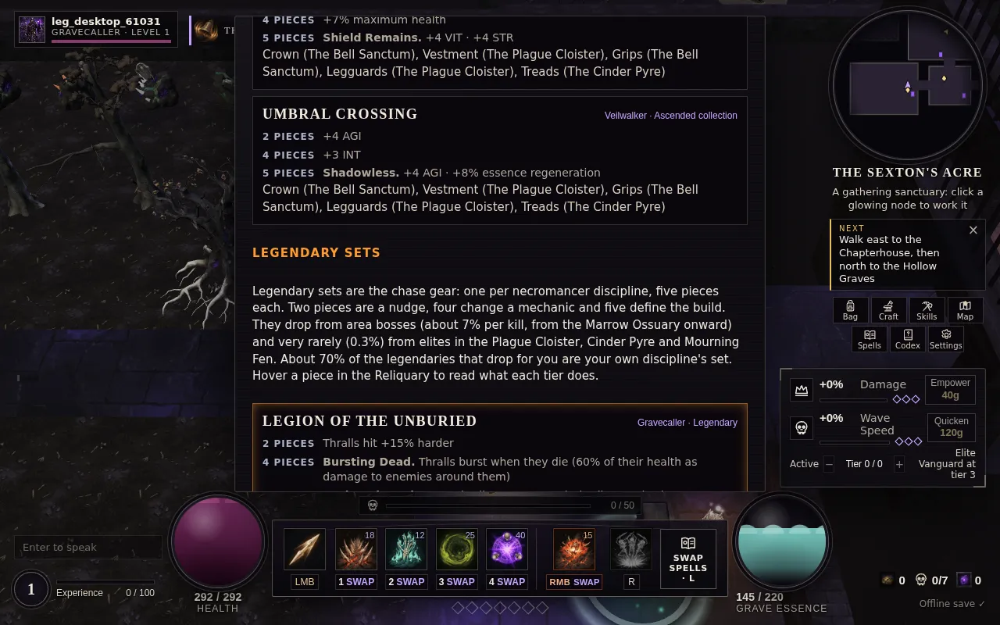 <b>Told plainly.</b> Every tier is spelled out in the tooltip and the Codex, including where each set drops.</td>
</tr><tr>
<td>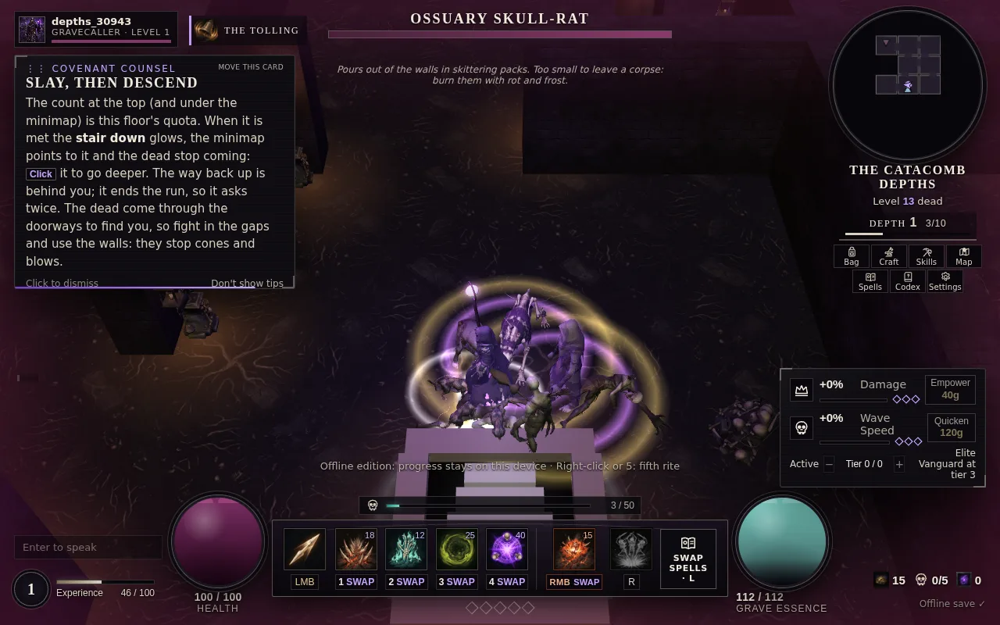 <b>The Catacomb Depths.</b> An endless descent from the Warren's west chamber: slay a floor's quota, the stair opens, and the dead grow one level older.</td>
<td>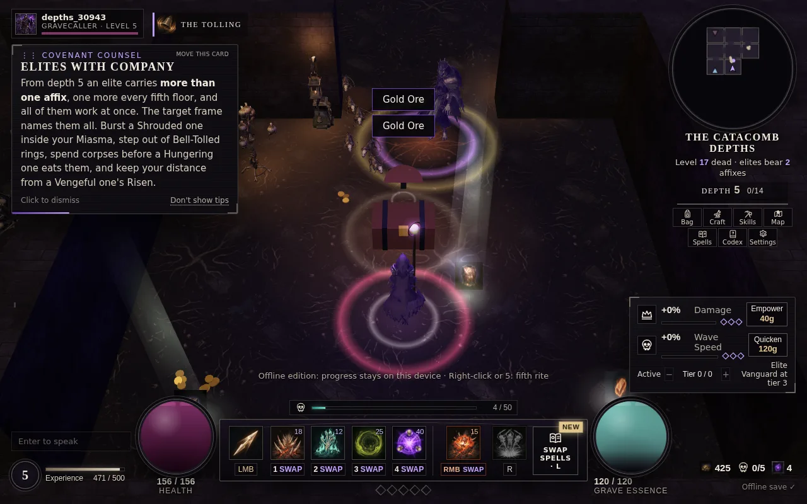 <b>A chest every fifth floor.</b> Gear, finds and now and then a Relic rune, and elites with one more affix each time.</td>
</tr></table>

## Contents

- [Highlights and what's new](#-highlights)
- [Your first hour](#your-first-hour)
- [What to explore next](#what-to-explore-next)
- [Finding your way](#finding-your-way)
- [Controls](#controls)
  - [A HUD that grows with you](#a-hud-that-grows-with-you)
  - [Smooth play and loading](#smooth-play-and-loading)
  - [Phones and tablets](#phones-and-tablets)
- [Choose a discipline](#choose-a-discipline)
- [Combat and corpses](#combat-and-corpses)
- [Relic runes](#relic-runes)
- [Loadouts](#loadouts)
- [The world and its bosses](#the-world-and-its-bosses)
- [The Catacomb Depths](#the-catacomb-depths)
- [Gold, gear, and difficulty](#gold-gear-and-difficulty)
  - [Gold sinks: Reforge and Empowered bosses](#gold-sinks-reforge-and-empowered-bosses)
- [Gear, stats and the character sheet](#gear-stats-and-the-character-sheet)
- [Getting better gear (upgrade guide)](#getting-better-gear-upgrade-guide)
- [Loot tables and the Gear Atlas](#-loot-tables--gear-atlas)
- [Gathering and crafting](#gathering-and-crafting)
- [Ascension](#ascension)
- [Playing together and getting help](#playing-together-and-getting-help)
  - [One login at a time](#one-login-at-a-time)
- [Offline play status](#offline-play-status)

## Your first hour

Nothing in the first hour is a quest, and nothing can be failed or missed. This is the route most players take, and what the game says along the way. Skip any of it, in any order.

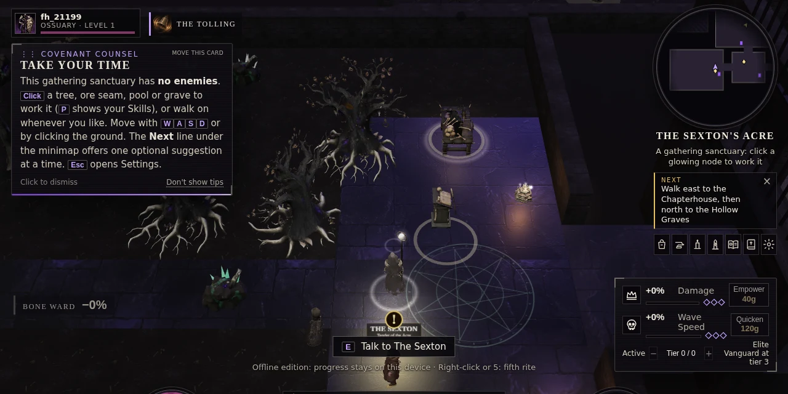

1. **Minutes 0-2: the Sexton's Acre.** You start in a safe gathering yard with no enemies. One Covenant counsel card ("Take your time") explains the controls, and the **Next** line under the minimap offers a single optional suggestion: *Walk east to the Chapterhouse, then north to the Hollow Graves*. The Sexton (a gold **!** over his head; click him or press **E**) explains gathering, Grave Laborers and the daily Contracts when you ask. To begin a skill, click a Coffin-Oak, Copper or Tin Seam, Still Pool or Pauper's Grave; **P** shows your skills. You can leave gathering for later.
2. **Minutes 2-3: the Chapterhouse.** East of the Acre, a safe hub with the Reliquary for your bag, the Workbench for smelting and tools, the Altar of Ascension, a Waystone and the Prior, who points the way when asked. The east door leads to the **Alchemist's Wing**, where the Apothecary brews. **T** channels a return here whenever you want a break.
3. **Minutes 3-15: the Hollow Graves.** Go north through the Chapterhouse. Move with **WASD** or by clicking the ground, click an enemy for your basic attack, and use **1-4** and **Right-click** for rites. The first dead you meet bring one short fight card ("Walk among the dead"), and the first corpse brings the necromancer's main lesson: **Exhume** raises it as a thrall. A card about one kind of enemy appears the first time you see it, and **Hurt?** appears when your health drops below half. The first levels come quickly (level 4 after a couple of minutes of fighting in our test runs), and each level can unlock a new rite for the **Grimoire (L)**.
4. **Minutes 5-20: loot and the first seal.** Loot goes to the **Reliquary (I)**, a 48-slot bag. A green **▲** on a bag item means it beats what you wear; under the paper doll a **set summary** shows the pieces you wear of a set, the bonus tiers that are on and what the next one needs; **J** is the Character sheet. When the bag fills, **Sell all junk**, the **Vault (V)** and the **Bone Grinder** make room. The count under the minimap (and the Next line) tracks your first seal: 300 kills in the Graves open the **Marrow Ossuary**, whose dead are tougher and whose loot is better. Elites carry **soul shards**; two wake the Gravedigger King.
5. **Whenever you like: brewing.** The dead drop **Grave Dust**; four brew a first tonic at the Great Cauldron in the Alchemist's Wing. The Apothecary tells you what to brew and where each reagent falls.
6. **Read what you meet.** Hover a rite for its cost and targeting advice, and open the **Codex (K)** for enemies, rites and professions.

**How the guidance behaves.** It never blocks you and never repeats itself: one Covenant counsel card at a time; a card that only explains a quiet idea waits until a fight is over, no conversation is open and no panel is up; a card about something you just did (opening the Vault, placing a rite on a key) appears at once; the **Hurt?** card jumps the queue; and a card about a place waits until you are there. The Next line and the area text under the minimap never say the same thing. Drag a card by its header to move it. Every card stays reachable through **Settings → Show tips again** and the **Codex (K)**.

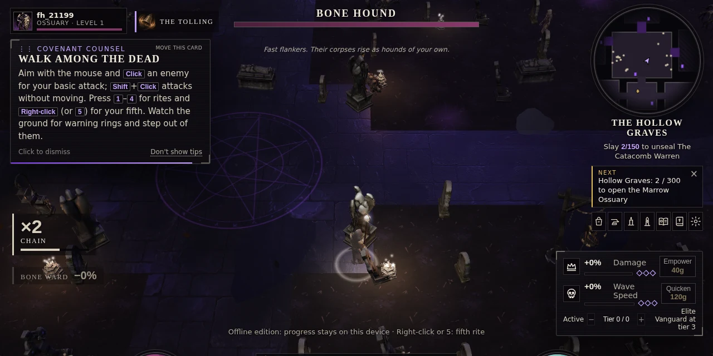

**Medium** is the default difficulty for each character. The Brbmuffins developer account can use auto combat on **Easy**; it turns on when switching to Easy unless turned off. **G** toggles it; clicking or moving takes manual control. Auto combat also **steps out of boss telegraphs** (rings, cones such as the Flood Hymn, the Abbess's spokes, the Regent's burning arena unless an ash circle is near) and out of hostile ground pools, by the nearest safe spot, then goes back to attacking; it still never walks up to a boss for you and never casts Veil Step. Auto gathering and AFK professions remain available to every player.

## What to explore next

| If you enjoy… | Try this |
|---|---|
| A new fight | Follow the main route through the Plague Cloister to the **Cinder Pyre**. Fire enemies leave burning ground; the Cinder Regent's ash circles are safe during Conflagration. After 800 Pyre kills, enter the **Mourning Fen** from the Drowned Nave's west wall and fight the Mire Mother from the dry hummocks. |
| Finding a build | Collect a five-piece armor set for any discipline. Necromancers can also try a staff, scythe, wand or ritual sickle: each changes the basic attack. Equip a skull focus, grimoire or mourning bell in the off-hand if your weapon leaves that hand free. |
| Gathering and brewing | Dead in the Hollow Graves drop **Grave Dust**. Four dust make a **Grave-Dust Tonic** at the Great Cauldron in the Alchemist's Wing, with no garden required. Forage Rot-cap in the Cloister, Ash-bloom in the Pyre, and bog myrtle or drowned lotus in the Fen for later recipes. |
| A longer goal | Fill Sexton's Contracts, grow herbs in the Acre, send Grave Laborers to work, and unlock capes and companions as your skills rise. The **Codex (K)** lists enemies, weapons, brews, reagents and professions. |

The landing page previews the fire realm and its enemies with a lightweight purple fire glow and drifting embers. **Settings → Reduced motion** tones down effects in game if you prefer a quieter screen.

## Finding your way

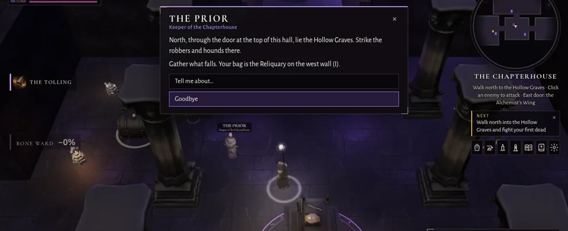

Nothing in Death Muffin is a quest, and nothing can be failed or missed. If you would like a nudge, the game gives you three ways to ask for one.

| Who or what | Where | What it tells you |
|---|---|---|
| **The Prior** | The Chapterhouse, near the Altar | Where to hunt next, how the seals and the kings of the dead work, and when the Altar of Ascension is ready. |
| **The Sexton** | The Sexton's Acre, near the Covenant Lectern | Gathering, your Grave Laborers, the Bone Grinder and the Vault, and the day's Contracts. |
| **The Apothecary** | The Alchemist's Wing, at her counter (through the Chapterhouse's east door) | What to brew, where each reagent falls, and how elixirs and tonics work. |
| **The Next line** | Under the minimap | One short suggestion from the same advice, such as *Ossuary seal: 172/300 kills* (every seal count reads this way, naming the door it opens: *Warren seal: 0/150 kills*), *Your laborers are ready in the Acre* or *The Gravedigger King waits at the King's Grave, 2 soul shards*. A gold marker or arrow on the minimap points the way. |

**Talking.** Click a person, or stand close and press **E**. They turn to face you, and a gold **!** over their head means they have something new to say (a seal you have broken, a king you have buried, a full bag, laborers waiting). Every conversation has three or four buttons: *Where should I go next?*, *Tell me about...* and *Goodbye*. Their answers use your real numbers: your level, your kill counts, your shards, your bag. The camera eases north while a conversation card is open, so you and the speaker stay in view below it. Press **Esc**, press **E** again, or walk away to end a conversation.

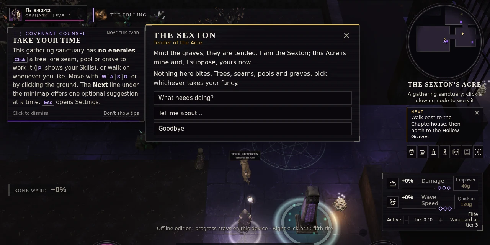

**The Next line.** It updates as you play and shows only the single best suggestion. Press its **x** to hide the current one; a different suggestion will appear when your situation changes. **Settings** can turn the line off, and turn the minimap marker off separately. The **Codex (K)** has a **People** tab listing who stands where and what to ask them. What you have heard is remembered per character in this browser.

## Controls

| Input | Action |
|---|---|
| **WASD** or arrow keys | Walk directly; a held key takes over from click-to-move |
| Left click ground / enemy / object | Set a walking destination, use your basic attack, interact, or gather |
| Shift + left click | Use your basic attack without moving |
| Click the minimap | Walk to a reachable point; the amber marker is your destination |
| Mouse / wheel | Aim / zoom |
| **1–5** | Use your equipped rites at the cursor; hold to repeat when ready |
| Right click | Also uses your fifth equipped rite, which you can change in the Grimoire |
| **R** or **6** | Use your class's signature rite after level 10 |
| **Q** | Drink a healing flask |
| **Z** / **X** | Drink the elixir / tonic on your belt (**F** is reserved for throwables); these are your elixir belt, not the tool belt |
| **T** | Recall to the Chapterhouse |
| **Loadout keys** | Unbound by default: **Settings → Controls** lists **Next loadout** and **Loadout 1** to **6** (see [Loadouts](#loadouts)) |
| **L** | Open the Grimoire to inspect rites and set all five slots (necromancers get a **Legion** tab beside it) |
| **I** or **B** / **C** | Reliquary / Workbench |
| **P** (also **U** / **H** / **O**) | **Acre ledger**: one window with tabs for Skills and AFK gathering, Grave Gardening, Grave Laborers and Sexton’s Contracts. The old keys U, H and O open the matching tab. |
| **J** (also **N**) | Character window: your numbers and where each comes from, plus a **Capes & Pets** tab (N opens it) |
| **Y** | Legion tab beside the Grimoire (necromancers): spare weapon and armour for your thralls, and Reinforce |
| **M** / **K** | Waystone map / Codex |
| **.** (period) | Gear Atlas: where every piece drops and how often, how to craft it, and what suits your discipline (also **Atlas** in the Menu) |
| **E** | Talk to the Prior, the Sexton or the Apothecary when you stand beside them |
| **V** | Ossuary Vault, the shared stash (in the Chapterhouse or the Acre) |
| **G** | Toggle auto combat on Easy (Brbmuffins developer account) |
| **Enter** | Chat |
| **Esc** | Close an open panel, then open Settings |

You can also click hotbar icons. Once you have learned a second rite (a few levels in), small swap arrows appear under each spell icon: click them to open the Grimoire with that slot selected; right click a hotbar slot also works. In **Settings**, you can change class, difficulty, graphics, frame rate (**Max**, 60 or 30 fps), **Auto resolution**, volume (Master, plus separate **Combat**, **Ambience** and **Interface** sliders), reduced motion, damage numbers, **Hide helms** (draw heroes without their helm look), gathering behavior, counsel tips, and the Next suggestion with its minimap marker. **Music**: five original instrumental themes follow you through the world (the Chapterhouse; the Graves and the open grounds; the Ossuary and the deep halls; the Cinder Pyre; and a boss cue while an area boss is active in your area). They crossfade when you move, sit lower during fights, and have their own **Music** slider in Settings. Rain falls (audio only) in the Graves, Cloister and Fen, and fire roars at the Pyre and in the Alchemist's Wing.

### A HUD that grows with you

The screen starts small and shows things as they start to matter. A fresh character sees no Upgrades box (Empower / Quicken / the wave dial) until the first gold drops in a hunting ground, no Omen chip in the safe rooms (the Chapterhouse, the Acre, the Alchemist's Wing), no Soul Shards counter until a shard drops, and no Spells, Acre or Atlas button in the Menu until you learn a second rite, start gathering or find your first gear piece. The first time something appears it glows with a small gold **NEW** tag and a single line in the toast area says what it is and which key opens it; the tag clears when you hover or open it, and once revealed it stays. Characters that already have the progress simply keep their HUD. The keys always work, even before the button shows.

Panels are merged to keep the key list short: **P** opens the **Acre ledger** (tabs: Skills, Garden **U**, Laborers **H**, Contracts **O**), **J** opens the **Character** window (tabs: Stats, Capes & Pets **N**) and **L** opens the **Grimoire** (necromancers get a **Legion** tab, **Y**). The old keys U, H, O, N and Y still open the right tab.

### Smooth play and loading

- **One load screen.** The game loads and warms everything once at login; walking through doors and teleports never shows another load screen.
- **Frame rate and resolution.** In **Settings**, **Frame rate** can be **Max** (no cap, the default on a computer until you choose), 60 or 30 fps. **Auto resolution** lowers the picture's resolution only when the machine keeps missing its frame rate; turn it off for a constant sharp picture.
- **Belt.** A labelled **Belt** at the left edge always shows three slots: **Q** Heal, **Z** Elixir, **X** Tonic. Healing flasks fill Heal by themselves. **Click an empty Elixir or Tonic slot** to pick a brew from your bag, or drag a brew from the Reliquary onto it (the **Put on belt** button on a brew works too). Hover any slot for the item, its effect and its key.
- **Co-op and updates.** If the connection drops, the game retries on its own and returns you to the same world. When a new release goes live it saves, waits for any boss fight to end, and reloads you in.
- **Computer first.** This is the PC build; phones and tablets go to [their own build](#phones-and-tablets).

### Phones and tablets

This is the PC build. Phones and tablets play at **[muffindevelopment.com/death-muffin/mobile/](https://muffindevelopment.com/death-muffin/mobile/)** (same accounts and characters), and opening the PC address on a touch-only device sends you there.

## Choose a discipline

Every class has a basic attack, five swappable rites on **1–5** (slot 5 also uses right click), and a signature on **R** at level 10. The four necromancers share a larger pool of rites and can choose any five unlocked rites in the Grimoire as they level. The other five classes have their own resource and five rites to rearrange.

| Portrait | Discipline | Resource and style |
|---|---|---|
| 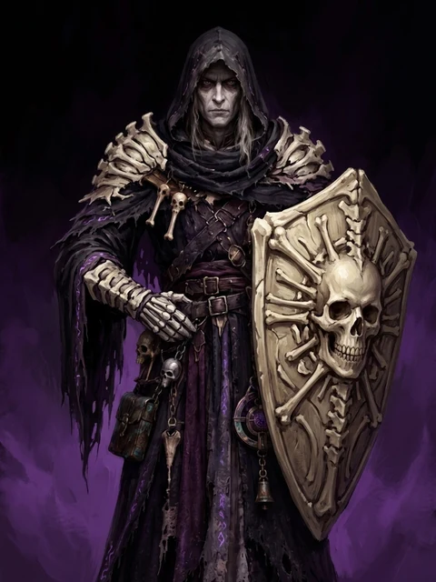 | **Ossuary** | Grave Essence. Defensive necromancer: shield-bearing thralls draw attacks, and each active thrall reduces the damage you take. |
| 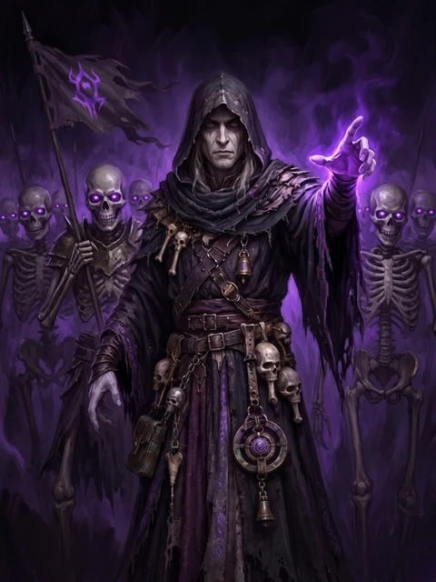 | **Gravecaller** | Grave Essence. Leads the largest, fastest-attacking legion; sacrifices leave corpses to raise again. |
| 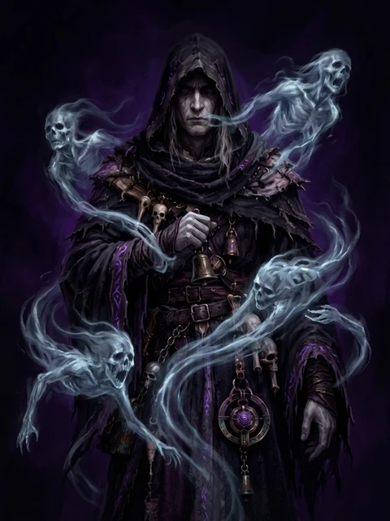 | **Mourner** | Grave Essence. Ranged wraiths, faster essence recovery, and healing when consuming corpses. |
| 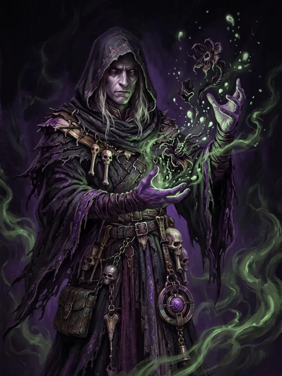 | **Rotweaver** | Grave Essence. Larger Miasma, more Withered stacks, and corpses that burst inside its rot field. |
| 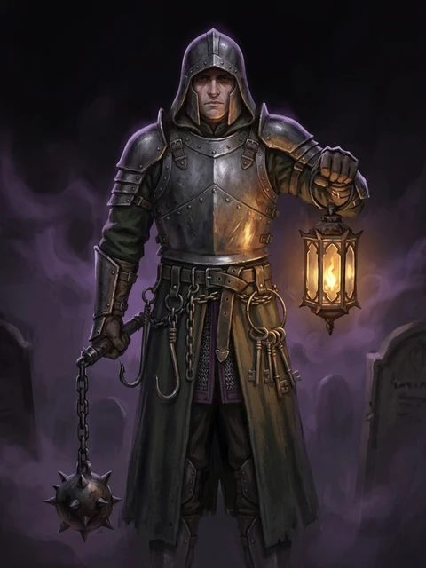 | **Grave Warden** | Oil refills over time and from burning bodies. A flail, lantern, chain, and protective wards support close fighting and allies. |
| 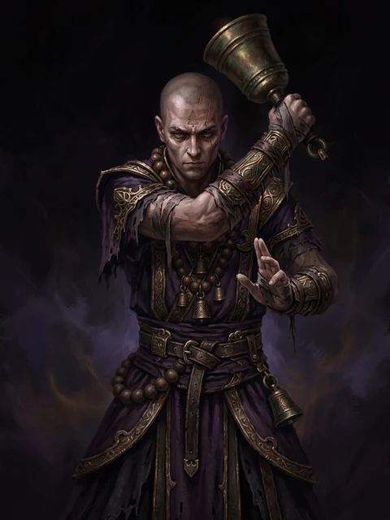 | **Bell Monk** | Build Resonance by landing hits, especially on the beat. Toll and corpse-sounding rites reward timing. |
| 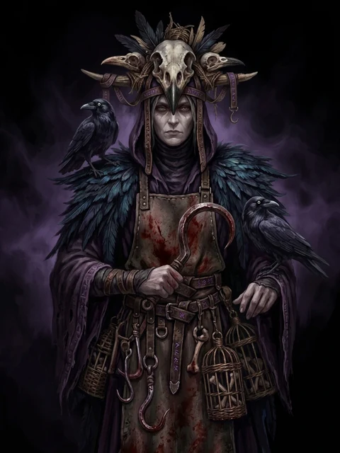 | **Carrion Witch** | Harvest bodies for Offal; use hooks, crows, and hexes to control a pack. Offal does not refill on its own. |
| 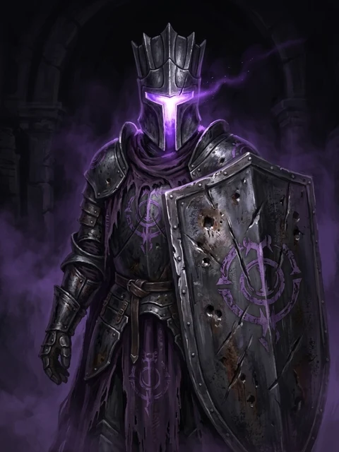 | **Hollow Knight** | Build Rage by fighting and taking hits, especially with a well-timed block; spend it on a leap and slam. |
| 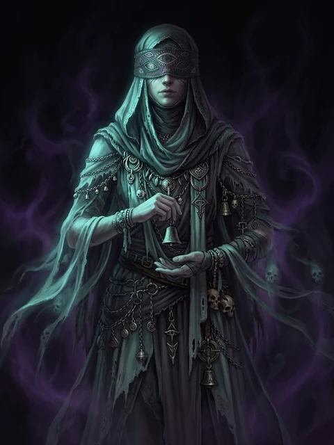 | **Veilwalker** | Veil refills in Life form and drains in Veil form. Move between forms and make temporary spectral allies from fallen enemies. |

**Fighting without a legion.** The five classes above that raise no thralls (Grave Warden, Bell Monk, Carrion Witch, Hollow Knight, Veilwalker) hit 1.5x harder than their spell power alone would give, and they earn extra experience while young: 2x at level 1, easing down to normal at level 15.

**New player picks:** the picker marks **Gravecaller** *Recommended for your first run* (the largest legion and the simplest loop; it appears only when you have no character yet, and every discipline is still one click away). Ossuary gives you a sturdy front line; Mourner has forgiving sustain; Hollow Knight suits players who want to stand close and time blocks. Any discipline can change later through Settings.

At **level 10**, each discipline unlocks its own signature rite on **R**:

| Discipline | Signature | What it brings |
|---|---|---|
| Ossuary | 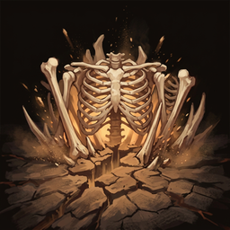 **Ossuary Wall** | Blocks the dead with a wall of bone. |
| Gravecaller | 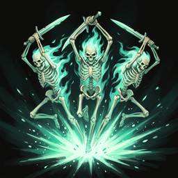 **Command: Rend** | Sends the legion leaping into a target area. |
| Mourner | 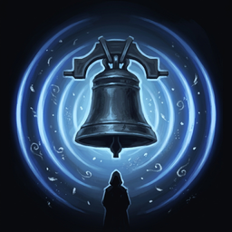 **Dirge** | Mends allies and silences enemy casters nearby. |
| Rotweaver | 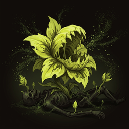 **Plague Bloom** | Starts a rot bloom that spreads through corpses. |
| Grave Warden | 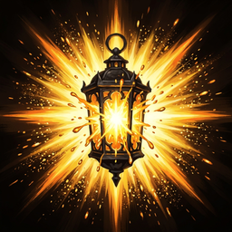 **Last Light** | Stuns nearby enemies and heals allies. |
| Bell Monk | 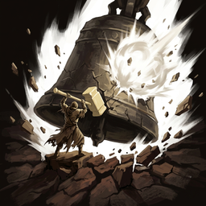 **Great Toll** | Spends Resonance on a damaging, silencing toll. |
| Carrion Witch | 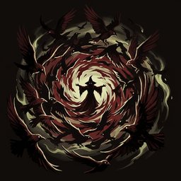 **Murder of Crows** | Sends a moving swarm after enemies. |
| Hollow Knight | 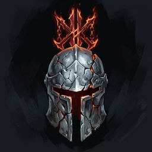 **Oath Unbroken** | Briefly refuses death and increases damage. |
| Veilwalker | 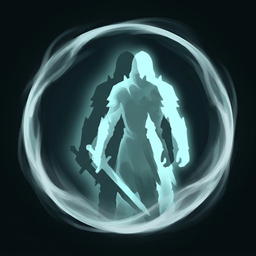 **Between Worlds** | Gains Veil protection with Life-form damage. |

## Combat and corpses

The necromancers begin with this kit. The icons are the same ones used on the hotbar:

| Icon | Input | Rite | Use |
|---|---|---|---|
| 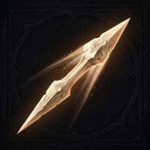 | Left click | **Bone Needle** | Free basic attack; hits restore Grave Essence. |
| 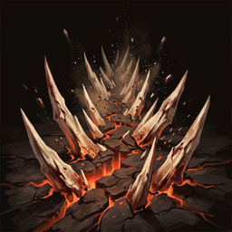 | **1** | **Marrow Spear** | Pierces a line and applies Fracture, making targets take more damage. |
| 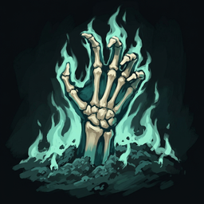 | **2** | **Exhume** | Raises the corpse nearest your cursor as a fighting thrall. |
| 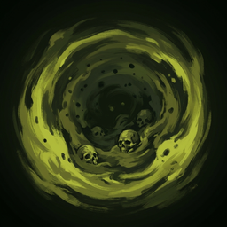 | **3** | **Miasma Circle** | Slows and withers enemies standing in the field. |
| 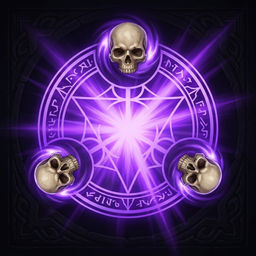 | **4** | **Black Litany** | Sacrifices nearby corpses and thralls for a stronger burst. |
| 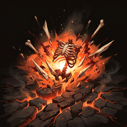 | Right click / **5** | **Corpse Explosion** | Detonates a corpse near the cursor under a pack. |

Your **Grimoire (L)** shows unlock levels, costs, cooldowns, and available alternatives. Click the swap arrows below a hotbar spell (shown once you can swap anything) to jump to its socket, then choose an unlocked rite. Necromancers gain new primaries and rites while leveling; put any five unlocked class rites on **1–5**, including right click. Swapping slots does not clear a rite's cooldown. Your loadout is remembered for your character. Other classes can inspect and rearrange their five starting rites.

A corpse is an opportunity, but it will not last forever. Necromancers can raise it, explode it, or save it for Black Litany. The kind of corpse affects the thrall: a Penitent becomes an archer, a Deacon a bone mage, and a Carrion Sac a plague bearer. The other classes have their own corpse rites. **Crypt Deacons** can steal unattended bodies and raise enemies from them, so deal with a Deacon before letting corpses pile up.

Necromancers also fill a **Soul Harvest** meter through kills by themselves or their thralls. When it fills, the next Marrow Spear, Miasma Circle, or Black Litany costs no essence and covers a larger area. Watch the skull meter above the hotbar for the ready state.

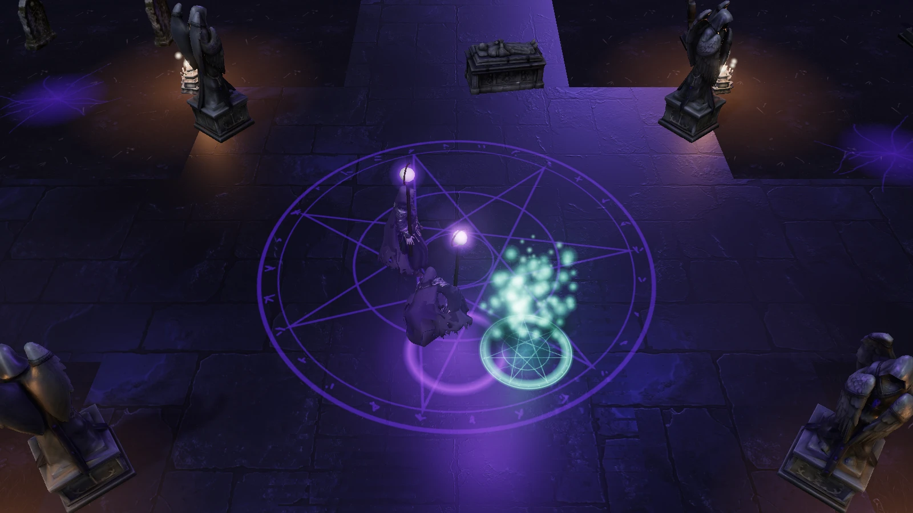

**Practical combat habits:**

- Keep using your basic attack between costly rites. For necromancers, Bone Needle restores the essence you spend.
- Put Fracture on a tough target before a large burst. Pull a pack into Miasma or another area effect, then use corpses when the enemies are close.
- Read an elite's tag in the target frame. Soul shards come from elites and pay for boss summons.
- Step out of marked ground before it resolves. A warning ring, cone or line shows exactly where the blow will land (it fills in the time the blow takes, elites included): if your feet are outside the red when it fills, it misses you. Use **Q** for a flask, **T** to recall, or reduce the Wave Speed dial when fights get too dense.
- Death returns you to the Chapterhouse without taking your level, gold, or gear.

## Relic runes

Runes are the build-depth layer for the four necromancer disciplines. A rune does not make a rite hit harder; it changes **what the rite does**, and most trade something for it. Each of the five necromancer rites (**Bone Needle, Marrow Spear, Exhume, Miasma Circle, Black Litany**) has **one socket**, and a rune fits only the rite it was made for.

**Getting and using them.** The sockets are already yours (one per rite, from the start): what you hunt for is the runes. They drop from **elites** (5% of elite kills in the Hollow Graves, one point more per rung of the descent, 12% in the Mourning Fen), from **Grave Surge** offerings (35% of them), from **bosses**: the Prelate and the *first* kill of every other boss always leave one, repeat kills half the time, and from **Catacomb Depths chests** (a quarter of the fifth-floor chests, rising to 70%). The Grimoire's rune box, the Gear Atlas and a Covenant counsel tip all say so. The first hunting grounds shed only uncommon runes; rare ones start in the Marrow Ossuary and epic ones in the Bell Sanctum. They stack in the Reliquary, rest in the Ossuary Vault, sell for gold and can be ground at the Bone Grinder (one at a time, into reagents only). Select one in the Reliquary and its detail strip says exactly what it changes, what it costs and where it drops; **Socket into ...** moves one into its rite. The **Grimoire (L)** shows a socket under the bar for whichever rite you select: click a rune to set it, **Take the rune out** to free it (or set another and the old one returns to your bag; nothing is ever lost). A jade badge on the hotbar slot shows a rite wearing a rune, and hovering the slot lists the change. The **Codex's Relic Runes tab** lists all eleven.

| Rite | Rune | What it does | What it costs |
|---|---|---|---|
| Bone Needle | **Splinters** | A hit splinters to the nearest other enemy within 6 m for 30% of the damage | none |
| | **Marrow-Tap** | Each hit returns 4 more Grave Essence (10) | needles hit for 30% less |
| | **Volley** | Every 4th needle is three, aimed at three different enemies within 9 m (all at one if it stands alone) | each volley needle hits for 40%; the three together return one needle's essence |
| Marrow Spear | **Ossuary Ring** | Bone erupts in a 3 m ring on the cursor instead of a line | it strikes for 80% and no longer reaches down a line |
| | **Impaling** | The spear stops at the first enemy, hits it for 50% more and roots it for 1.5 s (a boss takes the hit but shrugs off the root) | it no longer pierces the line behind |
| Exhume | **Mass Grave** | Raises up to 3 corpses near the cursor at once | each thrall has 75% health and damage (a lone corpse is raised at full strength) |
| | **Bone Colossus** | With 3 or more corpses within 6 m of the one you name, consumes up to 5 and raises **one giant thrall**: 4x the health and 3.5x the damage of a thrall at five corpses (less with fewer), every blow cleaving 2.4 m; fills 2 legion places; you keep one | Exhume takes 4 s to ready after raising it; with fewer corpses, or while a Colossus stands, Exhume raises an ordinary thrall |
| Miasma Circle | **Creeping Rot** | The circle drifts 1.5 m/s toward the nearest enemy | 15% narrower |
| | **Contagion** | A Withered enemy that dies spreads its stacks (minus one) to the 2 nearest within 4.5 m; they spread it again | none |
| Black Litany | **Hollow Choir** | Nothing is sacrificed: your thralls sing and stay (they still add to the burst) | the burst hits for 40% less |
| | **Requiem** | The ground is marked; the burst lands 2 s later over 1.7x the radius, taking the corpses and thralls then | enemies can walk out of it, and it can take more of your thralls |

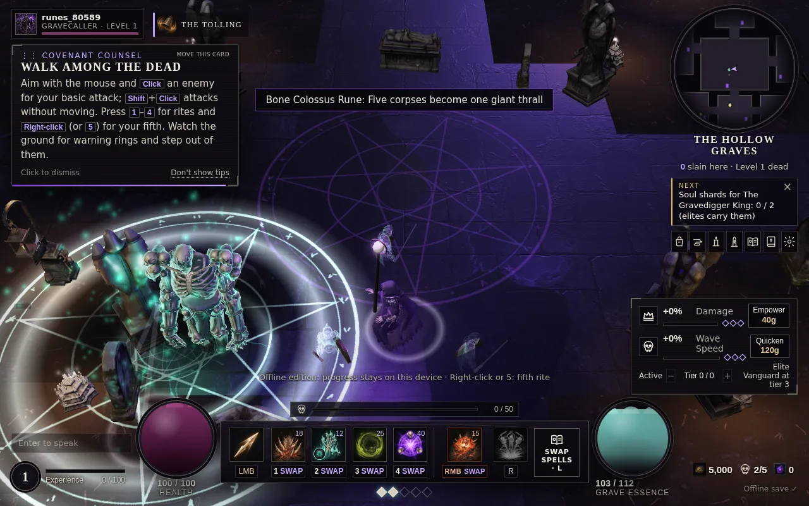 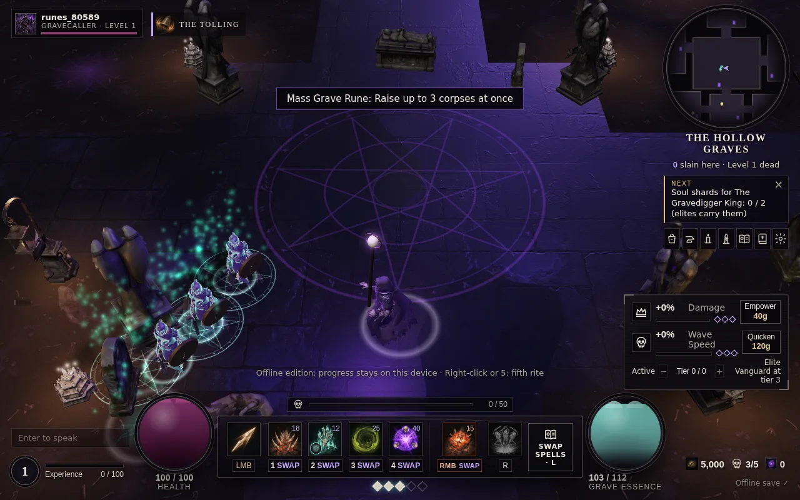 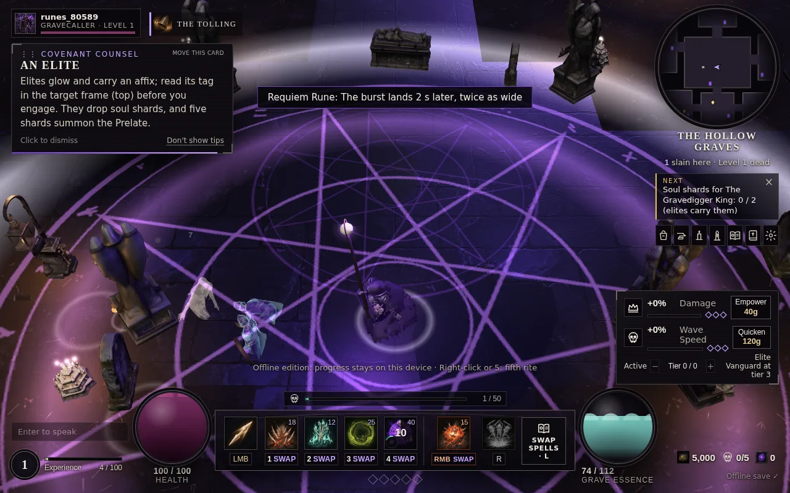

The Bone Colossus rising from five corpses, Mass Grave's three weaker thralls, and Requiem's warning sigil.

Bone Needle runes also ride a scythe's reaping arc, once per swing (not once per enemy hit): **Marrow-Tap** softens the swing and returns its bonus essence once, **Splinters** throws one shard from the nearest enemy struck to the nearest one the arc missed; the **Volley** is needle-only. In co-op a rune changes your own casts: your friends see the effect (the creeping circle, the Colossus, the Requiem warning ring, the contagion arcs) but not your badges.

## Loadouts

Twenty-odd rites, eleven runes and four weapon lines make swapping builds by hand a chore, so the necromancer disciplines can **save a loadout**: the primary and the five rites on keys 1-5, the **rune socketed in each rite**, and the **weapon and off-hand** you wear, under one name. Open the **Grimoire (L)**, set things up and press **Save what I have now** under the bar. You can keep **six per character**, stored on the server so they follow the character to any device.

**Apply** puts one on in a click: the weapon and off-hand are swapped in from your bag, each rune moves into its rite (the old one goes back to your bag), and the rites are placed. The loadout you are wearing is marked **on now**; **Update** overwrites one with what you have on, **Rename** and **Delete** do what they say. Nothing is lost: a weapon or rune you no longer have (sold, ground, resting in the Vault) is left out and named, a rite you have not learned yet is replaced by another, and a swap that needs a free bag slot you do not have is refused while the rest still applies. A hand the loadout was saved with nothing in is left as it is (the card says "keep current"). **Hotkeys:** Settings → Controls lists **Next loadout** and **Loadout 1** to **6**, all unbound until you pick a key (click the action, press a key; Esc clears it). Keys the game already uses are refused, and a bound key shows on its loadout card.

## The world and its bosses

The diocese is one connected world. Kill enough enemies in the preceding area to break each seal. The Chapterhouse, the Acre, and the Hollow Graves are open from the start. Waystones can travel among areas you have unlocked.

| Area | Base level | How to open it | What to expect |
|---|---:|---|---|
| **The Chapterhouse** | Safe | Always open | Reliquary, Workbench, Altar, Ossuary Vault, and Waystone. |
| **The Sexton's Acre** | Safe | Always open | Gathering nodes and processing stations; no enemy waves. |
| **The Hollow Graves** | 1 | Always open | Your first waves, corpses, elites, and the Gravedigger King. |
| **The Marrow Ossuary** | 5 | 300 kills in the Graves | Bone-lined halls and Crypt Deacons. |
| **The Drowned Nave** | 9 | 420 kills in the Ossuary | Flooded cathedral and the Drowned Congregation. |
| **The Bell Sanctum** | 13 | 520 kills in the Nave | The Sundered Bell and the Bell-Sworn Prelate. |
| **The Plague Cloister** | 20 minimum | 600 kills in the Sanctum | A scaling hunting ground: its enemies keep pace with the highest-level player inside it. |
| **The Catacomb Warren** | 4 | 150 kills in the Graves | A side dungeon west of the Graves: nine chambers split by tall half-walls. See [Levels to explore](#levels-to-explore). |
| **The Bone Coliseum** | 11 | 350 kills in the Ossuary | A horde pit east of the Ossuary: four gates, fast surges, twice the elites. |
| **The Cinder Pyre** | 30 minimum | 700 kills in the Cloister | A fire realm past the Cloister's east arch, level-scaled the same way. Cinder Husks burst into embers, Pyre Priests hurl coals, Cinderhounds hunt in packs, Slag Brutes slam burning rings: everything here leaves burning ground. |
| **The Mourning Fen** | 45 minimum | 800 kills in the Pyre | A drowned marsh west of the Nave (door on the Nave's west wall), level-scaled. Bog water slows you; dry hummocks do not. Bog Hags hex your thralls, Wisps chill and lure, Leeches swarm, Sextons drag. |

<table><tr>
<td>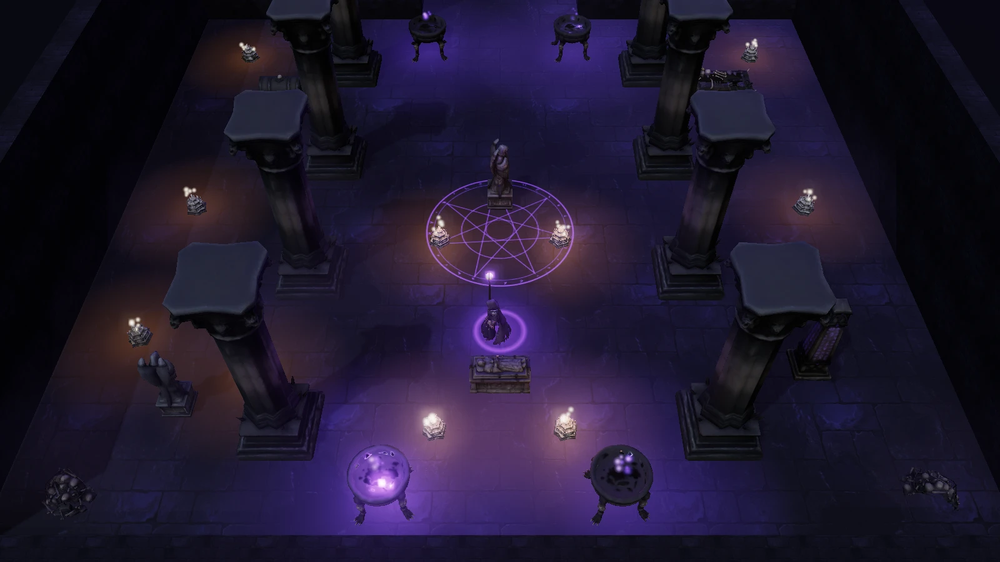 The Chapterhouse</td>
<td>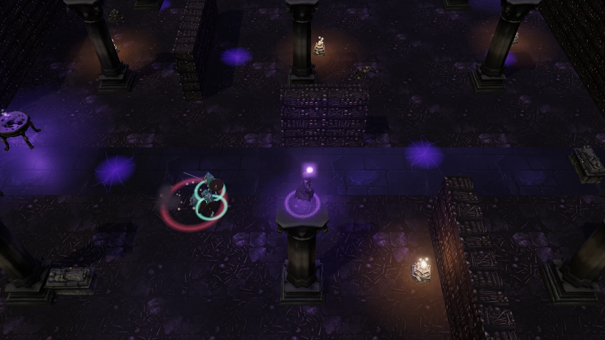 The Marrow Ossuary</td>
<td>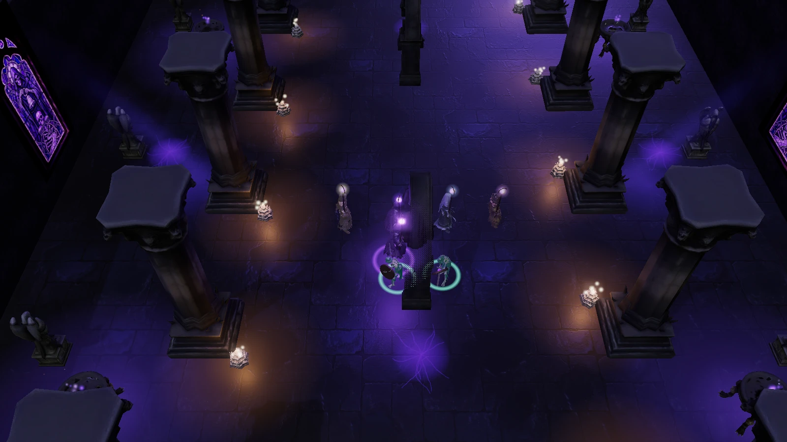 The Drowned Nave</td>
</tr></table>

Every hunting ground has a boss summon object. Bosses cost **soul shards**, and only one can be active in a shared world at a time. Carry a **Covenant Seal** and the altar also offers an **Empowered** summon (a Seal and gold instead of shards): see *Gold sinks* under Gold, gear, and difficulty. Waves in that boss's area pause during the fight. Their first defeat per character awards extra shards, a rare or better relic, and a Codex trophy.

| Boss | Where and cost | Fight clue |
|---|---|---|
| **Gravedigger King** | King's Grave, Hollow Graves · **2 shards** | Leave the marked burial ground before it roots you; watch for pits later in the fight. |
| **Bone Abbess** | Abbess's Reliquary, Marrow Ossuary · **3 shards** | Break the skull niches that heal her; spend corpses before she draws them in. |
| **Drowned Congregation** | Drowned Font, Drowned Nave · **4 shards** | Use pews to block the Flood Hymn and leave grasping rings. |
| **Bell-Sworn Prelate** | Sundered Bell, Bell Sanctum · **5 shards** | Leave the expanding Toll ring, the frontal Slam, and marked Bell Rain circles. Defeating it unlocks Ascension for the run. |
| **Cinder Regent** | Ember Altar, Cinder Pyre · **6 shards** | When Conflagration starts, run to a grey ash circle and stay on it; the rest of the arena burns. Kill the Pyre Priests early so their coals do not cover the ash. His level scales with the Pyre. |
| **Mire Mother** | Mire Altar, Mourning Fen · **7 shards** | She sinks and resurfaces under a ringed hummock: leave it, then hit her while she is winded. Phase 2 floods the marsh; in phase 3 she raises every corpse in the Fen, so spend yours first. Her level scales with the Fen. |
| **Plague Saint** | Saint's Litter, Plague Cloister · **5 shards** | Move her off rot pools, where she heals, and kill the Plague Doctors that feed her through a green link. Her level scales with the Cloister. |

### Levels to explore

Three levels sit off the main road. Each has its own layout and its own reason to go there.

<table><tr>
<td>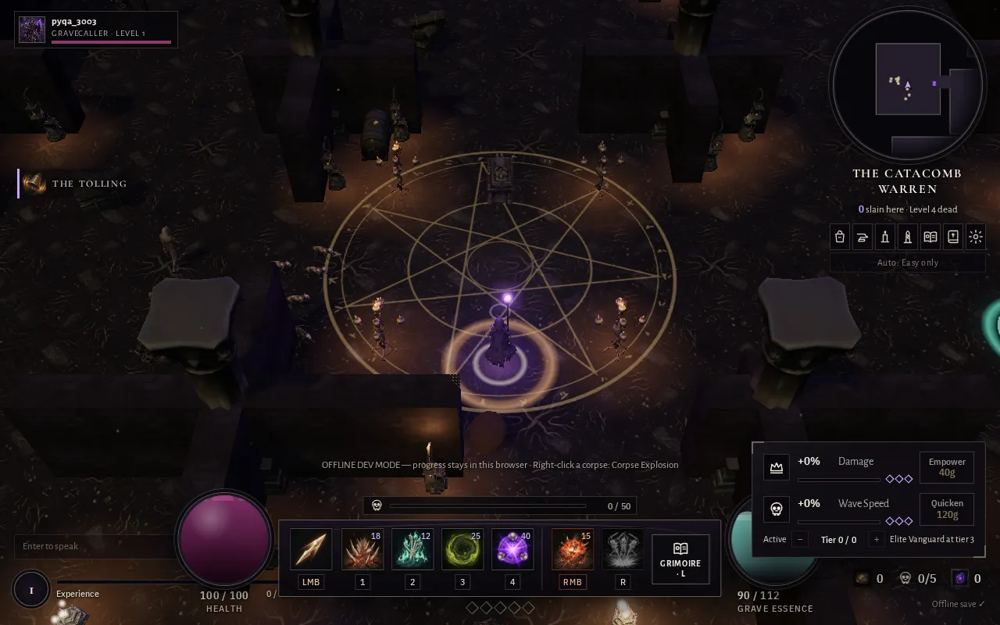 The Catacomb Warren: the vault chamber</td>
<td>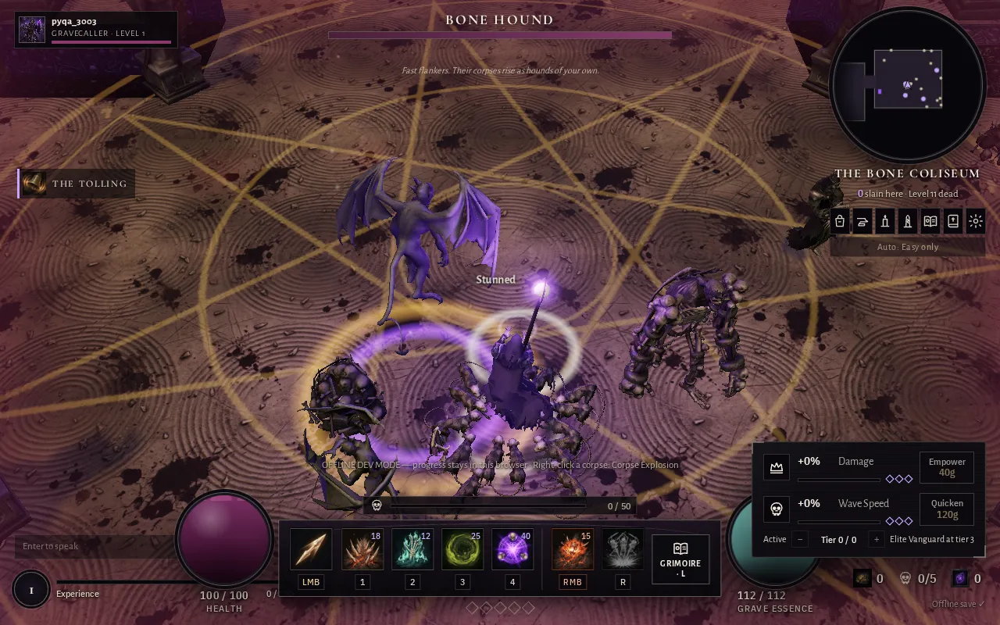 The Bone Coliseum: a surge in the pit</td>
</tr><tr>
<td>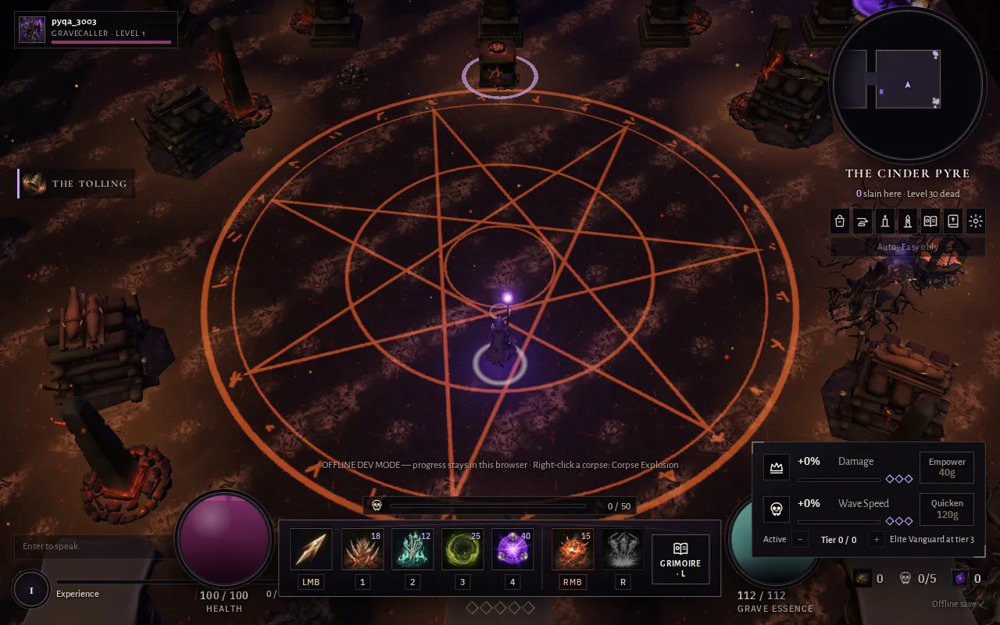 The Cinder Pyre: the Regent's arena and the Ember Altar</td>
<td>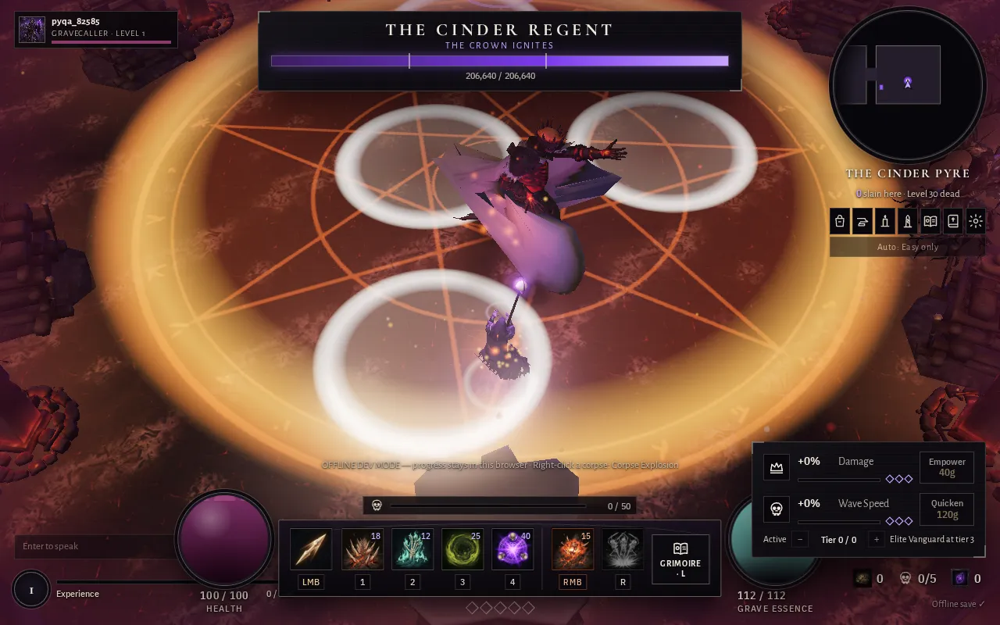 Conflagration: stand on a white ash circle</td>
</tr></table>

**The Catacomb Warren** (level 4 · open after 150 Graves kills · door on the Graves' west wall).
A chambered dungeon: a three-by-three grid of rooms divided by tall half-walls, with staggered gaps and a lantern beside every gap so the doorways read in the dark. The middle chamber is the vault, a sarcophagus under four candelabra. Walls are solid to more than feet: **cones and blows stop at a wall**, so stepping behind one breaks a Bellbound Penitent's line and funnels the swarm into the gaps. Rats, Barrow Ghouls, bats, sacs and the odd Penitent live here. Good for learning to fight around corners; drops lean toward bones, tin, iron and copper gear. A glowing **stair in its west chamber** leads down to [the Catacomb Depths](#the-catacomb-depths).

**The Bone Coliseum** (level 11 · open after 350 Ossuary kills · door on the Ossuary's east wall).
A wide sand pit ringed by pillars with four gates. Surges arrive fast (a wave of 14 every 4.2 seconds, cap 36) and **elites are twice as common** as in the Nave. The only shelter is four low L-shaped skull walls, each with a statue at the elbow, and the pillar ring. The roster mixes fodder (skull rats, hounds, bats) with the newer kinds (Wraiths, Gargoyles, Templars, Acolytes), so it rewards area rites, kiting and holding a wall. Better drops and more XP per minute than the Nave, and a real chance of dying.

**The Cinder Pyre** (level-scaled, never below 30 · open after 700 Cloister kills · east arch of the Cloister).
The fire realm: a scorched garth of black obelisks, funeral pyres and a slag font, under drifting embers and ash. Enemy level follows the highest-level player inside, like the Cloister, and **everything here leaves burning ground**:

| Dead | What it does | What to do |
|---|---|---|
| **Cinder Husk** | Sturdy melee corpse that bursts into an ember pool when it dies | Finish it at range or step back as it falls |
| **Pyre Priest** | Hurls a coal onto where you stand (orange ring), leaving burning ground | Leave the ring, then the embers; close the gap with a blink |
| **Cinderhound** | Fast flankers in packs of two or three; corpses rise as your own hounds | Hold a wall or a Bone Ward, use area rites |
| **Slag Brute** | Slow, heavy slam that cracks a wide ring and leaves it burning; resonant corpse | Leave the ring on the wind-up, kite it in circles |

The Regent waits at the Ember Altar on the arena's north edge. The floor sigil marks the arena; the slag font stands in the east alcove, out of the fight.

**The Mourning Fen** (level-scaled, never below 45 · open after 800 Pyre kills · door on the Nave's west wall).
A drowned graveyard marsh under heavy fog and drifting marsh-lights. The whole floor is **bog water**: wading is slow (-22%), the pale-rimmed **hummocks** and the dry landing by the door are not, so you fight from the islands and cross the water on purpose. Enemy level follows the highest-level player inside, like the Pyre. Bog myrtle and drowned lotus grow here as gathering nodes (Gravedigging 25 and 45) and their seeds plant in the Acre's Mourning Beds (Gardening 55 and 70); both herbs brew into flasks. It drops the ascended armour sets, void sapphires and moon ore.

| Dead | What it does | What to do |
|---|---|---|
| **Bog Hag** | Lays a magenta ring on your thrall knot: inside it they deal 30% less for six seconds (a sigil shows on each) | Kill her first, or walk the legion out of the ring |
| **Mire Leech** | Swarms of four to six, bog-rot bites, no corpse | Miasma and area rites; stay on a hummock |
| **Fen Wisp** | Flies; pulses a teal chilling ring under you, backs away toward the open water | Step out, do not chase it into the bog |
| **Drowned Sexton** | Throws a grave-hook along a brown line and drags you 4.5 m in, then slams; two corpses | Step off the line, then leave the slam ring |
| **Choir Wraith** | Sings rings onto the ground (as in the Nave) | Keep moving |

The **Mire Mother** wakes at the Mire Altar on the marsh's heart. She sinks and resurfaces under a hummock (ripple ring: leave it), and is winded for a moment when she bursts out. Drowned Hands root anyone wading the open water. At 60% the marsh floods (hummocks shrink, the bog drags harder, leeches climb out); at 30% she raises a Risen from every corpse lying in the Fen, so spend your corpses first and the rite fails.

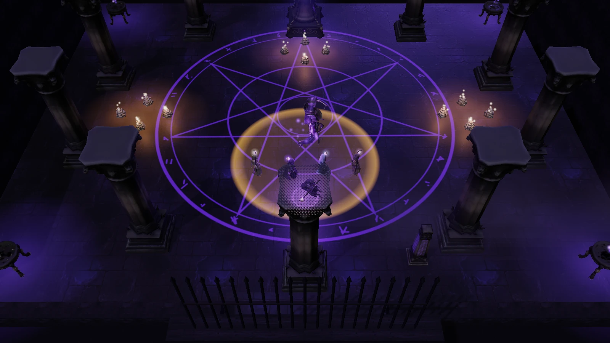

**Grave Surges** occasionally open a special breach in an active hunting area. Clear most of its rapid waves before it closes to earn an item and bonus gold.

## The Catacomb Depths

An endless descent. Behind the **Catacomb Warren's west chamber** a glowing stair leads down (the Warren opens after 150 Hollow Graves kills). Click it and you go down into a floor of small chambers; slay its quota and the stair to the next one opens. How deep can you get?

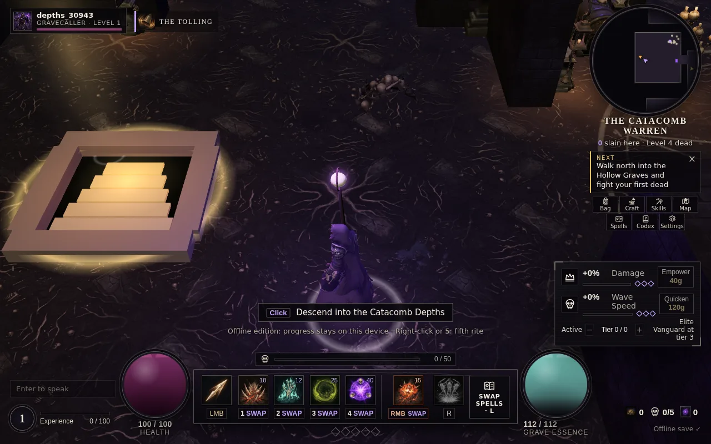

**The loop.** Every floor is a fresh, seeded maze of seven to nine chambers built from the Warren's own kit: tall half-walls that stop cones and blows, doorways with a lantern beside them, pillars, cages and coffins. The dead climb out of the chambers nearest you and come through the doorways to find you; a floor never holds more than 24 of them at once. A quiet readout under the minimap counts the floor (**Depth 7 · 12/20**; the quota is 10 kills on depth 1 and climbs to 30). When the quota is met the readout turns gold (**Stair open**), the stair glows amber, a banner says so, the minimap points to it, and the floor pays a bonus in gold and experience and usually leaves an item on the steps. Click the stair to go down. Your legion comes with you; corpses stay behind with the floor, so the first kills of each floor feed the next raising.

**How hard.** The dead on depth *d* are level **your level + d** (never counting your level below 12), so a level-60 hero meets level-61 dead on depth 1 and level-80 dead on depth 20. Starter dead (rats, robbers, ghouls) fill depths 1-4; Penitents, Deacons, Acolytes, Wraiths and moths join from depth 5, Templars, Censer Bearers, flyers and plague doctors from 10, golems, Pyre and Fen dead from 15. Elites grow more common with depth, and **every fifth floor gives them one more affix** (two on depth 5, three on 10, all four from 15): the target frame names them all and they all act at once.

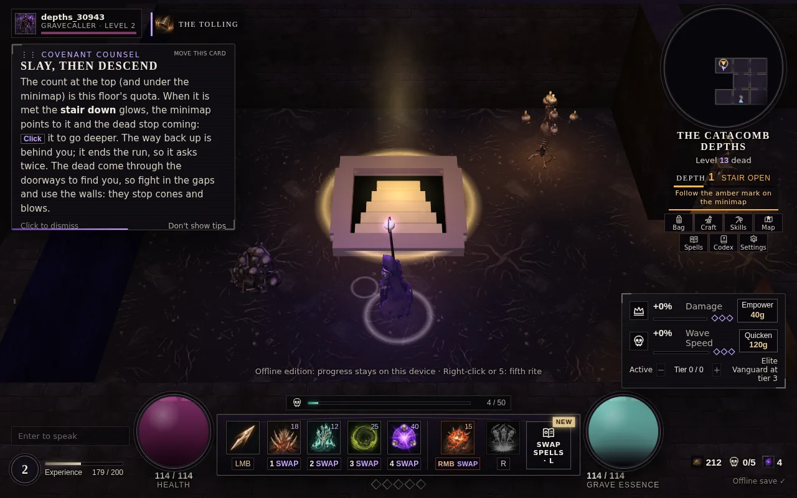

**Chests and loot.** Kills drop from the hunting ground whose gear matches the depth: the Marrow Ossuary's on depths 1-4, the Bone Coliseum's on 5-9, the Bell Sanctum's on 10-14, the Cloister's on 15-19, the Pyre's on 20-29 and the Fen's from 30 (armour sets, necromancer weapons, ores, gems and reagents included). **Every fifth floor holds a chest** in a side chamber, marked on the minimap: it gives gear with at least one affix, finds from that ground (more of them deeper), gold and experience, and one time in four (rising to seven in ten) a **Relic rune**.

**Ending a run.** Dying ends it, and so does the way up (the stair at your feet when you arrive; it asks twice, so a stray click cannot end a run) or leaving by any other road (recall, a class change). Everything you looted is already yours. The deepest floor you reach is written to the **Chronicle** (Codex **K**, Chronicle tab, "Deepest descent") and shown on the public leaderboard; Ascension never resets it.

**A descent for one.** The floors live in one player's world, so a run is solo. If you are in a party, the stair says so when you hover it: you **step out of the party** for the run and rejoin it automatically when the run ends. If a friend appears while you are down, the stair closes behind you. Playing together on a floor is on the list.

## Gold, gear, and difficulty

**Kill Chain.** Kills you land (your thralls' and damage-over-time kills count) within **4 seconds** of each other build a chain, shown on the left edge. Tiers at 5, 12, 25, 45 and 80 (Stirring, Rampage, Slaughter, Massacre, Requiem) add **+5% to +25% XP and gold**, ring a rising chime and warm the readout from bone to red. It breaks when the window runs out or you die; a chain of 10 or more announces its end. Safe areas do not count.

**Weekly Omens.** One omen hangs over the diocese each week, the same for everyone, shown as an icon and name on the left edge (hover it for the rules). It changes every Monday at 00:00 UTC and cycles in order:

| Omen | Effect |
|---|---|
| **Blood Moon** | Elites are much more common in every hunting ground; every kill pays 15% more XP and gold. Red moon. |
| **Drowned Week** | Waves arrive 25% larger and kills pay 20% more; thicker cold mist. |
| **The Tolling** | Elites come Bell-Tolled and drop twice the shards; kills pay 5% more. Bronze moon. |

Omens only act in combat areas. The sky tint is half-way, so each place keeps its own light.

**Milestones.** One-off gold purses for kill counts (100 up to 25,000), kills in each hunting ground (100 up to 2,500) and your best chain (10 up to 100). Each pays once per character in this browser.

Gold and experience come from fighting. Open the **Reliquary (I)** to equip gear, use consumables, and see your inventory: a **48-slot bag** (8 × 6). Click an item's **padlock** to lock it; locked items are skipped by every bulk action. **Sell all junk** sells your unlocked common and uncommon gear after a confirmation that shows the count and the gold; it keeps any piece that would be an upgrade for you (the green ▲, an empty slot counts) or that completes a set bonus, and any gear with a necromancer affix. When the bag fills, store things in the **Vault** or grind spare gear at the **Bone Grinder** (see Gathering and crafting). Loot pillars mark better drops; item rarity is shown by color and marks. The dead drop gear, flasks, brews, reagents and runes, but no profession materials: ore, bars, logs, bones, seeds and herbs come from gathering, and a kill that would have dropped one pays its sell value in gold instead (gear keeps its odds; bosses and the Depths can still leave gems). **Settings → Loot** sets a rule for each gear rarity (Common to Legendary): **On the ground** (walk over it; the default), **Auto-loot** (straight into your bag as it drops; it lands instead when the bag is full) or **Sell for gold** (its sell value, no drop). Set pieces, legendaries, necromancer affixes and upgrades for you are never sold: a gold rule leaves them on the ground. Loot never comes looking for you: walk over an item to take it (gold and shards pull in from a few steps away). Drops you leave behind expire after a minute, whatever their rarity. With a full bag an item stays where it lies for that minute. The Empower and Quicken buttons in the Upgrades panel say, on hover, exactly what the next tier gives. The **Workbench (C)** turns materials into equipment and tools. Healing flasks are used with **Q**. **Brews** are two slots: one **elixir** (combat: damage, ward, lifesteal, haste, fire/rot resist) and one **tonic** (utility: speed, essence, wisdom, fortune). A new elixir replaces the active one; drinking the same brew extends it (up to twice its length). Right-click a brew in the Reliquary to put it on your belt, then press **Z** (elixir) or **X** (tonic). The **belt** at the left edge always shows three slots (**Q** Heal, **Z** Elixir, **X** Tonic): empty ones are faint and say how to fill them, full ones show a count and timer and a click drinks them. Lifesteal heals a share of the damage of each hit (at most 3 targets count, and one hit heals at most 1.5% of max health). Brews are local and never sent to other players; cooked meals can be eaten from the bag for healing over time.

Each discipline has two five-piece armor sets with matching icons and visible colors on the hero. The first collection begins in the Hollow Graves and completes in the Bell Sanctum; the stronger ascended collection begins in the Sanctum and completes in the Cinder Pyre. Any class can wear any set, but the ground favours yours: about half of the armor an area drops (and most boss first-kill trophies) is your own discipline's set, and the necromancer weapons drop a third as often for the other classes. **Set bonuses:** wear 2, 4 or 5 pieces of the same set for a bonus; they stack, and the ascended sets are one step stronger. Necromancer sets scale their rites and thralls (Ossuary: thrall health, ward and maximum health; Gravecaller: thrall damage, attack speed and +1 thrall cap; Mourner: essence regeneration, corpse healing, wraith damage and maximum health; Rotweaver: Miasma radius, Withered stacks and a little health); the other sets give stats, health or essence regeneration. Hover a piece to see its set (green lines are active, grey need more pieces), press **J** for the Set bonuses block (what you have, what is next, which piece you still need and where it drops), and watch the bag arrows: an item that finishes a set says so ("completes Ivory Reliquary 4-piece"), one that breaks a set says that too. Worn pieces of an active set glow faintly on the paper doll. The Codex (**K**, Armor sets tab) lists every bonus. See [the armor set guide](docs/ARMOR-SETS.md) for the full table, names and drop areas.

**Necromancer weapons.** The four necromancer disciplines (Ossuary, Gravecaller, Mourner, Rotweaver) can carry a weapon line that changes what your left click (Bone Needle) does. Other classes wear the same items for their stats only.

| Weapon | Hands | Left click becomes | Passive |
|---|---|---|---|
| **Staff** | Two | Needle reaches 25% farther and pierces one more enemy | +10% spell damage |
| **Scythe** | Two | A close reaping arc (100 degrees, 3 m, 4 m against a boss, up to 3 enemies) | Kills in the arc give +1 soul toward Soul Harvest |
| **Wand** | One | Needle fires 30% faster and strikes 15% softer | none: pair it with an off-hand |
| **Ritual Sickle** | One | Needle leaves one Withered stack | Exhume returns 20% of its essence |
| **Skull Focus** | Off-hand | none | Gold tier and above: +1 thrall cap |
| **Grimoire** | Off-hand | none | Rites recover 10% sooner |
| **Mourning Bell** | Off-hand | none | A Mourner's wraith hits heal allies for 2% of their max health |

Every kind comes in five materials, **Bone, Iron, Gold, Hell and Moon** (recommended levels 1, 15, 30, 45 and 60). They drop by zone (Bone in the Hollow Graves and Bone Warren, Iron in the Ossuary and Coliseum, Gold in the Nave and Sanctum, Hell in the Cloister and Pyre, Moon rarely in the Pyre) and the Workbench crafts them from planks and ingots (Carpentry: staff, wand, grimoire; Smithing: scythe, sickle, skull focus, bell). Two-handed weapons push the off-hand back to your bag. Hover a piece in the Reliquary for its line, or open the Codex (K, Weapons tab). Screenshots: [docs/screenshots/necro-weapons](docs/screenshots/necro-weapons).

Necromancer rites also have distinct casting motions now. A scythe sweeps, wands and sickles flick, and larger rites slam, channel or summon; the four necromancer heroes each use their own animations.

<table><tr>
<td>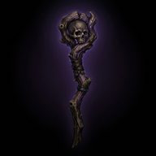</td>
<td>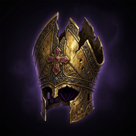</td>
<td>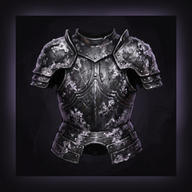</td>
<td></td>
<td>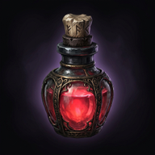</td>
</tr></table>

The HUD has two gold upgrades:

- **Damage:** each purchased tier adds 8% spell power, up to 25 tiers.
- **Wave Speed:** buy up to 8 tiers, then choose an **active** tier from 0 up to what you own. Higher settings mean faster, larger waves, stronger enemies, more gold, XP and loot chances, and more elites. The pressure builds over the first 30 seconds of a visit, and the wave density levels off after tier 3 while the rewards keep climbing. The diamonds mark added pressure at tiers **3** (Elite Vanguard), **6** (Restless Crypts), and **8** (Nightfall). Lower the active tier when you need room to recover.

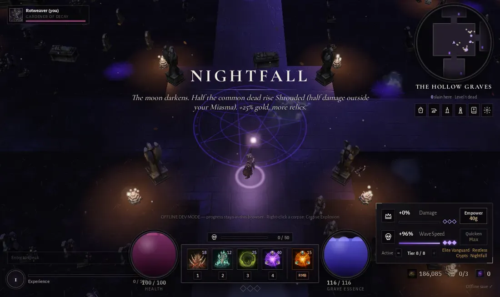

Choose difficulty in **Settings (Esc)**. **Medium** is the starting balance for each character. **Easy** reduces enemy health and damage and pays less gold and XP; the Brbmuffins developer account can also use auto combat on Easy. **Hard** raises enemy health and damage, adds elites, and pays more gold and XP. In a shared world, the world keeper's difficulty and Ascension rank govern the enemies.

### Gold sinks: Reforge and Empowered bosses

Once the Damage tiers are bought, gold has two more places to go.

**Reforge (Workbench, C, Reforge tab).** Pick a piece you carry or wear, pick one of its affixes, and pay gold to draw that affix's number again. The affix stays; only its value changes, anywhere in the range the piece's item level allows, and it can come out lower. The price is shown before you confirm: 40 gold per item level (x1.5 for a piece that shows rare, x2.5 epic, x4 legendary), and every reforge of the same piece costs 25% more than the last (it stops rising after 20; an ilvl-99 epic costs 9,900 for the first and about 860,000 for the twenty-first). A roll already at the top of its range cannot be reforged. The server takes the gold and rolls the number.

**Empowered bosses (boss altars).** Click an area boss's altar with a **Covenant Seal** in your bag and choose *Call it Empowered*: the Seal and gold are taken (7,500 x shards squared: 30,000 for the Gravedigger King, 67,500 Abbess, 120,000 Drowned Congregation, 187,500 Plague Saint, 270,000 Cinder Regent, 367,500 Mire Mother). The boss wakes bigger and red-gold, six levels (plus 15%) stronger with 40% more health, and its kill pays one extra prize the server rolls: an epic-or-better piece (three affixes) or, at 2.5 times that boss's usual legendary odds (15% for the King, 50% for the Abbess, rising to a 60% cap in the deep grounds), a legendary set piece. The prize drops at the boss's feet. A summon you lose to a wipe is not wasted: call it again within three hours for free (the server remembers it, so a reload does not lose it); if another boss was already awake the Seal and gold come back. Seals come from digging **Crypt Collapses** (Gravedigging 40, 1 in 200), the **Barrow-King's Tomb** (70, 1 in 80) and the **Abyssal Coelacanth** pools (Fishing 80), and the Sexton sometimes orders them. The Prelate cannot be Empowered. The **Codex (K, Professions)** lists the prices.

## Gear, stats and the character sheet

Gear carries four stats. Each one feeds a few numbers you can feel, and the game shows you which:

| Stat | What each point gives you |
|---|---|
| **VIT** (Vitality) | +8 health. Your thralls have 45% of your health, so VIT helps them too |
| **INT** (Intellect) | +1.3 spell power, +2 max essence, +0.1 essence per second |
| **STR** (Strength) | +0.4 spell power |
| **AGI** (Agility) | +0.3% move speed, +0.2 spell power |
| **Each level** (up to 999) | +14 health, +1.6 spell power, +2 max essence |

Your discipline then scales the result (an Ossuary necromancer has extra health, a Mourner regains essence faster), Covenant boons add their own share, **Damage upgrades** raise spell power by 8% per tier, and a necromancer's **staff** adds 10% spell power. A thrall hits for 40% of your spell power, before the staff's boost.

**Reading an item.** Hover a piece, or select it in the Reliquary (**I**). Under each stat is what it does for *your* character, for example `+6 VIT: +48 health (+22 thrall health)`. These numbers already include your discipline, so the same helm can be worth more to one class than another.

**Upgrade arrows.** Every gear item in your bag wears a small **green ▲** if it is better for your discipline than what you wear in that slot (an empty slot always counts as an upgrade), or a **red ▼** if it is worse; nothing means about the same. Hover or select it and the first line says why, for example `Upgrade for your Gravecaller: +12% (more thrall damage)` or `Worse than your Iron Helm: -8% (less health)`. The percentage is the change in one overall power score that weighs your damage (your spells plus your thralls' hits), how tough you and your thralls are, essence, and speed, with the mix set by your discipline: an Ossuary necromancer leans on toughness, a Rotweaver on damage. Necromancer weapon effects have an estimated value in the score (a scythe's reaping arc about 6%, a sickle's Withered about 3%, a grimoire's faster rites about 5%, and so on); the staff's spell damage and a skull focus's extra thrall are counted exactly.

**What you're looking for.** The top of the Character sheet lists your discipline's stats best first (a Gravecaller: INT > VIT > STR > AGI), what each is for, the necromancer weapon kinds that suit you, and your **weakest slots**: empty ones ("Ring: empty. Any ring is an upgrade") and the worn pieces adding least, with a better bag item named when you have one.

**Comparing.** Select a bag item you can wear and the Reliquary shows what changes if you equip it instead of what you wear now: health, spell power, essence, essence per second, move speed, thrall health and thrall damage. **Green** is a gain and **red** is a loss. A two-handed weapon is compared against both your main hand and your off-hand, since both leave your hands. For necromancer weapons it also says what changes about your left click ("Left click becomes a reaping arc").

**Item level and affixes.** Gear you find now drops *rolled*, and a good roll is a real upgrade: since 3 Oct 2026 affix numbers are about 1.45 times what they were and each range is +-35% around its middle, so an ideal (top) roll adds roughly twice what a median one does (the Gear Atlas's "For you" shows a piece's bare value and its value with ideal rolls). Each piece has an **item level** (the level of what dropped it, +2 from an elite, +4 from a boss, +5 from a boss's first kill) and up to **three affixes**. The server rolls them the moment the piece drops, so they cannot be edited in a save. Affixes name the item (`Gravebound Iron Helm of the Legion`) and change its colour: one affix is green, two blue, three purple (a rarer base item keeps its own colour). Bosses always leave at least one affix and a first kill at least two. An affix is either a stat (`+6 INT`, as a prefix like *Occult* or a suffix like *of the Seer*) or a **necromancer lever**, marked with a violet **†**: *Gravebound* (thralls hit harder), *of the Legion* (thrall health), *Whispering* (essence regeneration), *of the Rotting Mist* (wider Miasma), *Blighted* (more Withered stacks) and *of the Ossuary Wall* (less damage taken per thrall). The levers work for any class but only matter to the four necromancer disciplines; on another class the tooltip says "no effect for you". Hover a piece to see its item level, every affix and what each one does for *you*. The ▲/▼ arrow, the power score and the Character sheet all count affixes (the sheet has an **Item affixes** block and an "Item affixes" row inside the formulas they feed). Higher item levels and more affixes also sell for more and salvage a little richer (an extra-material chance and more Salvaging XP). **Sell all junk** and **Salvage all below rare** skip any piece with a necromancer affix. The Codex (**K**, Item affixes tab) lists every affix and its range at item levels 10 and 40. Pieces from before this update stay as they are, with their base stats and no item level.

**Thrall gear: the Legion (Y, or the Legion button under the tool belt).** Necromancers can give spare gear to the dead instead of salvaging it. The Legion has two slots, **Weapon** (any weapon or off-hand) and **Armour** (a helm, chest, legs, boots or gloves), held in reserved inventory slots 120-121 beside the tool belt: they take no bag space, and Sell all junk, Salvage, the Vault and bag saves never touch them. A piece's stat points (STR, AGI, INT and VIT, including flat stat affixes) become thrall bonuses: a **weapon** gives +1% thrall damage and +0.3% attack speed per point, **armour** gives +1.2% thrall health per point (capped at +35% damage, +10% attack speed, +45% health per piece). A Copper Sword (4 points) is +4% damage; a Crypt-Iron Crozier (10) is +10% damage and +3% attack speed; an Iron Chestplate (11) is +13.2% health. *Gravebound*, *of the Legion* and *of the Ossuary Wall* affixes count too, at 60% of their worn strength; other affixes are yours alone. None of it ever changes your own stats. The bonus rides the same thrall multipliers as set bonuses, so it shows on the Character sheet ("Legion kit" and "Legion reinforcement" rows). A kit piece applies to thralls you raise after the change; thralls already standing keep what they were raised with (Reinforce and Damage tiers are different: see below). Archers and bone mages carry the kit's bow and staff, and every kit-wearing thrall takes a light wash of the armour's colour. Select a spare in the Reliquary and the detail strip says what it would do for the legion; the Legion panel ranks every spare weapon and armour piece with a green **▲** or red **▼** against what the legion wears now.

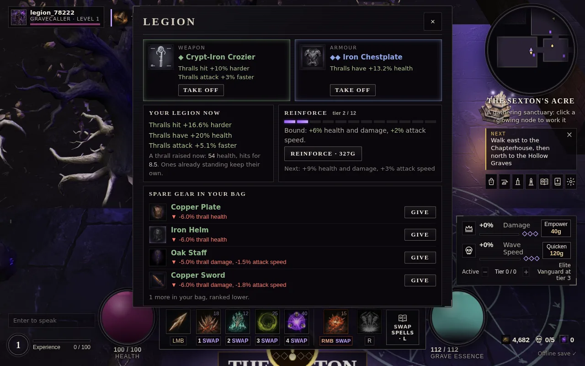

Three thralls without the kit (left) and with it (right): the archer's baked bow, the bone mage's staff, a light wash on chest and hands.

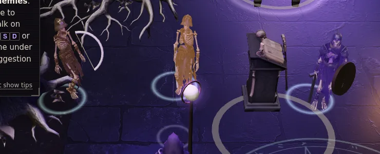 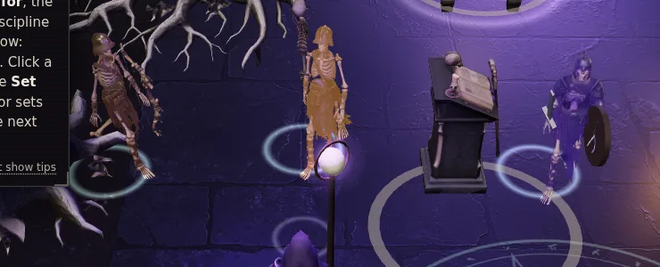

**Reinforce** is the gold sink: twelve tiers, each +3% thrall health and damage and +1% attack speed, for 120 gold at the first tier and 1.65 times more each time (the last costs 29,615; all twelve about 75,000). Buying a Reinforce tier, or a Damage tier, **strengthens every thrall you already have standing, once, at the moment you buy** (their health keeps its fraction, so it is never a heal); thralls raised afterwards carry it from the start. Like Damage and Wave Speed the tiers reset when you Ascend; the kit pieces stay. On the overall power score (Gravecaller, level 20) a copper kit is worth about +1%, an iron kit +2.6%, an iron kit at tier 6 +7.5%, tier 12 alone +9% and the best kit at tier 12 about +20%; the other necromancers gain 5-16% at the top, since thralls are a smaller part of their power.

**The character sheet (J, or the Sheet button beside the paper doll).** Lists your final Health, Spell power, Max essence, Essence per second, Move speed, Thrall health, Thrall damage and Damage upgrade, plus your STR, AGI, INT and VIT totals. Click any line to open its breakdown: the base, your level, each worn piece, your discipline, boons, Damage tiers and the weapon line. Brews and other timed effects are not included. The Codex (**K**, Stats tab) carries the same table. The Set bonuses block lists each worn set and its bonuses.

## Getting better gear (upgrade guide)

*The short version: kill bosses for legendaries, follow the green ▲ for everything else, and open the Gear Atlas (**.**) → **Best for me** when you are not sure what to chase next.*

**1. Follow the arrows.** Every gear item in your bag shows a **green ▲** when it beats what you wear in that slot for *your* discipline, and a **red ▼** when it is worse. Hover it to see why (`+12% (more thrall damage)`). The Character sheet (**J**) lists your **weakest slots**, so you know which slot to fill first.

**2. Hunt where your gear is.** Every ground drops gear of its own material: **Bone** in the Hollow Graves and Bone Warren, **Iron** in the Ossuary and Coliseum, **Gold** in the Nave and Sanctum, **Hell** in the Cloister and Pyre, and **Moon** (rarely) in the Pyre. Gear from a stronger ground has a higher **item level** and up to **three affixes**:
- an elite adds +2 item levels, a boss +4, and a boss's first kill +5;
- **Wave Speed** and the **Hard** difficulty raise loot chances and the number of elites;
- the ground favours your own discipline, so about half the armour it drops is from your sets.

**3. Finish your armour sets.** Each discipline has two five-piece sets: the **first collection** (Hollow Graves → Bell Sanctum) and the stronger **ascended collection** (Bell Sanctum → Cinder Pyre). Set bonuses switch on at 2, 4 and 5 pieces. An item that completes a set says so on its tooltip, and **Sell all junk** never sells it.

**4. Craft the gaps.** The **Workbench** makes every necromancer weapon in all five materials from planks and ingots (Carpentry: staff, wand, grimoire; Smithing: scythe, sickle, skull focus, bell). Gathering skills (Woodcutting, Mining and the rest) feed it. The Gear Atlas shows the recipe for any craftable piece.

**5. Chase legendaries (the end-game sets).** There is one legendary set per necromancer discipline, five pieces each: two pieces are a nudge, four change a mechanic, and five define the build. **How to get them:**

| Source | Chance of a legendary piece |
|---|---|
| Any area boss from the **Bone Abbess** onward (Abbess, Drowned Congregation, Bell-Sworn Prelate, Plague Saint, Cinder Regent, Mire Mother) | **20% per kill at the Abbess, rising with depth to 33% at the Mire Mother** |
| The **Gravedigger King** (Hollow Graves, the first boss) | **6% per kill** |
| An **elite** in a level-scaled ground (Plague Cloister, Cinder Pyre, Mourning Fen) or a deep Catacomb Depths floor | 0.5% per elite in the Cloister, 0.7% in the Pyre, 0.9% in the Fen |

- **Your own set comes first:** 70% of the legendaries that drop for a necromancer are their own discipline's set. The five New Blood classes have no set of their own, so they get one of the four necromancer sets.
- **Duplicates are rare:** a drop favours the pieces you don't hold yet, so a full set takes about 5 drops. That is about 25 boss kills at the Abbess for any set (36 for your own discipline's full set), and fewer the deeper the boss.
- **Bosses cost soul shards** to summon (elites drop them, and bosses hand some back). Boss loot, legendaries included, goes only to players who are **alive and within 38 m** when the boss dies, the same rule as ordinary kills.
- Hover a legendary piece to read each tier of its bonus; the Codex has a Legendary sets section.

**6. Socket runes.** Relic runes (from elites, surges and bosses) change how a rite behaves; socket them in the Grimoire (**L**). See [Relic runes](#relic-runes).

**7. Spend gold on power that stays.** **Damage** tiers (+8% spell power each) and the Legion's **Reinforce** tiers (thrall health, damage and speed) both strengthen thralls already standing the moment you buy. They reset on Ascension.

**8. Keep the bag clean.** Lock (padlock) anything you want to keep. **Salvage** spare gear at the Bone Grinder for reagents, park pieces in the **Ossuary Vault**, or give spares to your thralls in the **Legion** panel (**Y**).

## 📖 Loot tables & gear atlas

*What can drop, how often, where, and what is worth wearing.* The full tables are in **[docs/LOOT-TABLES.md](docs/LOOT-TABLES.md)**, generated from the same tables the game rolls (`npm run gen:loot`; a test fails if the file goes stale): every hunting ground's drop table with ordinary-kill, elite and Grave Surge chances, each boss's spoils and first-kill trophy, runes, reagents, legendary armor by discipline, the Catacomb Depths, gathering finds, every recipe, salvage yields and how affixes and item level work.

In game, the **Gear Atlas** (press **.**, or **Atlas** in the Menu) is the same data as an AtlasLoot-and-Pawn-style browser: browse by slot, by area or boss, by set, or by materials and brews; every row shows where it drops with its chance, how to craft it, a fit badge for *your* discipline and a green ▲ / red ▼ against what you wear in that slot (counting the set bonuses a piece switches on). A piece of an armour or legendary set also shows what its whole set would add ("▼ alone · ▲ with set"), so a legendary is never marked worse just because one piece by itself switches no bonus on; tick **Build towards sets** to rank set pieces by their whole set. **Best for me** lists the top upgrades you do not own yet. The percentages are *your* odds (your own armour set drops far more often than the other eight), and under **By area & boss** each hunting ground shows a **drop quality** rung from 1 to 9: the deeper the ground, the likelier the pieces worth wearing, runes and legendaries, and the higher their item level. Areas, the map, waystones and the Codex all list the world in descent order: Chapterhouse, Sexton's Acre, Alchemist's Wing, Hollow Graves, Bone Warren, Marrow Ossuary, Drowned Nave, Bone Coliseum, Catacomb Depths, Bell Sanctum, Plague Cloister, Cinder Pyre, Mourning Fen. Hover or click a row for the full source list, the recipe tree one level deep, what the item is used in, its set bonuses and the odds of rolled affixes. Percentages are per kill at default settings (Medium difficulty, Wave Speed 0, no fortune tonic); the page says what moves them.

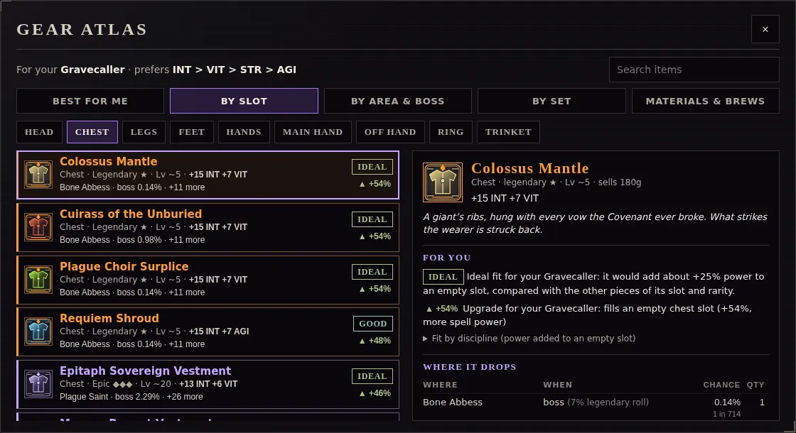 The Gear Atlas: every chest piece for your discipline with a fit badge and an upgrade arrow; the detail pane lists each source with its chance.

**Capes & pets.** There are no legendary (or any rarer) capes: all ten capes are one tier, earned purely by skill levels, with no drop, shop or crafting route. The seven **mastery capes** need level 99 in their skill (Woodcutting, Mining, Fishing, Gravedigging, Grave Gardening, Alchemy, Salvaging); the **Apprentice's Mantle** needs a total level of 100, the **Journeyman's Mantle** 300 and **The Sexton's Mantle** 693 (99 in all seven). Five **pets** (Tithe Bat, Grave Rat, Drowned Pup rare; Wee Thrall, Shroud Moth epic) come from a charm, a rare find while you work its skill (about 1 in 3,500 successful actions, a little likelier on higher-tier nodes; the Shroud Moth's charm also drops about once per 35 Mourning Bed harvests). Capes and pets are **purely cosmetic**: no stats, no combat effect. Open the **Capes & Pets** tab of the Character window (**J**, or **N** to jump straight to it), press **Wear** on an unlocked cape, **Adopt** on a charm in your bag, then **Call** on a pet. [docs/LOOT-TABLES.md](docs/LOOT-TABLES.md#capes-and-pets) has the full list, and the Atlas has a Capes & pets view under Materials & brews.

## Gathering and crafting

The **Sexton's Acre**, west of the Chapterhouse, contains every tier of the four gathering skills without combat, and the stations that process them (Sawpit, Bone Kiln, Cooking Fire and the Bone Grinder). Click a node to work it; it depletes and later returns. Higher tiers need the matching skill level. Press **P** for your skill levels, next unlocks, and AFK controls. The **Codex (K)** has a Professions tab for node details.

| Skill | Level 1 start | What you collect and make |
|---|---|---|
| **Woodcutting** | Coffin-Oak | Logs; mill them into planks at the **Sawpit**. |
| **Mining** | Copper or Tin Seam | Ore for ingots, equipment, and tools at the **Workbench**. |
| **Fishing** | Still Pool | Fish; cook them into healing meals at the **Cooking Fire**. |
| **Gravedigging** | Pauper's Grave | Bones and occasional finds; grind bones into bone meal at the **Bone Kiln**. |

Carry a matching hatchet, pickaxe, rod, or spade to improve gathering success; the best one you carry counts. Tools can live **on the tool belt**: four slots under the paper doll in the Reliquary (hatchet, pickaxe, rod, spade; reserved inventory slots 110-113). Select a tool and press **Put on belt** (or double-click it); double-click it on the belt to take it off, which needs a free bag slot. A belted tool counts exactly like one in the bag (the best of belt and bag wins, for manual, auto and AFK gathering), takes no bag space, is never sold, salvaged or stored by the bulk buttons, and is what the hero holds while gathering. With an empty belt and tools in your bag, the Reliquary offers once to put your best tools on the belt. **Skills (P)** shows which tool each skill is using. The Workbench crafts stronger tools from ingots and planks. Some hunting grounds also hold richer nodes, but enemy hits interrupt gathering there.

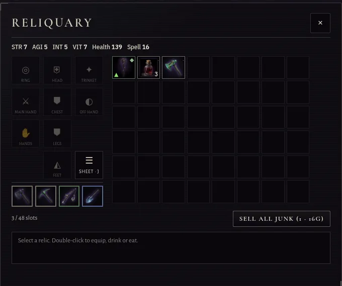

With **Auto gathering** enabled in Settings, clicking a node can continue to another of the same kind. For longer sessions, use **P → choose a node tier → Start AFK** while in the Acre. Your character keeps working while the game is open. A full bag pauses work; movement, casting, or **Pause AFK** stops it. Closing the game ends the session, so it does not earn rewards while offline. When work stops, **the Sexton’s Ledger** shows your finds, their worth, skill gains and personal bests.

**Sexton’s Contracts (O)** offers three delivery orders a day, based on what your skills can make. Deliver from your bag for gold and sometimes an item; completing all three gives a bonus and builds a daily streak. Tin and Bronze Ingots are ordered like any other smelted good, and the **Workbench** turns the old trade goods into gear: **Tin Augment** (2 Tin Ingots, Mining 5), **Garnet Ring** (a Grave Garnet and 2 Copper Bars, Mining 8), **Bronze Warden Kit** (6 Bronze Ingots and 2 Oak Planks, Mining 12) and **Opal Flask** (a Bone Opal and 3 River Fillets make 2 Forge-Tempered Flasks, Fishing 20); each is worth no more at the vendor than what it eats. About one day in five the hard order is a **relic order**: two or three Grave Garnets, Bone Opals, Reliquary Fragments or Covenant Seals (one Void Sapphire), whichever your levels can find, paid at twice their sell price. That is where the gems, fragments and seals go. **Grave Gardening (U)** gives you four Mourning Beds and two Coffin Patches. Plant seeds or saplings and return later; plots grow in real time even while you are away, and bone meal makes them grow faster.

**Ossuary Vault (V).** A sarcophagus in the Chapterhouse holds a **120-slot shared stash** (three tabs of 40) for every character on your account. Press **V** in the Chapterhouse or the Acre. Click an item to move its whole stack across; **Deposit materials** stores every unlocked material and consumable, **Deposit all** stores everything unlocked that you are not wearing, and **Sort** merges stacks and orders the Vault by type, rarity and name. Moves stack first, then fill free slots, and a move that will not fit changes nothing. Worn gear and locked items are never stored by the bulk buttons.

<table><tr><td> The Ossuary Vault (V)</td><td>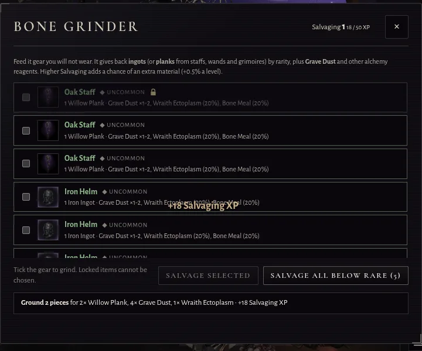 Salvage at the Bone Grinder</td></tr></table>

**Salvaging** is a seventh skill, worked at the **Bone Grinder** beside the Bone Kiln in the Acre. Tick gear in its panel (or press **Salvage** on an item in the Reliquary while you stand at the Grinder) and **Salvage selected**, or use **Salvage all below rare** for every unlocked common and uncommon piece (pieces that would upgrade you are spared). Each piece gives an ingot by rarity (copper, iron, silver or steel, gold, hell, moon), or a plank from staffs, wands and grimoires (oak, willow, yew or ghostwood, blackthorn, bone elder), plus Grave Dust and, on better gear, Wraith Ectoplasm, Plague Bile, Cinder Ash and bone meal. Every Salvaging level adds a 0.5% chance of one extra material, and it grants a mastery cape at 99. If the yield will not fit your bag, nothing is ground. The **Codex (K → Professions)** lists the yields by rarity.

**Alchemy** is brewed in **the Alchemist's Wing**, through the Chapterhouse's east door: click the **Great Cauldron** (or the Alembic) to brew, and the **Reagent Shelf** to see every herb, reagent and ichor you have found. Each day one brew is the cauldron's pick and gives one extra the first time you make it there. The Workbench's **C → Alchemy** tab still works. Start with four Grave Dust from the Hollow Graves or Catacomb Warren to brew a Grave-Dust Tonic at level 1. Later, Wraith Ectoplasm drops from spirit enemies, Plague Bile from the Cloister, and Cinder Ash from the Pyre. Area bosses always leave an ichor; the Mire Mother’s ichor combines with drowned lotus for a Moonlight Elixir. Forage Rot-cap in the Cloister and Ash-bloom in the Pyre from Gardening level 1, then grow their seeds in the Acre at Gardening 35 and 50. Bog myrtle and drowned lotus grow in the Fen. The **Codex (K → Professions → Reagents)** lists sources, brew effects, recipes and Alchemy levels. Equip an elixir or tonic on your belt in the Reliquary, then use **Z** or **X**.

<table><tr><td>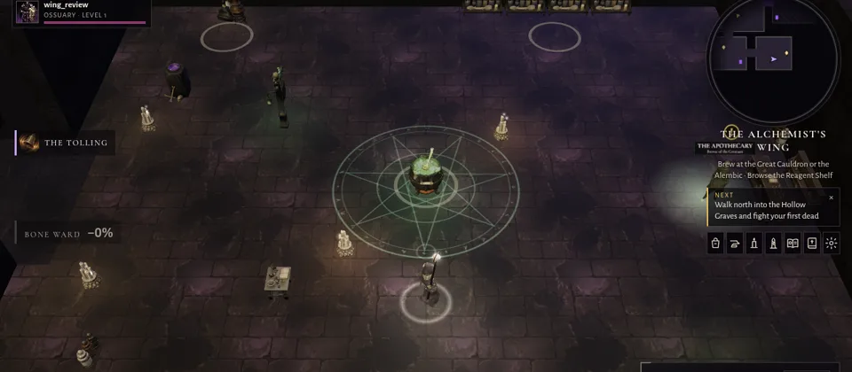 The Alchemist's Wing</td><td>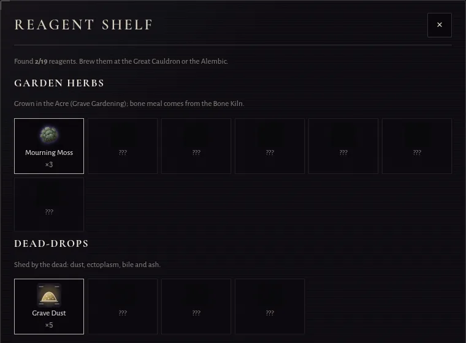 The Reagent Shelf</td></tr></table>

**Grave Laborers (H)** gather slowly for up to eight hours while you fight, explore or are away. Collect their work and the Ledger shows what they found. You begin with one laborer and gain another for every 50 total gathering levels, up to four. In the Sexton’s Acre you can **watch them work**: each laborer stands beside a node of its post with a hatchet, pickaxe, spade or fishing rod (chopping, digging or fishing; one that is full rests). A gold check over a laborer means its work is ready; hover it for the post and time, click it to open the Laborers. **Capes & Pets (N)** has a mastery cape for level 99 in each of the seven skills, total-level mantles (the Sexton’s Mantle now needs all seven at 99), and five companions found as rare charms while gathering, from laborers, or from garden harvests. Adopt a charm permanently; other players see your cape and companion.

<table><tr><td></td><td>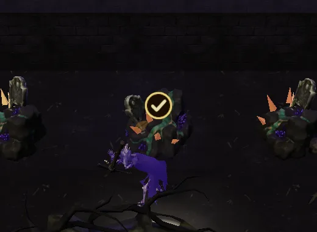</td></tr></table>

<table><tr>
<td>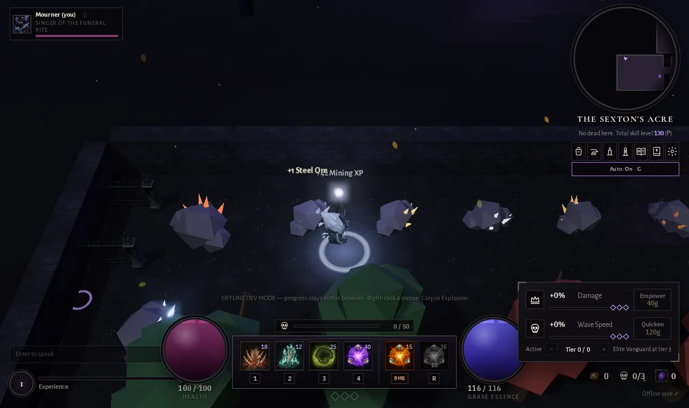 Working a node</td>
<td>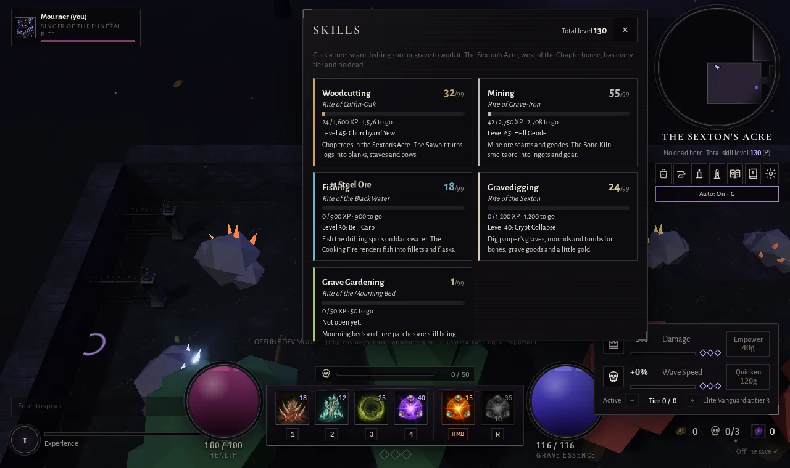 Skills (P)</td>
<td>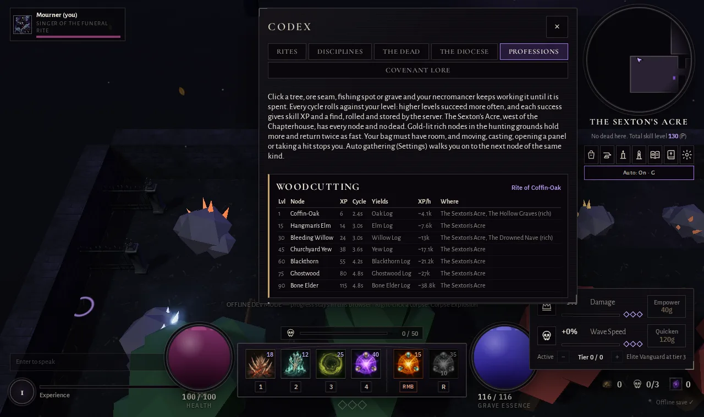 Codex professions</td>
</tr></table>

**Craft many at once.** Every Workbench and Cauldron recipe has a quantity control: − / +, **×5**, **Max** (as many as your materials and bag room allow) and **Craft ×N**. A batch stops at the first problem and tells you how many were made. In the bag, stacks have **Sell all (N · gold)** with a confirm in place; locked items are never sold.

## Ascension

Ascension is chosen difficulty. At the **Altar of Ascension** in the Chapterhouse you swear **Vows** before a run: curses that make it harder, like Hades' Pact of Punishment. Every vow carries **heat**, and **the heat of the vows you swear is the run's Ascension rank**. When the **Bell-Sworn Prelate** falls, burn the run at the Altar for **Ashes**: each point of heat adds 20% to the payout, and the older, tougher dead also pay more gold and XP (+5% per point of world heat, up to 30). Your **best rank** (the hottest run you ever burned) is kept for the leaderboard.

**Seals never reset.** Opened seals, kill counts and soul shards all stay when you Ascend. Only your Damage, Wave Speed and Legion tiers and the run's tally reset. The difficulty comes from the vows you choose, so no run has to repeat the same seal grind.

| Vow | Heat | What it does | Unlock |
|---|---|---|---|
| **Elder Dead** | 1 per step, up to 20 | The dead rise 3 levels older per step | known |
| **Iron Dead** | 1 per step, up to 3 | Enemies have 25% more health per step | known |
| **Frail Vessel** | 1 per step, up to 3 | You have 12% less maximum health per step (only you) | known |
| **Famished Rites** | 1 per step, up to 2 | Grave Essence returns 20% slower per step (only you) | 100 shards |
| **Thin Graves** | 1 per step, up to 2 | Corpses rot 25% sooner per step | 120 shards |
| **Brittle Dead** | 1 per step, up to 2 | Your thralls have 20% less health per step (only you) | 150 shards |
| **Swollen Waves** | 1 per step, up to 3 | Every wave brings 25% more of the dead per step | 200 shards |
| **Dry Cellar** | 2 | Healing flasks no longer work for you (brews and meals still do) | 250 shards |
| **Bloodied Elites** | 1 per step, up to 3 | Elites are 8% more common per step | 300 shards |
| **Deacon Host** | 2 per step, up to 2 | Crypt Deacons are twice as common (step 2: three times) | 400 shards |
| **Prelate Echoes** | 2 per step, up to 3 | The Prelate learns a trick per step: a second bell that tolls on whoever stands farthest, an elite procession, and rain that chases where you run | 600 shards |

The Altar's vow screen shows the heat total, the Ashes multiplier and the gold and XP bonus as you choose, and nothing changes until you press **Swear these vows**. Vows stay sworn from run to run until you change them. **Changing vows while a run has kills on its tally restarts that tally** (kills, and any Prelate kill), so a run's Ashes always match the heat it was fought at. Tiers, seals and shards are never touched.

Ashes buy permanent **Covenant Boons**. Nine are small baselines (more health, cheaper upgrades, a stronger start, faster seals, an extra thrall). Six change how you play, and **soul shards unlock them** at the Altar first:

| Boon | Ranks and Ashes | What it does | Unlock |
|---|---|---|---|
| **Lingering Dead** | 2 (8, 18) | Corpses last 50% longer per rank (the room keeper's boon) | 150 shards |
| **Grave Feast** | 2 (8, 16) | Each corpse you consume heals 3% of your health per rank | 200 shards |
| **Bonded Dead** | 1 (10) | A thrall rises beside you whenever you enter a hunting ground with none | 300 shards |
| **Hollow Sacrifice** | 1 (14) | A thrall you sacrifice leaves a fresh corpse | 350 shards |
| **Bone Ward** | 2 (10, 20) | Each standing thrall turns away 2% more damage per rank | 400 shards |
| **Carrion Bloom** | 1 (16) | Corpses caught inside your Miasma burst | 500 shards |

Soul shards come from elites (about 7 per 100 kills), so unlocks take hours rather than minutes; everything together is about 3,700 shards. Keep 5 back for the Sundered Bell. Counsel cards in the Chapterhouse tell you about the vows and the first time you can afford an unlock, and the Codex tab **Altar & Vows** lists everything.

**Existing characters** keep their rank (now their best rank), Ashes, boons and shards. Their old Ascension rank N is swapped for **N steps of Elder Dead**, the same older world they were playing in, which they can lower at any time at the Altar.

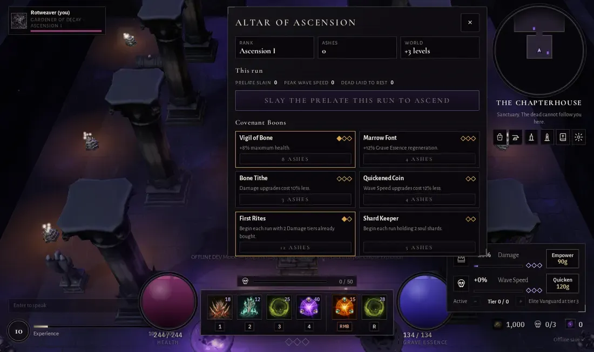

## Playing together and getting help

You play **solo by default**: being online at the same time as someone else never puts you in their world. To play together, open **Settings → Play together** and **Make a party**, then share its short **party code**; friends type it under **Join a friend** (or use `/party CODE` in chat). Leave with **Leave party (play solo)** or `/solo`. A party is one shared world for up to **10 players**: you share chat, combat, gathering node depletion and boss activity, and each character receives their own finds and progression. Press **Enter** to chat. If the realtime service is unavailable, the game continues as a solo world. If the link drops (a deploy, a bad connection) you keep playing while the game retries on its own and puts you back in the same party; when a new release goes live the game saves, shows a short countdown with a **Reload now** button (waiting for a boss fight to end) and reloads straight back in. A reload remembers your party for ten minutes. The [Catacomb Depths](#the-catacomb-depths) are a solo run: partied players step out for the descent and rejoin after.

**Covenant counsel** cards appear when you first encounter important systems, one at a time and at a calm moment (see *Your first hour*). A card lights up the part of the screen it explains (the belt, the minimap, a Menu button). You can move them, turn them off in Settings, or choose **Show tips again** there, which walks you through the minimap, belt, Gear Atlas, Grimoire and Codex one card at a time. Hover or focus an ability icon for its cost, target, effects, and combat tip. The **Codex (K)** records rites, enemies, bosses, and professions you have encountered.

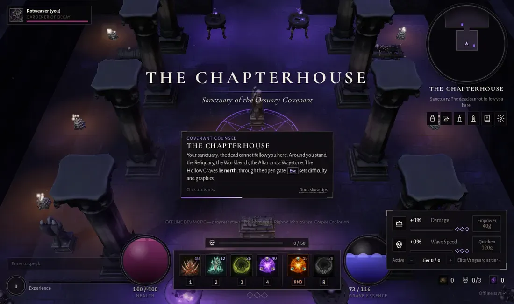

**Found a bug?** Click **Report a bug** just above the chat (bottom left), or open **Settings → Report a bug**, pick what kind of problem it is and describe what happened. Your area, level, discipline and game version are attached for you. Reports are read every day; the same screen lists your recent reports and what became of each one (for example *Fixed in an upcoming update*, or *Need more detail* with a note). How the daily triage works: [server/death-muffin/bug-agent/README.md](server/death-muffin/bug-agent/README.md).

### One login at a time

Only one window can play a character at a time, and the newest login wins. If you sign in somewhere else, the older window stops saving and shows **Logged in elsewhere**; your progress is safe in the newer one. Press **Play here** in the old window to take the session back. When the game reloads itself after a release, it never steals the session. Levels now go up to **999**.

For technical setup and deployment, see [docs/README.md](docs/README.md) and the [VPS handoff](docs/DEATH-MUFFIN-HANDOFF.md).

## Offline play status

The standalone **Death Muffin Offline** edition lives at [muffindevelopment.com/death-muffin/offline/](https://muffindevelopment.com/death-muffin/offline/). Open it while connected, create a local player, then select **Download for offline play**. Wait for “Ready to play without a network” before disconnecting. The download is about 105 MB; your browser may also offer **Install app**. The game and save stay on this device. Clearing site data removes the save, so use a browser profile you keep.

**Moving a save between offline and online.** After reconnecting, open **Sync complete save** in the offline game and sign in with your online Death Muffin account. The panel compares the two characters (level, XP, gold, items, professions, Ascension), then lets you choose:

- **Load offline save online** replaces your online character with the offline one: level, gold, inventory and equipment, professions, necromancer progress, Chronicle, contracts, garden, laborers, capes and pets. The game asks you to confirm first. Both saves must use the same discipline.
- **Load online save on this device** copies your online character into the offline edition as a separate local player, so your existing local save is untouched.

Before anything is replaced, the server keeps a copy of **both** versions. The panel lists your last saved versions, and **Restore** puts any of them back. If the online character changed after you compared (for example, another tab was still playing), the load is refused until you compare again. Close any open online game tab first and reopen it afterwards. Your password is only used to sign in for the sync and is not stored by the offline edition.

Developers can still run `npm run dev` with `?offline` for the browser mock, or run `npm run build:offline` to prepare the standalone edition in `dist-offline/`. The published offline edition is built and deployed from the `mobile` branch (`deploy-mobile.sh`), because it is the one used on phones.
