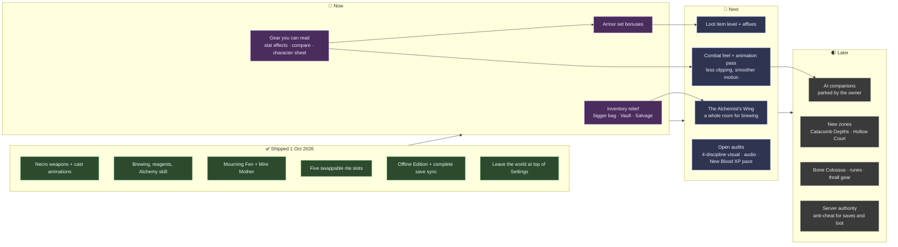

# Death Muffin — Roadmap

*Updated 1 October 2026. The player guide is [README.md](README.md); build status and history are in [HANDOFF.md](HANDOFF.md).*

The roadmap below runs left to right. **Now** is the next build session, **Next** follows it, and **Later** is waiting for a decision or for the earlier work. Each box links to a section below.

**Legend:** 🟪 Now · 🟦 Next · ⬜ Later · 🟨 needs an owner decision first · 🟩 shipped

---

## 🔨 Now

### N1 · Inventory relief
*Problem: the bag fills in minutes. It has 24 slots, there is no storage, and selling is one stack at a time.*

| Piece | What it does |
|---|---|
| **Bigger bag** | 24 → 48 slots. The 0–23 slot range is hard-coded in the server's save, add-item, contracts, gathering and offline sync, so it changes in one place first (a shared `BAG_SLOTS`). |
| **The Ossuary Vault** | A stash in the Chapterhouse: 120 slots shared by your characters, with tabs. Deposit-all-materials and stack-merge buttons. |
| **Salvage** | A **Bone Grinder** station in the Acre turns unwanted gear into **Scrap** and **Bone Dust** by rarity. Scrap feeds Smithing and Carpentry upgrades; Bone Dust feeds Alchemy. It becomes a small profession (*Salvaging*) with levels that raise the yield. |
| **Quick clean-up** | Reliquary buttons: *Sell all junk*, *Salvage all below rare*, and a lock icon to protect items from both. |

### N2 · Gear you can read
*Problem: gear shows STR / AGI / INT / VIT but never says what they do for you.*

Today the four stats feed these formulas (`src/gameplay/characterStats.ts`):

| Stat | What it gives |
|---|---|
| **VIT** | +8 max health each |
| **INT** | +1.3 spell power, +2 max essence, +0.1 essence/s each |
| **STR** | +0.4 spell power each |
| **AGI** | +0.2 spell power, +0.3% move speed each |
| *(thralls)* | Thrall health = 45% of yours; thrall damage = 40% of your spell power |

- **Plain-language tooltips:** "+6 VIT → +48 health", with green or red **compared to what you wear**.
- **Character sheet (paper doll):** final health, spell power, essence, speed and thrall strength, each with a breakdown (base, level, gear, upgrades, boons) you can hover.
- **Necro weapon effects** listed beside the stats, as the Codex does now.

### N3 · Armor set bonuses
The 18 armor sets (90 pieces) are themed but have **no set bonus**. Add 2-, 4- and 5-piece bonuses per set that support its discipline (for example, Ossuary: thralls take less damage; Mourner: wraith healing). Show them in the tooltip with a "3 / 5 worn" tracker.

---

## 🧭 Next

### X1 · The Alchemist's Wing
A dedicated room off the Chapterhouse: cauldrons and alembics as brewing stations, reagent shelves showing what you have found, a drying rack for herbs, and an NPC apothecary who hands out brewing orders. Art goes through the existing Gemini → Tripo pipeline (`ASSET_PIPELINE.md`; about 6,300 Tripo credits left). Brewing moves from the Workbench tab into the room, and the room becomes the home of higher-tier recipes (discovery, quality, concoctions from `docs/ALCHEMY-AND-WORLDS-PLAN.md`).

### X2 · Combat feel and animation pass
Keep the art style; make motion smoother. Practical steps, in the order that pays most:

0. **Found 1 Oct 2026: attacks are out of sync.** Enemy wind-ups last 0.38–1.3 s, but the attack clip is played at a fixed 1.6× speed (`EntityViews.ts`), so its impact frame shows about 1.3 s in (main clip) or about 0.3 s in (the random second variant). Damage therefore lands before or after the visible swing, and the clip is cut when the enemy walks again. Fix (code only): bake each clip's measured impact time (`tools/measure-clips.mjs`) into a table, scale each swing so its impact lands at the end of the wind-up, and let the follow-through finish before blending to walk. Quadruped rigs (bone hound, skull rat, cinderhound) need the tool taught their bone names.
1. **Measure first.** `tools/clip-sheet.mjs` and `tools/measure-clips.mjs` produce a contact sheet and numbers for every clip. Rank the worst clipping and sliding.
2. **Weapon and prop clipping:** per-weapon grip offsets, hide the off-hand during two-handed clips, and fit per-model attach points.
3. **Foot sliding:** scale walk and run clip speed to actual movement speed.
4. **Blends:** longer locomotion crossfades (0.18 s → about 0.3 s) while attacks stay snappy, and a short additive flinch instead of swapping to a full hurt clip.
5. **Crowds:** stronger separation and steering so packs do not stack, plus formation slots for thralls around the caster.
6. **Impact:** a two- or three-frame hitstop on heavy hits, eased knockback, and a death "settle" into the ground.
7. **Replace the worst Tripo clips** with retargeted library clips where measurements say they are beyond fixing.

### X3 · Loot item level and affixes
Already the next item in the grind loop (`docs/GRIND-LOOP.md` §3 #2). Items roll an item level and affixes on the server, so each drop is a real upgrade decision. It depends on N2, which makes stats readable.

### X4 · Open audits
- Four-discipline visual audit (`tools/qa/necro-audit.cjs`, run one discipline at a time).
- Audio has never been checked by ear.
- New Blood classes level 4–8× slower than necromancers in bot runs; check with a human before retuning.

---

## 🌒 Later

### L1 · AI companions (parked)
*Parked on 1 October 2026. The cost study below is kept for when this comes back: event-driven decisions on Claude Haiku 4.5, bots online only while a player is in the world, and a hard daily spend cap come to about $10–20 a month for three bots.*

Two or three bot players you can log in and play with. Recommended design:

- **Body:** a lightweight Node "player" that speaks the same realtime protocol as a browser (move, cast intents, chat), with no rendering. It reuses the existing Easy auto-combat brain (`src/gameplay/autoCombat.ts`) for moment-to-moment fighting. It is cheap enough to run several on the VPS.
- **Mind:** an LLM (Claude Haiku) decides every 10–30 seconds: follow you, hold a chokepoint, gather, return to town, and talks in chat with a persona. It never controls frame-by-frame input.
- **Accounts:** each bot is a real account and character with its own progress, flagged as a bot. Bots only join worlds you invite them to.
- **Decisions needed:** how strong bots should be, whether they loot or level, and the API budget.

### L2–L4
- **New zones:** Catacomb Depths and the Hollow Court (`docs/ALCHEMY-AND-WORLDS-PLAN.md`).
- **Content with paid art ready:** the Bone Colossus, runes (needs a migration), thrall gear.
- **Server authority:** today the browser is trusted for level, gold and loot (fine among friends). Move rewards to the server before opening to strangers.

---

## 🧹 Housekeeping
- Seven `zz_*` test accounts in the live database (owner to delete).
- Six merged worktrees in `wt/` and about 11 GB of old update zips in `vps-handoffs/DeathMuffin/` (owner to delete).
- Old one-off deploy scripts that build from stale trees (`deploy-afk.sh`, `deploy-update.sh`); `server/death-muffin/deploy-release.sh` replaces them.
