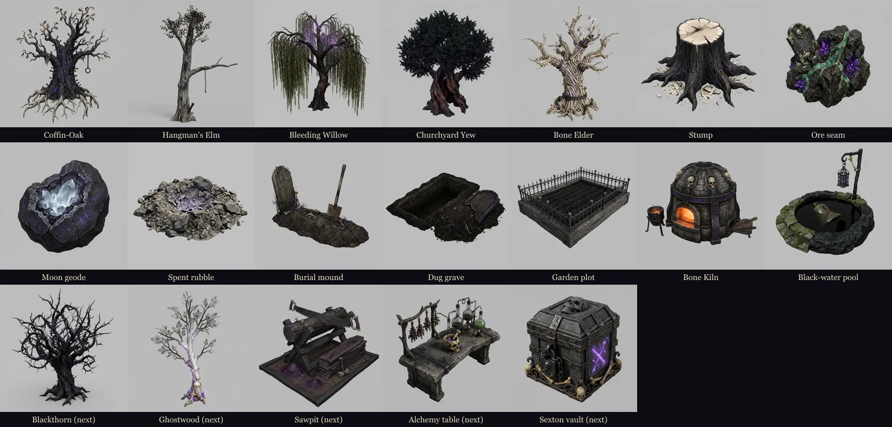

# Professions & gathering roadmap

Written 2026-09-27 for the agents who will build the skilling side of Death Muffin.

> **Status (2026-09-27, cloud session):** G0, G1, G2 and G4 are **built** (see `PHASE_REPORTS.md` → "Professions G0 +
> G1 + G2 + G4" and `server/death-muffin/GATHERING_DEPLOY.md`). G3 (node art) is with the owner; G5–G7 are not started.
> The §12 decisions are still the owner's: the code runs on the recommended defaults, except the XP curve, which stays
> on the live `level × 50` until the owner decides. The combat game is the approved baseline (`death-muffin-v1.0.0`), so do not
change its feel while adding this.

**The goal:** a RuneScape-style skilling layer where **the action is grinding levels**. You click a
tree, rock, pool or grave, your necromancer works it, XP ticks up, and levels unlock better nodes,
tools and recipes. It sits beside the combat loop and never requires it. One zone,
**the Sexton's Acre**, is **completely non-combat**: a player can reach 99 in every gathering skill
without fighting. Every node is a **real in-world 3D prop** built through the Gemini → Tripo
pipeline, like the tombstones and mausoleums already in the world.


*Gemini concepts for the first node set (jobs in `art-manifest/gemini-jobs/gathering-nodes.json`;
matching Tripo specs in `art-manifest/tripo-specs/prop_node_*.json`, not yet run).*

---

## 1. Pillars

1. **Click, work, level.** One click starts a repeating action, and the hero keeps working the node until it's
   depleted or the bag is full, just like RuneScape. Levels come quickly early and slowly late.
2. **Auto keeps it relaxed.** Players love auto combat, so gathering gets the same treatment: when
   a node depletes, **Auto** walks to the nearest node of the same kind and carries on. It never
   leaves the zone and never picks a node the player can't use.
3. **No combat required.** The Sexton's Acre has every tier of every gathering node, no waves,
   no enemies and no corpse pressure. The hunting grounds hold *rich* variants of the same nodes
   (more yield, faster respawn), which gives fighters a reason to stop and gather.
4. **Real things in the world.** Every node, depleted state and station is a GLB prop from the
   pipeline (`ASSET_PIPELINE.md`), placed in `content/layout.ts` and batched like the other props.
5. **The server decides rewards.** XP and items are rolled and rate-limited server-side. The
   client animates optimistically and reconciles, the same model `Progression` already uses.
6. **Grave flavour.** Coffin-oak, grave-iron, black water and bone meal. The skills feel like part of
   the Ossuary Covenant, not a farming sim bolted on.

## 2. What already exists (build on it, don't rebuild)

| Piece | Where | Notes |
|---|---|---|
| Professions `mining`, `fishing`, `woodcutting` with `skill_level` / `skill_xp` | Death Muffin DB `professions` table; `GET /api/professions/:characterId` | Rule: XP to next level = `level × 50` (`xpToNextLevel` in `server/death-muffin/backend/server.js`). |
| Recipes (`smelt` + `craft`, level-gated by profession) | `recipes`, `recipe_ingredients`; `GET /api/professions/recipes/:id`; `POST /api/craft` | Crafting already checks the profession level server-side. |
| Items: ores copper → moon (9 tiers), `fish_river`, `fish_fillet`, `log_oak`, `plank_oak`, flasks, oak staff/bow | `server/rules/content/items.ts` (mirror of the server table; a unit test enforces it) | Mining can use existing ids for every tier; wood and fish need new ids above tier 1. |
| Rite Niches panel (levels + XP bars), Ossuary Workbench (crafting) | `src/ui/ProfessionsPanel.ts`, `src/ui/ForgePanel.ts` | Become the Skills panel and the station UIs. |
| Props pipeline, prop batches and colliders | `ASSET_PIPELINE.md`, `content/layout.ts` `PROPS`, `graphics/WorldView.ts` | Nodes are props with state. |
| Host-authoritative world state in co-op (corpses, zones, walls) | `gameplay/sim/WorldSim.ts`, `sim/snapshot.ts` | Node depletion/respawn follows the corpse pattern. |
| Hero `dig` and `cast` clips | `public/models/*/character.glb` | `dig` covers mining and gravedigging; `cast` covers fishing and gardening. Chopping can use `dig` until a chop clip is retargeted (Tripo retarget: 10 credits per clip per hero). |

**Two trust problems to fix first:**
- `POST /api/professions/award-xp` accepts a client-sent `xpAmount` (up to 500 per call, unlimited
  calls). Nothing uses it yet, but gathering must not build on it. Replace it with the rate-limited
  `POST /api/gather` below, and restrict or remove `award-xp`.
- `POST /api/inventory/add-item` accepts any known item with quantity 1–9999. Gathered items must be
  granted by the server's own roll inside `/api/gather`, never through `add-item`.

## 3. The skills

Profession ids are the server keys (`VALID_PROFESSION_IDS`). ✓ = already exists; ✱ = new.

| Skill | Id | Kind | Actions | Feeds |
|---|---|---|---|---|
| Woodcutting (*Rite of Coffin-Oak*) | `woodcutting` ✓ | gather | Chop trees → logs, seed pods, crow's-nest finds | Carpentry, fires, gardening saplings |
| Mining (*Rite of Grave-Iron*) | `mining` ✓ | gather | Mine seams → ores, rare gems | Smithing (smelt ✓, craft ✓) |
| Fishing (*Rite of the Black Water*) | `fishing` ✓ | gather | Fish pools → fish, drowned trinkets | Cooking |
| Gravedigging (*Rite of the Sexton*) | `gravedigging` ✱ | gather | Dig graves, mounds and crypt collapses → bones, grave goods, seeds, coins | Gardening compost, Bonework, gold |
| Grave Gardening (*Rite of the Mourning Bed*) | `gardening` ✱ | farm | Plant herb and **tree** patches that grow in real time; harvest and check health | Alchemy, Woodcutting (your own trees) |
| Smithing | recipes under `mining` ✓ | process | Ore → ingots → gear and **tools** | Everything |
| Carpentry | recipes under `woodcutting` ✓ | process | Logs → planks → staves, bows, thrall shields | Gear |
| Cooking | recipes under `fishing` ✓ | process | Fish → meals (heal over time; small buffs) | Combat sustain |
| Alchemy | `alchemy` ✱ (P3) | process | Herbs + fish oil → flasks (existing `flask_*` ids ✓) | Combat sustain |

Processing stays on the existing recipe system (one `recipe_type` per station). New gathering
skills are two new profession ids plus rows. No schema redesign is needed.

## 4. Node catalogue (v1)

Action = one work cycle (RuneScape tick 0.6s; most nodes take 4–5 ticks ≈ 2.4–3s). Each cycle rolls
success from `(skill level − node level)` and the tool tier. A success grants one item and the XP.
Nodes deplete after a random number of successes and respawn on a timer. **Rich** variants in combat
zones get ×1.5 yield and ×0.5 respawn.

**Woodcutting**

| Tree | Lvl | XP | Item | Logs before felled | Respawn |
|---|---|---|---|---|---|
| Coffin-Oak | 1 | 6 | `log_oak` ✓ | 1–4 | 8s |
| Hangman's Elm | 15 | 14 | `log_elm` ✱ | 3–6 | 12s |
| Bleeding Willow | 30 | 24 | `log_willow` ✱ | 4–8 | 15s |
| Churchyard Yew | 45 | 38 | `log_yew` ✱ | 5–10 | 30s |
| Blackthorn | 60 | 55 | `log_blackthorn` ✱ | 6–12 | 45s |
| Ghostwood | 75 | 80 | `log_ghostwood` ✱ | 6–12 | 60s |
| Bone Elder | 90 | 115 | `log_bone_elder` ✱ | 8–14 | 120s |

Felled trees become a stump prop until they respawn. There is a 1/200 chance of a *crow's nest* (a seed or ring).

**Mining** (every ore id already exists)

| Seam | Lvl | XP | Item | Model |
|---|---|---|---|---|
| Copper / Tin | 1 | 6 | `ore_copper` / `ore_tin` ✓ | grave-soil seam, vein tint per ore |
| Iron | 10 | 12 | `ore_iron` ✓ | seam |
| Bronze | 20 | 18 | `ore_bronze` ✓ | seam |
| Silver | 30 | 24 | `ore_silver` ✓ | seam |
| Gold | 40 | 32 | `ore_gold` ✓ | seam |
| Steel | 50 | 42 | `ore_steel` ✓ | seam |
| Hell | 65 | 60 | `ore_hell` ✓ | geode, ember vein tint |
| Moon | 80 | 90 | `ore_moon` ✓ | geode, silver-blue glow |

Seams go to the spent-rubble prop for 5–60s by tier. A 1/250 chance of a gem (`gem_grave_garnet`, `gem_bone_opal`, `gem_void_sapphire` ✱).
**One seam model with a tinted vein material** (plus the geode for the top tiers) keeps the Tripo spend down.
Tint through a second emissive vein mesh or a material mask, never by recolouring the whole baked texture.

**Fishing** (spots drift between pool props every few minutes, as in RuneScape)

| Spot | Lvl | XP | Item |
|---|---|---|---|
| Still pool | 1 | 6 | `fish_river` ✓ |
| Crypt eels | 15 | 14 | `fish_crypt_eel` ✱ |
| Bell carp | 30 | 24 | `fish_bell_carp` ✱ |
| Drowned pike | 45 | 38 | `fish_drowned_pike` ✱ |
| Lanternfish | 62 | 58 | `fish_lanternfish` ✱ |
| Abyssal coelacanth | 80 | 95 | `fish_coelacanth` ✱ |

**Gravedigging** (new; the necromancer's own skill)

| Site | Lvl | XP | Finds |
|---|---|---|---|
| Pauper's grave (mound prop) | 1 | 7 | `bones_old` ✱, a few gold, `seed_mourning_moss` ✱ |
| Burial mound | 20 | 18 | `bones_barrow` ✱, rare `ring_copper` ✓ |
| Crypt collapse | 40 | 34 | `bones_crypt` ✱, `ore_silver` ✓, `reliquary_fragment` ✱ |
| Barrow-king's tomb | 70 | 70 | `bones_ancient` ✱, `covenant_seal` ✱, rare existing gear ids |

A dug grave shows the open-pit prop, then refills.

## 5. Grave Gardening — farming herbs *and trees*

- **Plots** in the Acre: 4 herb beds, 2 tree patches and 1 "bone elder" patch per character. They are
  personal (instanced per player), even in co-op.
- **Plant a seed → it grows in real time → harvest.** Growth is computed from timestamps on the
  server (`garden_plots`: `character_id, plot_id, seed_id, planted_at, compost, state`), so it grows
  while you're offline. Planting and harvesting give XP; tree patches also give a large *check health*
  XP when fully grown.

| Seed | Lvl | Grows in | Harvest |
|---|---|---|---|
| Mourning Moss | 1 | 20 min | herb ×3–6 |
| Nightshade | 15 | 40 min | herb |
| Corpse-lily | 30 | 60 min | herb |
| Wolfsbane | 45 | 80 min | herb |
| Bloodroot | 60 | 100 min | herb |
| Moonpetal | 75 | 120 min | herb |
| Coffin-Oak sapling | 10 | 2 h | a personal Coffin-Oak to chop (Woodcutting) |
| Churchyard Yew sapling | 40 | 6 h | a personal Yew |
| Bone Elder sapling | 80 | 16 h | a personal Bone Elder |

- **Farming trees:** a grown sapling becomes a full node prop in *your* patch. You chop it with
  Woodcutting, and it regrows from the stump, which is RuneScape's tree patch.
- **Ossuary compost:** `bones_old` ground at the kiln → bone meal. Composted plots grow 25% faster
  or yield more. This is the link between Gravedigging and Gardening.
- **Blight** (optional, later): an uncomposted plot can rot. Keep it gentle, with no loss while offline.

## 6. The Sexton's Acre — the non-combat zone

A walled cemetery garden west of the Chapterhouse. It's always open, never has waves, and has a waystone.

```
            x −62 ……………………………… −20   −13 ……… 13
   z  6  ┌──────────────────────────────┐
         │  Ore quarry wall (seams:     │
         │  copper…moon, geodes)        │     ┌─────────────┐
         │                              │     │ CHAPTERHOUSE│
         │  Grove: oak · elm · willow   ├─────┤  (existing)  │   door "chapter_acre"
         │  yew · blackthorn · ghostwood│ z17 │             │   x −20…−13, z 17…23
         │  bone elder (rare, 1)        │ …23 │             │
         │                              │     └─────────────┘
         │  Black-water pond + well     │
         │  (drifting fishing spots)    │
         │                              │
         │  Burial rows (mounds, crypt  │
         │  collapse, barrow-king tomb) │
         │  Garden beds + tree patches  │
         │  Bone kiln · sawpit · fire   │
   z 38  └──────────────────────────────┘
```

- `content/areas.ts`: `AreaId` + `'acre'`, `rect: { x0: -62, z0: 6, x1: -20, z1: 38 }` (clear of the
  Hollow Graves, whose south edge is z 4), `safe: true`, `enemies: []`, `cap: 0`, and theme `'acre'`
  (overcast dusk, cooler light, falling leaves, crows).
  Door `chapter_acre`: `rect { x0: -20, z0: 17, x1: -13, z1: 23 }`, `axis: 'x'`, **no unlock**.
- The sanctuary rule already used for the Chapterhouse (no waves or surges in `safe` areas;
  `WorldSim` skips them) covers the Acre. The dead should never path into it, same as the Chapterhouse.
- Stations: **Bone Kiln** (smelting + bone meal), **Sawpit** (carpentry), **Cooking fire** (existing
  brazier prop), **Alchemy table** (P3), **Sexton's Vault** (bank, P5).
- Every tier of every gathering node exists here. The hunting grounds get 2–4 *rich* nodes each,
  themed to the area (willows and eels in the Drowned Nave, silver and crypt collapses in the Marrow
  Ossuary, moon geodes in the Bell Sanctum).

## 7. The gathering loop (client)

1. Hover a node: cursor + tooltip with its name, level and XP, plus "Requires Woodcutting 45" when you're too low.
2. Click it: walk to the node's interaction ring (reuse click-to-move and the `pendingInteract`
   pattern). Face it and loop the gesture (`dig` or `cast`).
3. Every action cycle: a progress arc under the hero, then on success `+XP` floating text (a new
   `skill` kind with the skill's colour), the item pops into the Reliquary, and a light sound (chop,
   pick clink, splash, shovel).
4. When the node depletes it swaps to its depleted prop and a respawn timer runs. **Auto** moves on to
   the nearest same-kind node the player can use, in the same area.
5. It stops on: any movement input, opening a panel (as auto combat does), a full bag, or taking
   damage (only possible outside the Acre).
6. Level-up: a banner and sound, plus a counsel tip the first time for each skill.

Co-op: node **depletion** is host-authoritative and shared (a `nodes` map in `WorldSim`, snapshot-synced
like corpses, with a `gather` intent). Each player's **rewards** come from the server. Two players on
one tree deplete it faster, and each gets their own logs.

## 8. Server authority (Death Muffin backend)

The Death Muffin backend (`server/death-muffin/backend/`, its own MySQL `death_muffin`) is separate from the
original Crossworlds REST server, and the owner has authorised changes to it (see
`docs/DEATH-MUFFIN-HANDOFF.md`). **Never touch the original shared server.** Follow the necro-progress
pattern:

- **Shared rules module** `server/rules/gameplay/gatheringRules.ts`: the node catalogue, success formula, XP,
  loot tables and the XP curve. It is bundled for the server like `necroRules.ts`
  (`npm run build:server-rules`, with a parity test).
- **Migration `002-gathering.sql`** (additive): new `items` rows (§4, with `stackable`,
  `max_stack_size` ≈ 250 for materials), new profession ids, new recipes, `garden_plots`, and
  `gather_ledger (character_id, skill, window_start, actions)` for rate limiting.
- **`POST /api/gather`** `{ characterId, nodeType, actions }` sent in batches every ~10s. The server
  checks ownership, the skill level against the node level, and the **time budget**:
  `actions ≤ (now − last) / minActionMs(nodeType)` plus a small burst allowance. Then it rolls the
  loot with the shared rules, grants items and XP in one transaction, and returns
  `{ levels, xp, items }`. This caps XP per hour at the design rate whatever the client claims.
- `POST /api/garden/plant | harvest | compost`, `GET /api/garden/:characterId`.
- Restrict `POST /api/professions/award-xp` (remove it, or clamp it to crafting-only server use).
- Leaderboard: add **total level** and per-skill boards (`leaderboard.cjs`).
- The DEV offline mock backend (`src/net/`) implements every route, so `?offline` QA works.

## 9. XP curve and pacing

The live rule is `xpToNext = level × 50`: 99 costs ~243k XP and level 50 is already a quarter of
the way. That is too flat to feel like RuneScape. **Recommended:** keep it through level 20 and grow 3.5% per level after:

`xpToNext(L) = round(50 · L · 1.035^max(0, L − 20))`

| Reach level | Live rule (total XP) | Recommended (total XP) |
|---|---|---|
| 10 | 2,250 | 2,250 |
| 30 | 21,750 | 24,038 |
| 50 | 61,250 | 105,087 |
| 70 | 120,750 | 345,732 |
| 90 | 200,250 | 982,506 |
| 99 | 242,550 | **1,525,374** (the halfway point is level 85, close to RuneScape's 92) |

Target rates: roughly 4–5k XP/h on tier-1 nodes and ~40k XP/h on the top tier, so **99 takes about
60–70 hours of active play per skill**. Auto gathering is AFK-friendly, but the server's time budget
makes it no faster. **Migration:** keep each character's current level and XP-into-level (capped
below the new threshold), so nobody loses a level. Anyone below 20 is unaffected. (Owner decision, §12.)

## 10. Art via the pipeline

Concepts are already generated (see the image at the top; raw files in `art-src/concepts/props/node_*.png`
on the workstation that ran them). Tripo specs are written but **not run**:

| Prop | Tripo spec | Faces |
|---|---|---|
| Coffin-Oak, Hangman's Elm, Bleeding Willow, Churchyard Yew, Bone Elder | `prop_node_{coffin_oak,hangman_elm,bleeding_willow,churchyard_yew,bone_elder}.json` | 3.2–3.5k |
| Stump (felled state) | `prop_node_stump.json` | 0.9k |
| Ore seam (tinted per ore), Moon/Hell geode, spent rubble | `prop_node_{ore_seam,ore_geode,ore_spent}.json` | 0.9–2.2k |
| Burial mound, dug grave | `prop_node_{burial_mound,dug_grave}.json` | 1.5k |
| Garden plot, Bone Kiln, Black-water pool | `prop_node_{garden_plot,bone_kiln,black_water_pool}.json` | 1.8–3k |

- Cost: **14 static props × 50 credits ≈ 700 credits** (standard texture). A minimal P1 set of oak, yew,
  stump, seam, geode, spent rubble, mound, dug grave and pool is 9 × 50 ≈ 450. Check
  `node tools/ai/tripo.mjs balance` and get the owner's OK for the batch before running
  `node tools/ai/tripo.mjs run art-manifest/tripo-specs/prop_node_<id>.json --yes`, then
  `node tools/build-characters.mjs prop_node_<id>`.
- Still to generate: Blackthorn and Ghostwood trees, the Sawpit, the Alchemy table, the Sexton's Vault,
  herb growth stages (small, so they can be code-built or instanced), and **item icons** for every new item id (a
  Gemini job in the `icons-v3.json` style; cheap).
- Rich variants reuse the same props with a faint glow or particles, not new models.

## 11. UI, help and docs (CLAUDE.md rules)

- **Skills panel**: the Rite Niches (`P`) grows into a RuneScape-style skills grid with level, XP bar,
  XP to next level, total level and unlocks at the next level.
- Node tooltips, a station panel per recipe type (extend `ForgePanel`), and garden plot panels.
- **Counsel tips** (`ui/Onboarding.ts`): the Acre on first entry, the first node clicked, a full bag,
  the first level-up in each skill, the first seed planted, the first grown tree.
- **Codex**: a new *Professions* tab (skills, nodes, where to find them). Add Settings keys if any
  (e.g. `O` = Skills if `P` stays on the Rite Niches). Update the README.

## 12. Decisions for the owner

1. **XP curve**: keep `level × 50`, or adopt the recommended curve (§9)? *Recommended: the new curve.*
2. **Tools**: required to gather (RuneScape) or optional speed upgrades? *Recommended: optional in v1;
   tools become a Smithing sink in P4.*
3. **Should gathering grant any character XP?** *Recommended: none. Keep the two ladders separate.*
4. **Level cap** 99 (recommended) or 120.
5. **Tripo budget** for the node props (§10): all 14 now (~700 credits), or the P1 subset (~450)?
6. **Co-op nodes**: shared depletion with separate rewards (recommended) or fully per-player nodes.

## 13. Task breakdown for agents

Briefs are self-contained and listed in [`docs/agent-briefs/README.md`](agent-briefs/README.md). The
order and dependencies are:

| # | Brief | Depends on | Owns (don't edit outside) |
|---|---|---|---|
| G0 | [professions-g0-rules-server.md](agent-briefs/professions-g0-rules-server.md): shared rules, migration, `/api/gather`, mock backend, tests | — | `server/rules/gameplay/gatheringRules.ts`, `server/death-muffin/backend/**`, `src/net/**` mock, `tools/build-server-rules.mjs` |
| G1 | [professions-g1-nodes-loop.md](agent-briefs/professions-g1-nodes-loop.md): node entities in WorldSim + snapshot, the gathering loop, Auto, feedback | G0 contract (can stub) | `src/gameplay/**` (except rules), `src/scenes/WorldScene.ts` hooks, `src/graphics/EntityViews.ts` |
| G2 | [professions-g2-sextons-acre.md](agent-briefs/professions-g2-sextons-acre.md): the zone, door, layout, ambience, node placement | — (uses stand-in meshes until G3) | `server/rules/content/areas.ts`, `src/content/layout.ts`, `src/graphics/WorldView.ts`, `Atmosphere.ts` |
| G3 | [professions-g3-art.md](agent-briefs/professions-g3-art.md): run Tripo for the approved props, build, register, item icons | owner's Tripo OK | `art-manifest/**`, `public/models/props/**`, `public/art/items/**`, `layout.ts` `PROPS` entries |
| G4 | [professions-g4-ui-help.md](agent-briefs/professions-g4-ui-help.md): Skills panel, tooltips, stations, tips, Codex tab, README | G0, G1 | `src/ui/**`, `src/content/codex.ts`, README |
| G5 | Grave Gardening: plots, seeds, growth, tree patches | G0–G2 | new `gardening*` files + its routes |
| G6 | Processing: Cooking, Carpentry, Alchemy recipes and stations; tools (Smithing) | G0 | recipes migration + station UIs |
| G7 | Long tail: skill leaderboards, 99 mantles (cosmetic), pets, Sexton's contracts (daily gathering bounties), **thrall labour** (bind a labourer thrall to a node for slow AFK gathering) | G0–G4 | — |

G0 and G2 can start in parallel right away. G1 can start against a stubbed `/api/gather` contract.
G3 waits for the owner's Tripo approval. Every brief inherits the rules in the agent-briefs README
and must leave the checks green.
