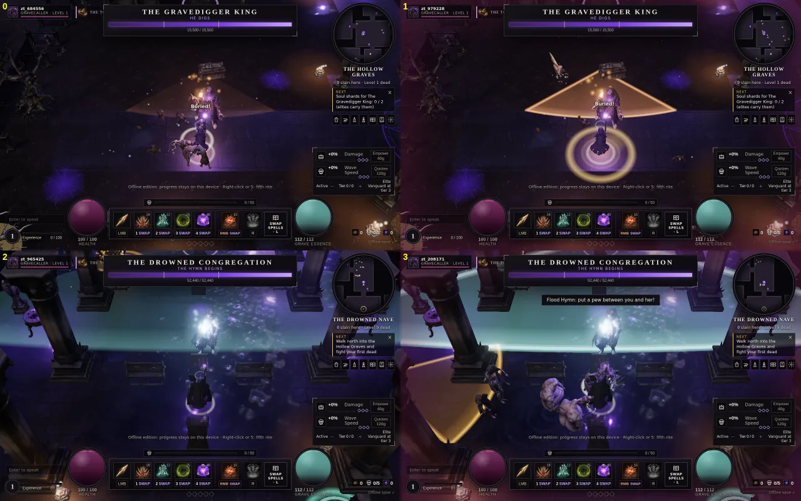
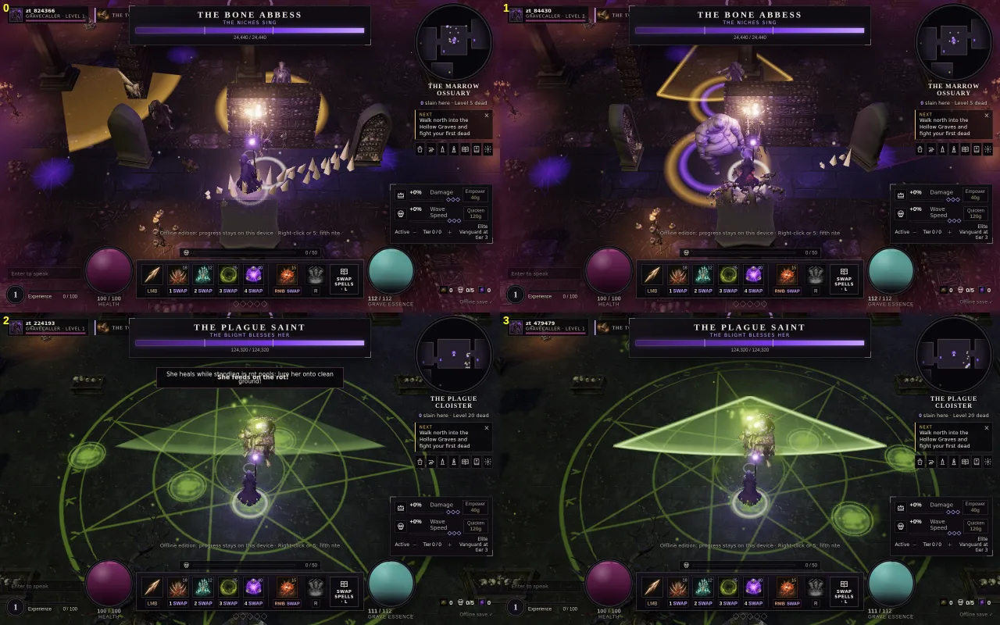
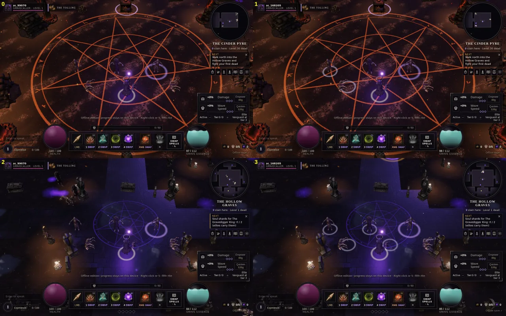
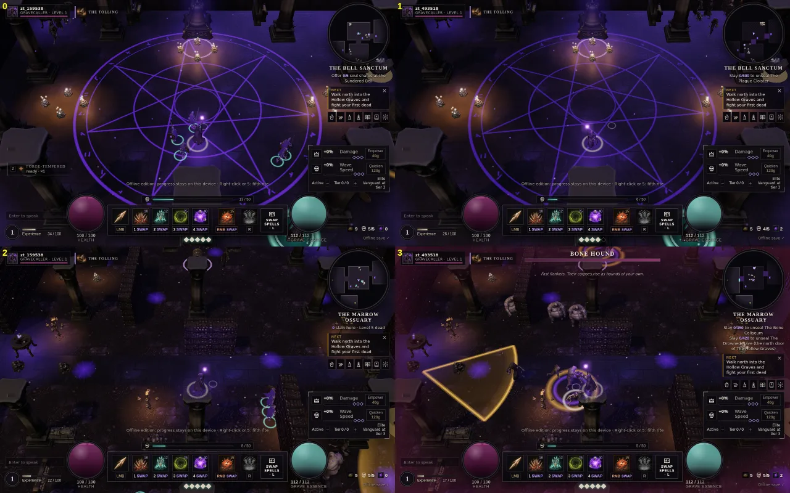
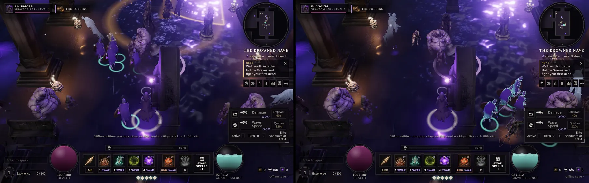
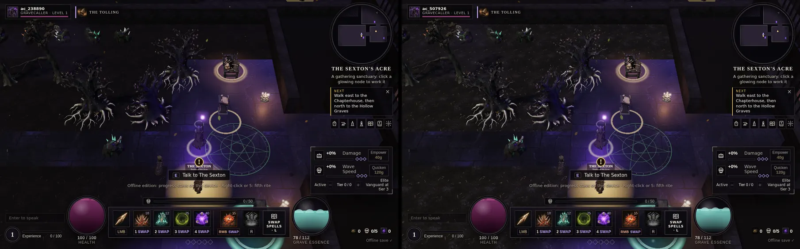
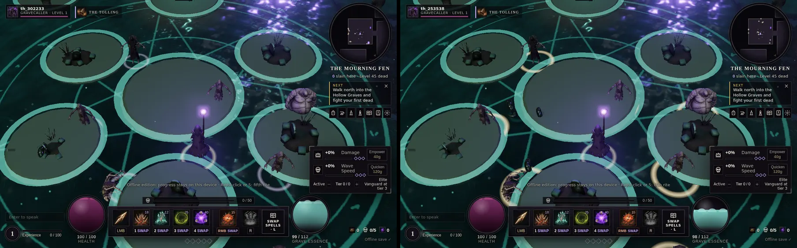
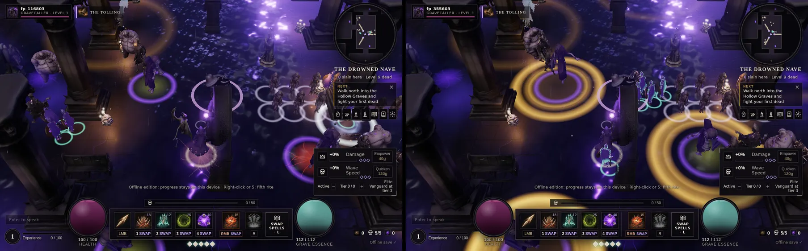

# Zone and encounter polish audit (2 Oct 2026, branch `dm/zone-polish`)

ROADMAP P3, round 2. Scope: visuals and readability of the twelve zones and seven area bosses. No timings, damage, HP or spawn numbers were touched.

How it was measured: `node tools/qa/zone-tour.cjs` (offline dev build, Gravecaller, god mode, `unlockAll`, `goto`, a full five-thrall legion, the zone's own roster in rings, twelve-ish corpses, then each boss summoned from the arena rim with one screenshot every 1.4 s). Both High and Low. Perf comes from `__cwDebug.perf()`.
Perf caveat, read this first: the VPS was at load average 20-25 from other jobs and the browser renders with SwiftShader (software), so **frame time is not reported** (it read 70+ ms everywhere and says nothing about a GPU). Draw calls and triangles are real but swing with which enemies/lights are in frame; the CPU `update ms` swings ±2x run to run. Treat differences under about 10% as noise.

Screenshots of the full before/after tours are not committed (about 200 PNGs); the pairs that matter are in `docs/screenshots/zone-polish/`.

## Findings and fixes

| # | Finding | Zones | Fix |
|---|---|---|---|
| 1 | **Boss cones and lines were the least readable thing on the ground.** A single 50% fill with only an arc rim, tinted with the dim enemy colours (`dirt` brown 0x6a4a30, tide teal 0x5f8f8a, curse crimson). The Gravedigger's sweep was a barely visible brown wedge; the Flood Hymn was a faint teal haze lost under the Nave's violet debris; lances and spoke volleys were scaled discs. | Graves, Ossuary, Nave, Sanctum, Cloister, Pyre | `fxTextures`: new `coneEdge` (stroked sector with glow) and `bar` (filled rectangle with bright edges) sprites. `WorldScene.areaBossEvent`: cones and lines are drawn brightened to a minimum channel of 214 (tint kept), fill plus outline. The Penitent's small cone telegraph also gets the outline. Slam/ring/disc telegraphs were already strong and are unchanged. |
| 2 | **Normal corpses are invisible.** A toppled body is dark on dark ground (worst in the Pyre and Warren); only resonant corpses had a ring. Corpses are the necromancer's resource. | all hunting grounds | `EntityViews`: every fresh non-resonant corpse gets a faint pale ring (26 s, fades with the corpse). Capped at 8 alive at once so a wipe cannot add dozens of draw calls. Not visible when a body sinks in Fen water (see "not done"). |
| 3 | **Wisp pulse ring in the Fen was camouflaged** on the hummock rims (same teal, same additive glow). | Fen | Pulse ring is now near-white teal (0xc4fff2) at full opacity. |
| 4 | **Prop clipping, found by a footprint scan of `generateLayout()`** (collider vs collider, vs walls, vs interactables). Real overlaps: a bone pile inside a sarcophagus (Ossuary 52, -35.5); a pillar standing inside the Bell Altar (Sanctum 0, -127.8); the Cloister waystone sharing a spot with an arcade pillar (27.5, -108 vs pillar -108.5). | Ossuary, Sanctum, Cloister | Scatter props near the four Ossuary coffins are lifted out; the Sanctum pillar behind the altar is skipped; the Cloister waystone and its interactable moved to z -111 (between two pillars). The seeded `rand()` stream is unchanged, so nothing else shifts. |
| 5 | Warren pillars and Coliseum statues report as "on a wall" (distance 0). Looked at in the shots: they are corner posts / statues on plinth walls, intended. | Warren, Coliseum | none |
| 6 | Boss-arena sigils are the brightest floor element in the Sanctum (purple, additive, bloom) and compete with telegraphs. | Sanctum, Cloister | sigil opacity 0.5 -> 0.3 (Sanctum) and 0.35 -> 0.26 (Cloister). The bloom still makes the Sanctum sigil bright; the effect is mild. |
| 7 | Ossuary north-west is a black hole in arrival view. | Ossuary | hemisphere sky 0x3a2d55 -> 0x46386a (about +20%); mood kept. |
| 8 | Nave is the heaviest zone: 296 draw calls, 876K triangles, 13 ms CPU update in the busy fight (High). Its boss fight is also the noisiest (violet debris sheet, flood glare). | Nave | **not fixed** (perf work, not polish); listed below. |

## Per-zone audit (before the fixes)

"Legion" = five thralls with cyan ground rings. Enemies carry gold (elite) or affix rings; telegraph rings sit on top of both.

| Zone | Readability | Clutter | Lighting / contrast | Props | Doors / seals | Notes |
|---|---|---|---|---|---|---|
| Chapterhouse | clear; the Prior's lit pool and altar sigil are the focus | pillars hide the hero (dither fade works) | purple/amber, good | nothing floating | East door to the Wing signed in the zone subtitle | fine |
| Sexton's Acre | the node rings are the cue and read well | tree canopy is dense overhead | **darkest zone on arrival**: dead trees against black, only the node rings glow | ok | n/a | candidate for a moonlight lift; left as is, since darkness is the identity |
| Alchemist's Wing | warmest, most legible room | busy: many small stations | warm brown, good | stations clean | n/a | busy but every cluster has a ring |
| Hollow Graves | good; scattered candle pools give depth | fence and tombstone forest is dense but dark | dark blue/black, amber candle pools | fine | the two seals show kills needed in the area line | boss King's sweep was the weakest telegraph (fixed) |
| Catacomb Warren | gold pentagram floor is the loudest thing; enemies on it read well | pillar rows | warm gold on black | pillars on partition walls intended | seal gates readable | fine |
| Marrow Ossuary | skull walls read well | niche walls plus columns hide enemies at the screen edge | NW black (fixed a little) | bone pile in a coffin (fixed) | fine | |
| Bone Coliseum | brightest zone; dark enemies pop against sand | few props, most open | light floor, strongest contrast of all | statues on plinths | big gate with sigil, impossible to miss | easy to read |
| Drowned Nave | enemies blur into violet debris; thralls vs ghosts hard to tell; hymn cone lost | **noisiest zone** (debris, flood sheet, pews, pillars) | blue/violet, low contrast | pews/pillars fine | N gate with sigil clear | Congregation fight worst of all bosses before the fix; heaviest zone for perf |
| Bell Sanctum | huge sigil dominates; candle groups readable | pillar ring | purple on black | pillar inside altar (fixed) | fine | |
| Plague Cloister | green sigil and puddles are the same family as telegraphs; the Saint's cone vanished | cart/garden props moderate | dark green, ok | waystone beside a pillar (fixed) | fine | |
| Cinder Pyre | orange sigil, glowing coal circles stand out; Conflagration is strongest telegraph in game | scorched ground texture is busy but low contrast | red/black, ok | fine | fine | |
| Mourning Fen | hummock rims are the brightest floor feature; hex ring (magenta) clear, pulse ring (teal) was not | open | teal on black, good | fine | fine | |

Bosses (before): Regent, Mire Mother, Prelate and Saint disc/ring telegraphs read well. Gravedigger sweep, Congregation hymn, Abbess grasp cone and Saint cone were weak (all cone/line based).

## Perf (before the fixes, tour numbers)

Real draw calls / triangles; update ms is CPU under heavy shared load.

| Zone | Quality | Arrival calls / tris (K) / update ms | Fight calls / tris (K) / update ms (enemies, 5 thralls) |
|---|---|---|---|
| chapterhouse | high | 188 / 650 / 2.7 | safe zone |
| chapterhouse | low | 145 / 379 / 3.2 | safe zone |
| acre | high | 140 / 557 / 0.9 | safe zone |
| acre | low | 109 / 322 / 2.0 | safe zone |
| alchemist_wing | high | 180 / 605 / 1.4 | safe zone |
| alchemist_wing | low | 149 / 404 / 0.7 | safe zone |
| graves | high | 186 / 637 / 1.8 | 209 / 665 / 6.9 (31) |
| graves | low | 169 / 332 / 2.1 | 168 / 362 / 4.1 (27) |
| warren | high | 200 / 685 / 2.7 | 190 / 742 / 5.1 (25) |
| warren | low | 145 / 366 / 2.4 | 133 / 395 / 7.1 (30) |
| ossuary | high | 248 / 609 / 4.0 | 249 / 651 / 5.0 (39) |
| ossuary | low | 209 / 310 / 3.3 | 189 / 333 / 8.4 (39) |
| coliseum | high | 130 / 237 / 3.7 | 167 / 344 / 4.8 (53) |
| coliseum | low | 118 / 104 / 4.9 | 132 / 185 / 5.2 (54) |
| nave | high | 257 / 739 / 8.2 | 296 / 876 / 13.1 (47) |
| nave | low | 185 / 343 / 2.0 | 230 / 484 / 4.2 (46) |
| sanctum | high | 222 / 514 / 3.8 | 252 / 677 / 5.2 (46) |
| sanctum | low | 112 / 157 / 2.2 | 158 / 313 / 10.5 (46) |
| cloister | high | 179 / 379 / 6.5 | 208 / 533 / 8.9 (39) |
| cloister | low | 108 / 135 / 2.7 | 159 / 237 / 4.2 (39) |
| pyre | high | 177 / 385 / 4.8 | 186 / 357 / 3.8 (28) |
| pyre | low | 155 / 141 / 1.7 | 164 / 191 / 2.8 (28) |
| fen | high | 194 / 531 / 3.9 | 206 / 572 / 4.2 (27) |
| fen | low | 133 / 249 / 3.5 | 154 / 257 / 2.5 (27) |

### Did the fixes cost anything?

Two controlled checks (fixed state: five thralls, the zone roster in rings frozen, 9-14 corpses, median of 3 `perf` reads, High), before vs after. The tour's own before/after pairs differ in random wave content and cannot answer this.

- **Triangles:** unchanged within ±1% wherever enemy counts matched (graves 552,391 -> 552,415; ossuary 440,148 -> 438,038).
- **Draw calls:** only the corpse rings add any: +12 calls (about +6%) in the Graves with 14 corpses at the first cap of 10; the cap is now 8, so at most +8 (about +4% at 200 calls), and 0 with no fresh corpses. Across the other eight zones the before/after call counts differ by up to -40%/+60% because enemy counts differed between runs; two back-to-back runs of the *same* code gave Sanctum 286 and 239. So only the Graves pair (same enemy and corpse counts) is a clean comparison.
- **Update ms:** inside run-to-run noise (Graves 2.07 -> 2.46 and 2.81, Pyre 1.69 -> 2.03 and 2.23).
- **Bosses** (tour, mid-fight read, High): 7 bosses, calls -12% .. +7% and triangles -2% .. +8% between runs (Regent 209 -> 184, Gravedigger 149 -> 160). The telegraph change adds one decal per cone for about 1-2 s.

| Boss | Quality | Before calls / tris (K) / ms | After calls / tris (K) / ms |
|---|---|---|---|
| gravedigger | high | 149 / 696 / 2.1 | 160 / 714 / 1.7 |
| abbess | high | 158 / 546 / 3.5 | 159 / 540 / 3.6 |
| congregation | high | 181 / 714 / 2.6 | 170 / 721 / 3.7 |
| prelate | high | 156 / 520 / 2.9 | 151 / 536 / 2.3 |
| saint | high | 137 / 421 / 1.8 | 119 / 441 / 1.6 |
| regent | high | 209 / 300 / 1.6 | 184 / 325 / 2.2 |
| mire | high | 99 / 502 / 1.8 | 108 / 515 / 1.9 |
| gravedigger | low | 92 / 344 / 2.4 | 96 / 342 / 2.2 |
| abbess | low | 91 / 231 / 2.8 | 111 / 247 / 3.6 |
| congregation | low | 118 / 370 / 2.5 | 134 / 371 / 3.4 |
| prelate | low | 106 / 194 / 5.8 | 108 / 186 / 3.7 |
| saint | low | 54 / 126 / 2.0 | 53 / 119 / 1.9 |
| regent | low | 133 / 105 / 2.6 | 119 / 95 / 2.8 |
| mire | low | 77 / 211 / 1.3 | 74 / 212 / 1.8 |

## Before / after

All on High, same tour. Left = before, right = after.

Boss cones: Gravedigger sweep (top row), Flood Hymn (bottom row).

Abbess cone (top row) and Plague Saint cone (bottom row).

Corpse rings in the Pyre (top) and the Graves (bottom).

Sanctum arrival (top; sigil dimmed, effect mild) and Ossuary arrival (bottom; slightly lifted; the right-hand shot also caught an enemy cone telegraph).

## Not done / open

- **Nave perf and noise.** Heaviest zone (296 calls, 876K tris, 13 ms) and the hardest to read; the violet debris sheet and flood glare want a contrast pass and a perf look together. Needs a GPU measurement, not SwiftShader.
- **Thralls vs pale enemies.** In a five-thrall fight the pale lavender bloated enemies and the thralls share a palette; only the cyan ground ring separates them. A clearer thrall silhouette is an art/shader job (`Creature` tint), left alone.
- **Fen corpses** sink below the water surface at some spots and their rings are faint on the teal water.
- **Acre** is very dark on arrival from the orchard; only the node rings glow.
- Frame time on a real GPU was not measured (software renderer on a loaded VPS).
- The generated server bundle (`server/vps-handoff/necro-progress/necro-rules.cjs`) was regenerated because `areas.ts` changed (waystone coordinates and the Ossuary ambient colour). It needs a deploy only if the live server is meant to know the new Cloister waystone spot.

---

# Round 3: readability (2 Oct 2026, branch `dm/readability-3`)

Views and visuals only; no gameplay numbers. This closes the open items above except GPU frame time. Measured with `zone-tour.cjs` (High and Low) plus the new `tools/qa/fixed-fight-perf.cjs` (one zone, a fixed state: five thralls, the zone roster in rings frozen, 10 fresh corpses, median of 3 `perf` reads). Same SwiftShader/loaded-VPS caveats as above: **no frame time is reported**.

| # | Problem | Fix | Files |
|---|---|---|---|
| 1 | Thralls and pale-lavender enemies shared a palette; only a small cyan ground ring told them apart | A soft fresnel rim in thrall jade (`SPELL_FX.exhume.spirit`, 0x6fe3c8) added to every thrall material: the silhouette edge glows, the face is untouched, no extra mesh or draw call (one extra shader variant). Own legion strength 0.9, a co-op ally's 0.6 (so allies read as friendly but yours stand out). Enemies never get it. | new `src/graphics/friendRim.ts`, `Creature.ts` (`rim` option), `EntityViews.ts` (`makeThrall`, `isOwn` ctor arg), `WorldScene.ts` (passes `owner === selfId`) |
| 2 | The Acre was the darkest place on arrival (60% of the play-field under luminance 20) | Soil floor tint 0x9aa48c -> 0xe6f0d4 plus a self-lit share (emissive 0x4a5a3c through the soil texture, new optional `glow` in `FLOOR_TEX`), hemisphere sky/ground brighter, Acre-only light boost (moon 2.65 -> 3.4, hemi 1.12 -> 2.0; the Alchemist's Wing keeps its old values). Mean play-field luminance 26.5 -> 31.1, share under 20 from 60% to 34%. Trees still read as silhouettes against lit ground; fog and mood unchanged. | `WorldView.ts`, `WorldScene.ts`, `areas.ts` (Acre ambient; regenerated `necro-rules.cjs`) |
| 3 | Fen corpse rings (pale lilac, 0.4) vanished on the teal water | In the Fen the ring is warm bone-ivory (0xffe6b0, the one hue the marsh lacks), bigger (1.1) and 0.85 opaque. Other zones unchanged. Still counted in the existing cap of 8. | `EntityViews.ts` |
| 4 | Nave noise and cost | (a) every static floor light pool (candles, braziers) was its own additive decal, 14+ overlapping draw calls in the Nave; they are now baked into one mesh per area (vertex colours, identical look elsewhere). (b) Nave pools drawn 20% smaller and 32% fainter so the violet and gold no longer smear together. (c) Water moon glints scaled to 0.3 in the roofed Nave (they bloomed into violet confetti). (d) Nave light-shaft layer 150 -> 100 particles at lower alpha, the bright specks 90 -> 60. | `WorldView.ts` (`buildDecals`, `POOL_TONE`), `Water.ts`, `Atmosphere.ts` |

## Before / after screenshots

Left = before, right = after (High).

Thralls among pale enemies (Nave):

The Acre on arrival:

Fen corpses on water (before: faint lilac rings; after: ivory):

Nave fixed fight (random enemy placement differs between the two):

## Perf (Nave, calls / triangles K)

Draw calls swing run to run because enemies keep moving and attacking even frozen (one fixed-state pair: High before 279 / 301, after 228 / 262 / 268). Medians below.

| Case | Quality | Before | After |
|---|---|---|---|
| fixed fight (47 enemies, 5 thralls, 10 corpses) | High | 290 calls / 751K (279/723K, 301/780K) | 262 calls / 766K (228/739K, 262/749K, 268/810K) |
| fixed fight | Low | 237 calls / 428K (233/424K, 241/432K) | 227 calls / 408K (242/408K, 195/430K, 227/405K) |
| bare zone, no spawns of mine (14 wave enemies) | High | 135 / 568K (135, 134) | 125 / 568K (135, 116, 125) |
| bare zone | Low | 128 / 271K (123, 133) | 95 / 271K (82, 103, 95) |
| tour busy fight (47 enemies) | High | 240 / 784K | 216 / 736K |
| tour busy fight | Low | 195 / 409K | 155 / 394K |

Reading it honestly: the merged pools save about 10-35 calls in the Nave (more at Low, where there is no shadow pass to dilute them), roughly 10% in a busy fight on High; **triangles did not change** (prop and enemy meshes dominate, and no art LOD was touched). Update ms stayed inside run-to-run noise (1-11 ms on this loaded box). Other zones got the same pool merge for free: Graves tour arrival 209 -> 196 calls (High), 176 -> 168 (Low). The thrall rim adds no draw calls.

## Still open

- Frame time on a real GPU (software renderer on a loaded VPS).
- Nave triangles (about 570K bare at High): the pillar, statue and pew meshes are heavy; this needs lower-poly LODs, not a visibility tweak.
- Water glints in the Nave are quieter but still the brightest speckle on screen at the top right; the Fen shares the glint scale (it uses the same low-sheen water) and is a little calmer too.
- The Acre trees are still dark silhouettes; lifting them further means retinting the tree materials, which I did not do to keep the gloom.
- Fen bodies still sink slightly below the water surface; the ring now marks them but the mesh is unchanged.
- A tall thrall of the Mourner (spectral wraith) wears the rim too; it is subtle on a translucent body but unreviewed in co-op with real remote players (only the own/ally strength split is code-verified, offline has no remote legions).
- `necro-rules.cjs` was regenerated (Acre ambient colours); deploy only matters if the server should carry the new ambient values, which it does not use for gameplay.
